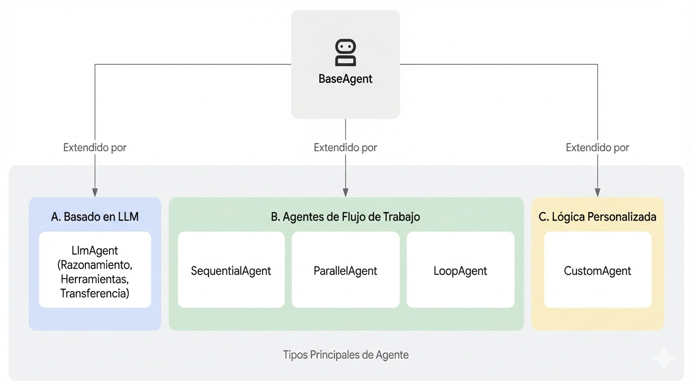

# Agentes

  Supported in ADKPythonTypeScriptGoJava

En Agent Development Kit (ADK), un **Agente** es una unidad de ejecución autónoma diseñada para actuar de forma independiente y lograr objetivos específicos. Los agentes pueden realizar tareas, interactuar con usuarios, utilizar herramientas externas y coordinarse con otros agentes.

La base para todos los agentes en ADK es la clase `BaseAgent`. Sirve como el modelo fundamental. Para crear agentes funcionales, típicamente extiendes `BaseAgent` de una de tres formas principales, adaptándose a diferentes necesidades – desde razonamiento inteligente hasta control de procesos estructurados.

## Categorías Principales de Agentes

ADK proporciona categorías distintas de agentes para construir aplicaciones sofisticadas:

1. [**Agentes LLM (`LlmAgent`, `Agent`)**](llm-agents.md): Estos agentes utilizan Modelos de Lenguaje Grandes (LLMs) como su motor principal para comprender lenguaje natural, razonar, planificar, generar respuestas y decidir dinámicamente cómo proceder o qué herramientas usar, haciéndolos ideales para tareas flexibles centradas en el lenguaje. [Aprende más sobre Agentes LLM...](llm-agents.md)

2. [**Agentes de Flujo de Trabajo (`SequentialAgent`, `ParallelAgent`, `LoopAgent`)**](workflow-agents/index.md): Estos agentes especializados controlan el flujo de ejecución de otros agentes en patrones predefinidos y deterministas (secuencia, paralelo o bucle) sin usar un LLM para el control de flujo en sí, perfectos para procesos estructurados que necesitan ejecución predecible. [Explora Agentes de Flujo de Trabajo...](workflow-agents/index.md)

3. [**Agentes Personalizados**](custom-agents.md): Creados al extender `BaseAgent` directamente, estos agentes te permiten implementar lógica operacional única, flujos de control específicos o integraciones especializadas no cubiertas por los tipos estándar, atendiendo a requisitos de aplicación altamente personalizados. [Descubre cómo construir Agentes Personalizados...](custom-agents.md)

## Eligiendo el Tipo de Agente Correcto

La siguiente tabla proporciona una comparación de alto nivel para ayudar a distinguir entre los tipos de agentes. A medida que explores cada tipo con más detalle en las secciones subsiguientes, estas distinciones se volverán más claras.

| Característica       | Agente LLM (`LlmAgent`)             | Agente de Flujo de Trabajo                  | Agente Personalizado (subclase de `BaseAgent`) |
| :------------------- | :---------------------------------- | :------------------------------------------ |:-----------------------------------------|
| **Función Principal** | Razonamiento, Generación, Uso de Herramientas | Control del Flujo de Ejecución de Agentes | Implementación de Lógica/Integraciones Únicas |
| **Motor Principal**  | Modelo de Lenguaje Grande (LLM)     | Lógica Predefinida (Secuencia, Paralelo, Bucle) | Código Personalizado                     |
| **Determinismo**  | No determinista (Flexible)           | Determinista (Predecible)                   | Puede ser cualquiera, según la implementación |
| **Uso Principal**  | Tareas de lenguaje, Decisiones dinámicas | Procesos estructurados, Orquestación     | Requisitos personalizados, Flujos de trabajo específicos |

## Agentes Trabajando Juntos: Sistemas Multi-Agente

Mientras que cada tipo de agente cumple un propósito distinto, el verdadero poder a menudo proviene de combinarlos. Las aplicaciones complejas frecuentemente emplean [arquitecturas multi-agente](multi-agents.md) donde:

* **Agentes LLM** manejan ejecución de tareas inteligentes basadas en lenguaje.
* **Agentes de Flujo de Trabajo** gestionan el flujo general del proceso usando patrones estándar.
* **Agentes Personalizados** proporcionan capacidades especializadas o reglas necesarias para integraciones únicas.

Comprender estos tipos fundamentales es el primer paso hacia la construcción de aplicaciones de IA sofisticadas y capaces con ADK.

---

## ¿Qué Sigue?

Ahora que tienes una visión general de los diferentes tipos de agentes disponibles en ADK, profundiza en cómo funcionan y cómo usarlos efectivamente:

* [**Agentes LLM:**](llm-agents.md) Explora cómo configurar agentes impulsados por modelos de lenguaje grandes, incluyendo establecer instrucciones, proporcionar herramientas y habilitar características avanzadas como planificación y ejecución de código.
* [**Agentes de Flujo de Trabajo:**](workflow-agents/index.md) Aprende cómo orquestar tareas usando `SequentialAgent`, `ParallelAgent` y `LoopAgent` para procesos estructurados y predecibles.
* [**Agentes Personalizados:**](custom-agents.md) Descubre los principios de extender `BaseAgent` para construir agentes con lógica e integraciones únicas adaptadas a tus necesidades específicas.
* [**Multi-Agentes:**](multi-agents.md) Comprende cómo combinar diferentes tipos de agentes para crear sistemas sofisticados y colaborativos capaces de abordar problemas complejos.
* [**Modelos:**](/adk-docs/agents/models/) Aprende sobre las diferentes integraciones de LLM disponibles y cómo seleccionar el modelo correcto para tus agentes.