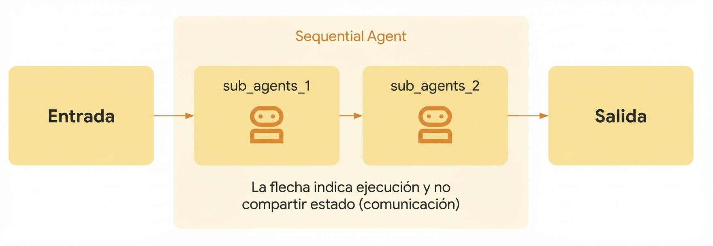

# Agentes secuenciales

<div class="language-support-tag">
  <span class="lst-supported">Supported in ADK</span><span class="lst-python">Python v0.1.0</span><span class="lst-typescript">Typescript v0.2.0</span><span class="lst-go">Go v0.1.0</span><span class="lst-java">Java v0.2.0</span>
</div>

El `SequentialAgent` es un [agente de flujo de trabajo](index.md) que ejecuta sus sub-agentes en el orden en que están especificados en la lista.
Usa el `SequentialAgent` cuando quieras que la ejecución ocurra en un orden fijo y estricto.

### Ejemplo

* Quieres construir un agente que pueda resumir cualquier página web, usando dos herramientas: `Get Page Contents` y `Summarize Page`. Dado que el agente siempre debe llamar a `Get Page Contents` antes de llamar a `Summarize Page` (¡no puedes resumir de la nada!), debes construir tu agente usando un `SequentialAgent`.

Al igual que otros [agentes de flujo de trabajo](index.md), el `SequentialAgent` no está impulsado por un LLM, y por lo tanto es determinista en cómo se ejecuta. Dicho esto, los agentes de flujo de trabajo se preocupan solo por su ejecución (es decir, en secuencia), y no por su lógica interna; las herramientas o sub-agentes de un agente de flujo de trabajo pueden o no utilizar LLMs.

### Cómo funciona

Cuando se llama al método `Run Async` del `SequentialAgent`, realiza las siguientes acciones:

1. **Iteración:** Itera a través de la lista de sub-agentes en el orden en que fueron proporcionados.
2. **Ejecución de Sub-Agentes:** Para cada sub-agente en la lista, llama al método `Run Async` del sub-agente.

{: width="600"}

### Ejemplo Completo: Pipeline de Desarrollo de Código

Considera un pipeline simplificado de desarrollo de código:

* **Code Writer Agent:** Un Agente LLM que genera código inicial basado en una especificación.
* **Code Reviewer Agent:** Un Agente LLM que revisa el código generado en busca de errores, problemas de estilo y adherencia a las mejores prácticas. Recibe la salida del Code Writer Agent.
* **Code Refactorer Agent:** Un Agente LLM que toma el código revisado (y los comentarios del revisor) y lo refactoriza para mejorar la calidad y abordar problemas.

Un `SequentialAgent` es perfecto para esto:

```py
SequentialAgent(sub_agents=[CodeWriterAgent, CodeReviewerAgent, CodeRefactorerAgent])
```

Esto asegura que el código se escriba, *luego* se revise, y *finalmente* se refactorice, en un orden estricto y confiable. **La salida de cada sub-agente se pasa al siguiente almacenándola en el estado a través de [Output Key](../llm-agents.md#structuring-data-input_schema-output_schema-output_key)**.

!!! note "Contexto de Invocación Compartido"
    El `SequentialAgent` pasa el mismo `InvocationContext` a cada uno de sus sub-agentes. Esto significa que todos comparten el mismo estado de sesión, incluyendo el espacio de nombres temporal (`temp:`), facilitando el paso de datos entre pasos dentro de un solo turno.

???+ "Code"

    === "Python"
        ```py
        --8<-- "examples/python/snippets/agents/workflow-agents/sequential_agent_code_development_agent.py:init"
        ```

    === "Typescript"
        ```typescript
        --8<-- "examples/typescript/snippets/agents/workflow-agents/sequential_agent_code_development_agent.ts:init"
        ```

    === "Go"
        ```go
        --8<-- "examples/go/snippets/agents/workflow-agents/sequential/main.go:init"
        ```

    === "Java"
        ```java
        --8<-- "examples/java/snippets/src/main/java/agents/workflow/SequentialAgentExample.java:init"
        ```