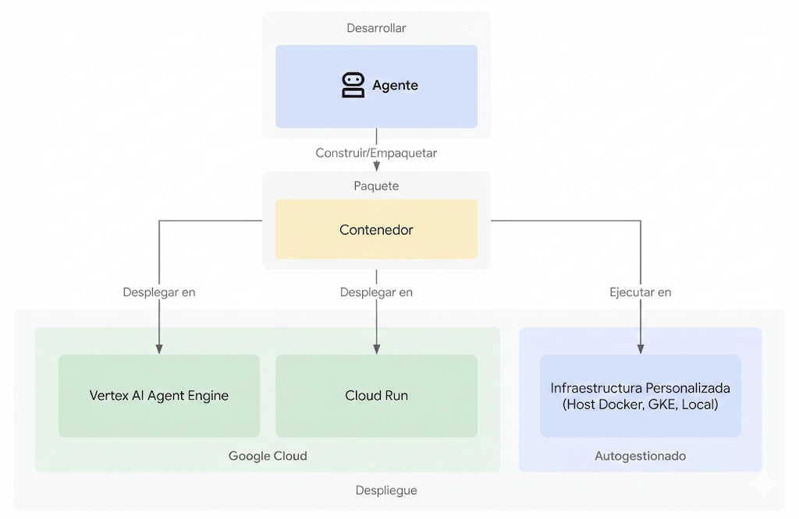

# Desplegando tu Agente

Una vez que hayas construido y probado tu agente usando ADK,
el siguiente paso es desplegarlo para que pueda ser accedido, consultado y usado en
producción o integrado con otras aplicaciones. El despliegue mueve tu agente
desde tu máquina de desarrollo local a un entorno escalable y confiable.

## Opciones de Despliegue

Tu agente ADK puede ser desplegado en una variedad de entornos diferentes basándose
en tus necesidades de preparación para producción o flexibilidad personalizada:

### Agent Engine en Vertex AI

[Agent Engine](agent-engine/index.md) es un servicio totalmente administrado con autoescalado en Google Cloud
específicamente diseñado para desplegar, administrar y escalar agentes de IA construidos con
frameworks como ADK.

Aprende más sobre [desplegar tu agente en Vertex AI Agent Engine](agent-engine/index.md).

### Cloud Run

[Cloud Run](https://cloud.google.com/run) es una plataforma de computación administrada con autoescalado en
Google Cloud que te permite ejecutar tu agente como una aplicación basada en
contenedores.

Aprende más sobre [desplegar tu agente en Cloud Run](cloud-run.md).

### Google Kubernetes Engine (GKE)

[Google Kubernetes Engine (GKE)](https://cloud.google.com/kubernetes-engine) es un servicio administrado
de Kubernetes de Google Cloud que te permite ejecutar tu agente en un entorno contenedorizado.
GKE es una buena opción si necesitas más control sobre el despliegue, así como
para ejecutar Modelos Abiertos.

Aprende más sobre [desplegar tu agente en GKE](gke.md).

### Otra Infraestructura Compatible con Contenedores

Puedes empaquetar manualmente tu Agente en una imagen de contenedor y luego ejecutarlo en
cualquier entorno que soporte imágenes de contenedor. Por ejemplo, puedes ejecutarlo
localmente en Docker o Podman. Esta es una buena opción si prefieres ejecutarlo sin conexión
o desconectado, o de otra manera en un sistema que no tiene conexión a Google
Cloud.

Sigue las instrucciones para [desplegar tu agente en Cloud Run](cloud-run.md#deployment-commands).
En la sección "Comandos de Despliegue" para gcloud CLI, encontrarás un punto de entrada FastAPI de ejemplo y 
un Dockerfile.