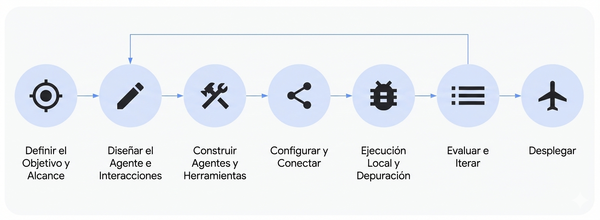

# Kit de Desarrollo de Agentes (ADK)

 <b> ¡Construye, evalúa y despliega agentes sin problemas! </b> 

ADK está diseñado para empoderar a los desarrolladores
para construir, gestionar, evaluar y desplegar agentes impulsados por IA. Proporciona un entorno
robusto y flexible para crear agentes tanto conversacionales como no conversacionales,
capaces de manejar tareas y flujos de trabajo complejos.

## Conceptos Principales

ADK está construido alrededor de algunas primitivas y conceptos clave que lo hacen
poderoso y flexible. Aquí están los elementos esenciales:

* **Agente:** La unidad de trabajo fundamental diseñada para tareas específicas. Los agentes pueden
  usar modelos de lenguaje (`LlmAgent`) para razonamiento complejo, o actuar como controladores deterministas de la ejecución, que se llaman "[agentes de flujo de trabajo](../agents/workflow-agents/index.md)" (`SequentialAgent`, `ParallelAgent`, `LoopAgent`).
* **Herramienta:** Proporciona a los agentes habilidades más allá de la conversación, permitiéndoles interactuar
  con APIs externas, buscar información, ejecutar código o llamar a otros servicios.
* **Callbacks:** Fragmentos de código personalizados que proporcionas para ejecutarse en puntos específicos en
  el proceso del agente, permitiendo verificaciones, registro o modificaciones de comportamiento.
* **Gestión de Sesiones (`Session` & `State`):** Maneja el contexto de una sola
  conversación (`Session`), incluyendo su historial (`Events`) y la
  memoria de trabajo del agente para esa conversación (`State`).
* **Memoria:** Permite a los agentes recordar información sobre un usuario a través de
  *múltiples* sesiones, proporcionando contexto a largo plazo (distinto del
  `State` de sesión a corto plazo).
* **Gestión de Artefactos (`Artifact`):** Permite a los agentes guardar, cargar y gestionar
  archivos o datos binarios (como imágenes, PDFs) asociados con una sesión o usuario.
* **Ejecución de Código:** La capacidad de los agentes (generalmente a través de Herramientas) para generar y
  ejecutar código para realizar cálculos o acciones complejas.
* **Planificación:** Una capacidad avanzada donde los agentes pueden descomponer objetivos complejos
  en pasos más pequeños y planificar cómo lograrlos como un planificador ReAct.
* **Modelos:** El LLM subyacente que impulsa los `LlmAgent`s, habilitando sus
  habilidades de razonamiento y comprensión del lenguaje.
* **Evento:** La unidad básica de comunicación que representa cosas que suceden
  durante una sesión (mensaje del usuario, respuesta del agente, uso de herramienta), formando el
  historial de conversación.
* **Runner:** El motor que gestiona el flujo de ejecución, orquesta las
  interacciones de agentes basándose en Eventos, y coordina con servicios backend.

***Nota:** Características como Streaming Multimodal, Evaluación, Despliegue,
Depuración y Rastreo también son parte del ecosistema ADK más amplio, apoyando
la interacción en tiempo real y el ciclo de vida del desarrollo.*

## Capacidades Clave

ADK ofrece varias ventajas clave para desarrolladores que construyen
aplicaciones agénticas:

1. **Diseño de Sistema Multi-Agente:** Construye fácilmente aplicaciones compuestas de
   múltiples agentes especializados organizados jerárquicamente. Los agentes pueden coordinar
   tareas complejas, delegar sub-tareas usando transferencia impulsada por LLM o invocación explícita
   de `AgentTool`, habilitando soluciones modulares y escalables.
2. **Ecosistema Rico de Herramientas:** Equipa agentes con capacidades diversas. ADK
   soporta la integración de funciones personalizadas (`FunctionTool`), usar otros agentes como
   herramientas (`AgentTool`), aprovechar funcionalidades integradas como ejecución de código,
   e interactuar con fuentes de datos y APIs externas (por ejemplo, Búsqueda,
   Bases de datos). El soporte para herramientas de larga duración permite manejar operaciones asíncronas
   de manera efectiva.
3. **Orquestación Flexible:** Define flujos de trabajo de agentes complejos usando agentes
   de flujo de trabajo integrados (`SequentialAgent`, `ParallelAgent`, `LoopAgent`) junto con
   enrutamiento dinámico impulsado por LLM. Esto permite tanto pipelines predecibles como
   comportamiento adaptativo del agente.
4. **Herramientas de Desarrollo Integradas:** Desarrolla e itera localmente con facilidad.
   ADK incluye herramientas como una interfaz de línea de comandos (CLI) y una
   UI de Desarrollador para ejecutar agentes, inspeccionar pasos de ejecución (eventos, cambios de estado),
   depurar interacciones y visualizar definiciones de agentes.
5. **Soporte Nativo de Streaming:** Construye experiencias interactivas en tiempo real con
   soporte nativo para streaming bidireccional (texto y audio). Esto se integra
   sin problemas con capacidades subyacentes como la
   [API Multimodal Live para la API de Desarrollador de Gemini](https://ai.google.dev/gemini-api/docs/live)
   (o para
   [Vertex AI](https://cloud.google.com/vertex-ai/generative-ai/docs/model-reference/multimodal-live)),
   a menudo habilitado con simples cambios de configuración.
6. **Evaluación de Agentes Integrada:** Evalúa el rendimiento del agente sistemáticamente. El
   framework incluye herramientas para crear conjuntos de datos de evaluación multi-turno y ejecutar
   evaluaciones localmente (vía CLI o la UI de desarrollo) para medir calidad y
   guiar mejoras.
7. **Amplio Soporte de LLM:** Aunque optimizado para los modelos Gemini de Google, el
   framework está diseñado para flexibilidad, permitiendo integración con varios LLMs
   (potencialmente incluyendo modelos de código abierto o ajustados) a través de su
   interfaz `BaseLlm`.
8. **Gestión de Artefactos:** Permite a los agentes manejar archivos y datos binarios. El
   framework proporciona mecanismos (`ArtifactService`, métodos de contexto) para que los agentes
   guarden, carguen y gestionen artefactos versionados como imágenes, documentos o
   informes generados durante su ejecución.
9. **Extensibilidad e Interoperabilidad:** ADK promueve un
   ecosistema abierto. Mientras proporciona herramientas centrales, permite a los desarrolladores
   integrar y reutilizar fácilmente herramientas de terceros y conectores de datos.
10. **Gestión de Estado y Memoria:** Maneja automáticamente la memoria
    conversacional a corto plazo (`State` dentro de una `Session`) gestionada por el
    `SessionService`. Proporciona puntos de integración para servicios de `Memory` a más largo plazo,
    permitiendo a los agentes recordar información del usuario a través de múltiples
    sesiones.

## Comenzar

* ¿Listo para construir tu primer agente? [Prueba el inicio rápido](./quickstart.md)