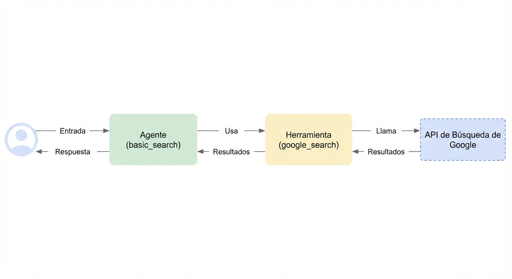

# Construye un agente con streaming usando Python

Con esta guía rápida, aprenderás a crear un agente simple y usar ADK Streaming para habilitar la comunicación de voz y video con él, que es de baja latencia y bidireccional. Instalaremos ADK, configuraremos un agente básico de "Google Search", probaremos ejecutar el agente con Streaming con la herramienta `adk web`, y luego explicaremos cómo construir una aplicación web asíncrona simple por ti mismo usando ADK Streaming y [FastAPI](https://fastapi.tiangolo.com/).

**Nota:** Esta guía asume que tienes experiencia usando una terminal en entornos Windows, Mac y Linux.

## Modelos compatibles para streaming de voz/video {#supported-models}

Para usar streaming de voz/video en ADK, necesitarás usar modelos de Gemini que soporten la API Live. Puedes encontrar los **ID(s) de modelo** que soportan la API Live de Gemini en la documentación:

- [Google AI Studio: API Live de Gemini](https://ai.google.dev/gemini-api/docs/models#live-api)
- [Vertex AI: API Live de Gemini](https://cloud.google.com/vertex-ai/generative-ai/docs/live-api)

## 1. Configurar el Entorno e Instalar ADK { #setup-environment-install-adk }

Crear y Activar un Entorno Virtual (Recomendado):

```bash
# Crear
python -m venv .venv
# Activar (cada nueva terminal)
# macOS/Linux: source .venv/bin/activate
# Windows CMD: .venv\Scripts\activate.bat
# Windows PowerShell: .venv\Scripts\Activate.ps1
```

Instalar ADK:

```bash
pip install google-adk
```

## 2. Estructura del Proyecto { #project-structure }

Crea la siguiente estructura de carpetas con archivos vacíos:

```console
adk-streaming/  # Carpeta del proyecto
└── app/ # la carpeta de la aplicación web
    ├── .env # Clave API de Gemini
    └── google_search_agent/ # Carpeta del agente
        ├── __init__.py # Paquete Python
        └── agent.py # Definición del agente
```

### agent.py

Copia y pega el siguiente bloque de código en el archivo `agent.py`.

Para `model`, por favor verifica el ID del modelo como se describe anteriormente en la [sección de Modelos](#supported-models).

```py
from google.adk.agents import Agent
from google.adk.tools import google_search  # Importar la herramienta

root_agent = Agent(
   # Un nombre único para el agente.
   name="basic_search_agent",
   # El Modelo de Lenguaje Grande (LLM) que el agente usará.
   # Por favor completa el ID del modelo más reciente que soporte live desde
   # https://google.github.io/adk-docs/get-started/streaming/quickstart-streaming/#supported-models
   model="...",
   # Una descripción breve del propósito del agente.
   description="Agent to answer questions using Google Search.",
   # Instrucciones para establecer el comportamiento del agente.
   instruction="You are an expert researcher. You always stick to the facts.",
   # Agregar la herramienta google_search para realizar grounding con Google search.
   tools=[google_search]
)
```

`agent.py` es donde se almacenará toda la lógica de tu(s) agente(s), y debes tener un `root_agent` definido.

Observa cómo integraste fácilmente las capacidades de [grounding con Google Search](https://ai.google.dev/gemini-api/docs/grounding?lang=python#configure-search). La clase `Agent` y la herramienta `google_search` manejan las interacciones complejas con el LLM y el grounding con la API de búsqueda, permitiéndote enfocarte en el *propósito* y *comportamiento* del agente.



Copia y pega el siguiente bloque de código en el archivo `__init__.py`.

```py title="__init__.py"
from . import agent
```

## 3\. Configurar la plataforma { #set-up-the-platform }

Para ejecutar el agente, elige una plataforma entre Google AI Studio o Google Cloud Vertex AI:

=== "Gemini - Google AI Studio"
    1. Obtén una clave API de [Google AI Studio](https://aistudio.google.com/apikey).
    2. Abre el archivo **`.env`** ubicado dentro de (`app/`) y copia y pega el siguiente código.

        ```env title=".env"
        GOOGLE_GENAI_USE_VERTEXAI=FALSE
        GOOGLE_API_KEY=PASTE_YOUR_ACTUAL_API_KEY_HERE
        ```

    3. Reemplaza `PASTE_YOUR_ACTUAL_API_KEY_HERE` con tu `API KEY` real.

=== "Gemini - Google Cloud Vertex AI"
    1. Necesitas una cuenta existente de
       [Google Cloud](https://cloud.google.com/?e=48754805&hl=en) y un
       proyecto.
        * Configura un
          [proyecto de Google Cloud](https://cloud.google.com/vertex-ai/generative-ai/docs/start/quickstarts/quickstart-multimodal#setup-gcp)
        * Configura el
          [CLI de gcloud](https://cloud.google.com/vertex-ai/generative-ai/docs/start/quickstarts/quickstart-multimodal#setup-local)
        * Autentícate en Google Cloud, desde la terminal ejecutando
          `gcloud auth login`.
        * [Habilita la API de Vertex AI](https://console.cloud.google.com/flows/enableapi?apiid=aiplatform.googleapis.com).
    2. Abre el archivo **`.env`** ubicado dentro de (`app/`). Copia y pega
       el siguiente código y actualiza el ID del proyecto y la ubicación.

        ```env title=".env"
        GOOGLE_GENAI_USE_VERTEXAI=TRUE
        GOOGLE_CLOUD_PROJECT=PASTE_YOUR_ACTUAL_PROJECT_ID
        GOOGLE_CLOUD_LOCATION=us-central1
        ```

## 4. Prueba el agente con `adk web` { #try-the-agent-with-adk-web }

Ahora está listo para probar el agente. Ejecuta el siguiente comando para lanzar la **UI de desarrollo**. Primero, asegúrate de establecer el directorio actual en `app`:

```shell
cd app
```

También, establece la variable `SSL_CERT_FILE` con el siguiente comando. Esto es necesario para las pruebas de voz y video más adelante.

=== "OS X &amp; Linux"
    ```bash
    export SSL_CERT_FILE=$(python -m certifi)
    ```

=== "Windows"
    ```powershell
    $env:SSL_CERT_FILE = (python -m certifi)
    ```


Luego, ejecuta la UI de desarrollo:

```shell
adk web
```

!!!info "Nota para usuarios de Windows"

    Cuando encuentres el error `_make_subprocess_transport NotImplementedError`, considera usar `adk web --no-reload` en su lugar.

!!! warning "Precaución: ADK Web solo para desarrollo"

    ADK Web ***no está destinado para uso en despliegues de producción***. Deberías
    usar ADK Web solo para propósitos de desarrollo y depuración.

Abre la URL proporcionada (usualmente `http://localhost:8000` o
`http://127.0.0.1:8000`) **directamente en tu navegador**. Esta conexión se mantiene
completamente en tu máquina local. Selecciona `google_search_agent`.

### Prueba con voz y video

Para probar con voz, recarga el navegador web, haz clic en el botón del micrófono para habilitar la entrada de voz, y haz las siguientes preguntas por voz. El agente usará la herramienta google_search para obtener la información más reciente para responder esas preguntas. Escucharás la respuesta por voz en tiempo real.

* What is the weather in New York?
* What is the time in New York?
* What is the weather in Paris?
* What is the time in Paris?

Para probar con video, recarga el navegador web, haz clic en el botón de la cámara para habilitar la entrada de video, y haz preguntas como "What do you see?". El agente responderá qué ve en la entrada de video.

#### Advertencia

- No puedes usar chat de texto con los modelos de audio nativo. Verás errores al ingresar mensajes de texto en `adk web`.

### Detener la herramienta

Detén `adk web` presionando `Ctrl-C` en la consola.

### Nota sobre ADK Streaming

Las siguientes características serán compatibles en futuras versiones de ADK Streaming: Callback, LongRunningTool, ExampleTool, y agente Shell (ej. SequentialAgent).

¡Felicitaciones\! ¡Has creado e interactuado exitosamente con tu primer agente de Streaming usando ADK\!

## Próximos pasos: construir una aplicación de streaming personalizada

La [serie de guías de desarrollo de streaming bidireccional](../../streaming/dev-guide/part1.md) proporciona una visión general del código del servidor y del cliente para una aplicación web asíncrona personalizada construida con ADK Streaming, habilitando comunicación de audio y texto bidireccional en tiempo real.