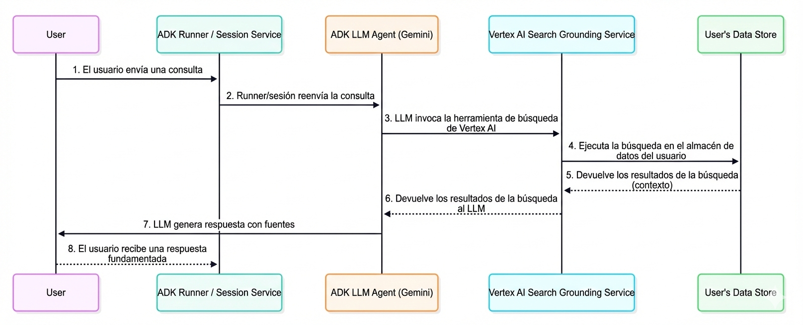

# Comprendiendo el Grounding con Vertex AI Search

<div class="language-support-tag">
  <span class="lst-supported">Supported in ADK</span><span class="lst-python">Python v0.1.0</span><span class="lst-typescript">TypeScript v0.2.0</span>
</div>

[Vertex AI Search](/adk-docs/tools/google-cloud/vertex-ai-search/) es una herramienta poderosa para el Agent Development Kit (ADK) que permite a los agentes de IA acceder a información de tus documentos empresariales privados y repositorios de datos. Al conectar tus agentes a contenido empresarial indexado, puedes proporcionar a los usuarios respuestas fundamentadas en la base de conocimiento de tu organización.

Esta característica es particularmente valiosa para consultas específicas de la empresa que requieren información de documentación interna, políticas, artículos de investigación o cualquier contenido propietario que haya sido indexado en tu datastore de [Vertex AI Search](https://cloud.google.com/enterprise-search). Cuando tu agente determina que se necesita información de tu base de conocimiento, automáticamente busca en tus documentos indexados e incorpora los resultados en su respuesta con la atribución apropiada.

## Lo Que Aprenderás

En esta guía, descubrirás:

- **Configuración Rápida**: Cómo crear y ejecutar un agente habilitado con Vertex AI Search desde cero
- **Arquitectura de Grounding**: El flujo de datos y proceso técnico detrás del grounding de documentos empresariales
- **Estructura de Respuesta**: Cómo interpretar respuestas fundamentadas y sus metadatos
- **Mejores Prácticas**: Directrices para mostrar citas y referencias de documentos a los usuarios

## Inicio Rápido de Grounding con Vertex AI Search

Este inicio rápido te guía a través de la creación de un agente ADK con la característica de grounding de Vertex AI Search. Este inicio rápido asume un IDE local (VS Code o PyCharm, etc.) con Python 3.10+ y acceso a terminal.

### 1. Preparar Vertex AI Search { #prepare-vertex-ai-search }

Si ya tienes un Data Store de Vertex AI Search y su ID de Data Store, puedes omitir esta sección. Si no, sigue las instrucciones en [Get started with custom search](https://cloud.google.com/generative-ai-app-builder/docs/try-enterprise-search#unstructured-data) hasta el final de [Create a data store](https://cloud.google.com/generative-ai-app-builder/docs/try-enterprise-search#create_a_data_store), seleccionando la pestaña `Unstructured data`. Con esta instrucción, construirás un Data Store de muestra con PDFs de informes de ganancias del [sitio de inversores de Alphabet](https://abc.xyz/).

Después de terminar la sección Crear un data store, abre [Data Stores](https://console.cloud.google.com/gen-app-builder/data-stores/) y selecciona el data store que creaste, y encuentra el `Data store ID`:


Anota este `Data store ID` ya que lo usaremos más adelante.

### 2. Configurar el Entorno e Instalar ADK { #set-up-environment-install-adk }

A continuación se muestran los pasos para configurar tu entorno e instalar el ADK tanto para proyectos de Python como de TypeScript.

=== "Python"

    Crear y Activar Entorno Virtual:

    ```bash
    # Crear
    python -m venv .venv

    # Activar (cada nueva terminal)
    # macOS/Linux: source .venv/bin/activate
    # Windows CMD: .venv\\Scripts\\activate.bat
    # Windows PowerShell: .venv\\Scripts\\Activate.ps1
    ```

    Instalar ADK:

    ```bash
    pip install google-adk
    ```

=== "TypeScript"

    Crear un nuevo proyecto Node.js:
    ```bash
    npm init -y
    ```

    Instalar ADK:
    ```bash
    npm install @google/adk
    ```

### 3. Crear Proyecto de Agente { #create-agent-project }

Bajo un directorio de proyecto, ejecuta los siguientes comandos:

=== "OS X &amp; Linux"
    ```bash
    # Paso 1: Crear un nuevo directorio para tu agente
    mkdir vertex_search_agent

    # Paso 2: Crear __init__.py para el agente
    echo "from . import agent" > vertex_search_agent/__init__.py

    # Paso 3: Crear un agent.py (la definición del agente) y .env (configuración de autenticación)
    touch vertex_search_agent/agent.py .env
    ```

=== "Windows"
    ```shell
    # Paso 1: Crear un nuevo directorio para tu agente
    mkdir vertex_search_agent

    # Paso 2: Crear __init__.py para el agente
    echo "from . import agent" > vertex_search_agent/__init__.py

    # Paso 3: Crear un agent.py (la definición del agente) y .env (configuración de autenticación)
    type nul > vertex_search_agent\agent.py
    type nul > google_search_agent\.env
    ```

#### Editar `agent.py`

Copia y pega el siguiente código en `agent.py`, y reemplaza `YOUR_PROJECT_ID` y `YOUR_DATASTORE_ID` en la parte de `Configuration` con tu ID de proyecto y ID de Data Store respectivamente:

```python title="vertex_search_agent/agent.py"
from google.adk.agents import Agent
from google.adk.tools import VertexAiSearchTool

# Configuración
DATASTORE_ID = "projects/YOUR_PROJECT_ID/locations/global/collections/default_collection/dataStores/YOUR_DATASTORE_ID"

root_agent = Agent(
    name="vertex_search_agent",
    model="gemini-2.5-flash",
    instruction="Answer questions using Vertex AI Search to find information from internal documents. Always cite sources when available.",
    description="Enterprise document search assistant with Vertex AI Search capabilities",
    tools=[VertexAiSearchTool(data_store_id=DATASTORE_ID)]
)
```

Ahora tendrías la siguiente estructura de directorio:

```console
my_project/
    vertex_search_agent/
        __init__.py
        agent.py
    .env
```

### 4. Configuración de Autenticación { #authentication-setup }

**Nota: Vertex AI Search requiere autenticación de Google Cloud Platform (Vertex AI). Google AI Studio no es compatible con esta herramienta.**

  * Configura el [gcloud CLI](https://cloud.google.com/vertex-ai/generative-ai/docs/start/quickstarts/quickstart-multimodal#setup-local)
  * Autentícate en Google Cloud, desde la terminal ejecutando `gcloud auth login`.
  * Abre el archivo **`.env`** y copia-pega el siguiente código y actualiza el ID del proyecto y la ubicación.

    ```env title=".env"
    GOOGLE_GENAI_USE_VERTEXAI=TRUE
    GOOGLE_CLOUD_PROJECT=YOUR_PROJECT_ID
    GOOGLE_CLOUD_LOCATION=LOCATION
    ```


### 5. Ejecutar Tu Agente { #run-your-agent }

Hay múltiples formas de interactuar con tu agente:

=== "Dev UI (adk web)"
    Ejecuta el siguiente comando para lanzar la **dev UI**.

    ```shell
    adk web
    ```

    !!!info "Nota para usuarios de Windows"

        Al encontrar el error `_make_subprocess_transport NotImplementedError`, considera usar `adk web --no-reload` en su lugar.


    **Paso 1:** Abre la URL proporcionada (usualmente `http://localhost:8000` o
    `http://127.0.0.1:8000`) directamente en tu navegador.

    **Paso 2.** En la esquina superior izquierda de la UI, puedes seleccionar tu agente en
    el menú desplegable. Selecciona "vertex_search_agent".

    !!!note "Solución de problemas"

        Si no ves "vertex_search_agent" en el menú desplegable, asegúrate de que
        estás ejecutando `adk web` en la **carpeta padre** de tu carpeta de agente
        (es decir, la carpeta padre de vertex_search_agent).

    **Paso 3.** Ahora puedes chatear con tu agente usando el cuadro de texto.

=== "Terminal (adk run)"

    Ejecuta el siguiente comando, para chatear con tu agente de Vertex AI Search.

    ```
    adk run vertex_search_agent
    ```
    Para salir, usa Cmd/Ctrl+C.

### Ejemplos de prompts para probar

Con esas preguntas, puedes confirmar que el agente está realmente llamando a Vertex AI Search
para obtener información de los informes de Alphabet:

* ¿Cuál es el ingreso de Google Cloud en el primer trimestre de 2022?
* ¿Qué hay sobre YouTube?


¡Has creado e interactuado exitosamente con tu agente de Vertex AI Search usando ADK!

## Cómo funciona el grounding con Vertex AI Search

El grounding con Vertex AI Search es el proceso que conecta tu agente a los documentos y datos indexados de tu organización, permitiéndole generar respuestas precisas basadas en contenido empresarial privado. Cuando el prompt de un usuario requiere información de tu base de conocimiento interna, el LLM subyacente del agente decide inteligentemente invocar la `VertexAiSearchTool` para encontrar hechos relevantes de tus documentos indexados.

### **Diagrama de Flujo de Datos**

Este diagrama ilustra el proceso paso a paso de cómo una consulta de usuario resulta en una respuesta fundamentada.



### **Descripción Detallada**

El agente de grounding utiliza el flujo de datos descrito en el diagrama para recuperar, procesar e incorporar información empresarial en la respuesta final presentada al usuario.

1. **Consulta del Usuario**: Un usuario final interactúa con tu agente haciendo una pregunta sobre documentos internos o datos empresariales.

2. **Orquestación de ADK**: El Agent Development Kit orquesta el comportamiento del agente y pasa el mensaje del usuario al núcleo de tu agente.

3. **Análisis del LLM y Llamada de Herramientas**: El LLM del agente (por ejemplo, un modelo Gemini) analiza el prompt. Si determina que se requiere información de tus documentos indexados, activa el mecanismo de grounding llamando a la VertexAiSearchTool. Esto es ideal para responder consultas sobre políticas de la empresa, documentación técnica o investigación propietaria.

4. **Interacción con el Servicio de Vertex AI Search**: La VertexAiSearchTool interactúa con tu datastore configurado de Vertex AI Search, que contiene tus documentos empresariales indexados. El servicio formula y ejecuta consultas de búsqueda contra tu contenido privado.

5. **Recuperación y Clasificación de Documentos**: Vertex AI Search recupera y clasifica los fragmentos de documentos más relevantes de tu datastore basándose en similitud semántica y puntuación de relevancia.

6. **Inyección de Contexto**: El servicio de búsqueda integra los fragmentos de documentos recuperados en el contexto del modelo antes de que se genere la respuesta final. Este paso crucial permite al modelo "razonar" sobre los datos factuales de tu organización.

7. **Generación de Respuesta Fundamentada**: El LLM, ahora informado por contenido empresarial relevante, genera una respuesta que incorpora la información recuperada de tus documentos.

8. **Presentación de Respuesta con Fuentes**: El ADK recibe la respuesta fundamentada final, que incluye las referencias de documentos fuente necesarias y groundingMetadata, y la presenta al usuario con atribución. Esto permite a los usuarios finales verificar la información contra tus fuentes empresariales.

## Comprendiendo la respuesta de grounding con Vertex AI Search

Cuando el agente usa Vertex AI Search para fundamentar una respuesta, devuelve información detallada que incluye la respuesta de texto final y metadatos sobre los documentos utilizados para generar esa respuesta. Estos metadatos son cruciales para verificar la respuesta y proporcionar atribución a tus fuentes empresariales.

### Ejemplo de una Respuesta Fundamentada

Lo siguiente es un ejemplo del objeto de contenido devuelto por el modelo después de una consulta fundamentada contra documentos empresariales.

**Texto de Respuesta Final:**

```
"Desarrollar modelos para un escriba médico presenta varios desafíos significativos, principalmente debido a la naturaleza compleja de la documentación médica, los datos sensibles involucrados y los requisitos exigentes de los flujos de trabajo clínicos. Los desafíos clave incluyen: **Precisión y Confiabilidad:** La documentación médica requiere niveles extremadamente altos de precisión, ya que los errores pueden llevar a diagnósticos incorrectos, tratamientos incorrectos y repercusiones legales. Asegurar que los modelos de IA puedan capturar de manera confiable el lenguaje médico matizado, distinguir entre información subjetiva y objetiva, y transcribir con precisión las interacciones médico-paciente es un gran obstáculo. **Comprensión del Lenguaje Natural (NLU) y Reconocimiento de Voz:** Las conversaciones médicas son a menudo rápidas, involucran jerga altamente especializada, acrónimos y abreviaturas, y pueden ser habladas por individuos con diversos acentos o patrones de habla... [la respuesta continúa con análisis detallado de privacidad, integración y desafíos técnicos]"
```

**Fragmento de Metadatos de Grounding:**

Estos son los metadatos de grounding que recibirás. En `adk web`, puedes encontrar esto en la pestaña `Response`:

```json
{
  "groundingMetadata": {
    "groundingChunks": [
      {
        "document": {
          "title": "AI in Medical Scribing: Technical Challenges",
          "uri": "projects/your-project/locations/global/dataStores/your-datastore-id/documents/doc-medical-scribe-ai-tech-challenges",
          "id": "doc-medical-scribe-ai-tech-challenges"
        }
      },
      {
        "document": {
          "title": "Regulatory and Ethical Hurdles for AI in Healthcare",
          "uri": "projects/your-project/locations/global/dataStores/your-datastore-id/documents/doc-ai-healthcare-ethics",
          "id": "doc-ai-healthcare-ethics"
        }
      }
      // ... documentos adicionales
    ],
    "groundingSupports": [
      {
        "groundingChunkIndices": [0, 1],
        "segment": {
          "endIndex": 637,
          "startIndex": 433,
          "text": "Asegurar que los modelos de IA puedan capturar de manera confiable el lenguaje médico matizado..."
        }
      }
      // ... soportes adicionales que vinculan segmentos de texto a documentos fuente
    ],
    "retrievalQueries": [
      "challenges in natural language processing medical domain",
      "AI medical scribe challenges",
      "difficulties in developing AI for medical scribes"
      // ... consultas de búsqueda adicionales ejecutadas
    ]
  }
}
```

### Cómo Interpretar la Respuesta

Los metadatos proporcionan un vínculo entre el texto generado por el modelo y los documentos empresariales que lo respaldan. Aquí hay un desglose paso a paso:

- **groundingChunks**: Esta es una lista de los documentos empresariales que el modelo consultó. Cada fragmento contiene el título del documento, uri (ruta del documento) e id.

- **groundingSupports**: Esta lista conecta oraciones específicas en la respuesta final con los `groundingChunks`.

- **segment**: Este objeto identifica una porción específica de la respuesta de texto final, definida por su `startIndex`, `endIndex` y el `text` en sí.

- **groundingChunkIndices**: Este arreglo contiene los números de índice que corresponden a las fuentes listadas en los `groundingChunks`. Por ejemplo, el texto sobre "cumplimiento de HIPAA" está respaldado por información de `groundingChunks` en el índice 1 (el documento "Regulatory and Ethical Hurdles").

- **retrievalQueries**: Este arreglo muestra las consultas de búsqueda específicas que se ejecutaron contra tu datastore para encontrar información relevante.

## Cómo mostrar respuestas de grounding con Vertex AI Search

A diferencia del grounding de Google Search, el grounding de Vertex AI Search no requiere componentes de visualización específicos. Sin embargo, mostrar citas y referencias de documentos genera confianza y permite a los usuarios verificar la información contra las fuentes autorizadas de tu organización.

### Visualización de Citas Opcional

Dado que se proporcionan metadatos de grounding, puedes elegir implementar visualizaciones de citas según las necesidades de tu aplicación:

**Visualización de Texto Simple (Implementación Mínima):**

```python
for event in events:
    if event.is_final_response():
        print(event.content.parts[0].text)

        # Opcional: Mostrar cantidad de fuentes
        if event.grounding_metadata:
            print(f"\nBasado en {len(event.grounding_metadata.grounding_chunks)} documentos")
```

**Visualización de Citas Mejorada (Opcional):** Puedes implementar citas interactivas que muestren qué documentos respaldan cada declaración. Los metadatos de grounding proporcionan toda la información necesaria para mapear segmentos de texto a documentos fuente.

### Consideraciones de Implementación

Al implementar visualizaciones de grounding de Vertex AI Search:

1. **Acceso a Documentos**: Verifica los permisos de usuario para documentos referenciados
2. **Integración Simple**: La salida de texto básica no requiere lógica de visualización adicional
3. **Mejoras Opcionales**: Agrega citas solo si tu caso de uso se beneficia de la atribución de fuentes
4. **Enlaces de Documentos**: Convierte URIs de documentos en enlaces internos accesibles cuando sea necesario
5. **Consultas de Búsqueda**: El arreglo retrievalQueries muestra qué búsquedas se realizaron contra tu datastore

## Resumen

El Grounding con Vertex AI Search transforma agentes de IA de asistentes de propósito general en sistemas de conocimiento específicos de la empresa capaces de proporcionar información precisa y atribuida a fuentes de los documentos privados de tu organización. Al integrar esta característica en tus agentes ADK, les permites:

- Acceder a información propietaria de tus repositorios de documentos indexados
- Proporcionar atribución de fuentes para transparencia y confianza
- Entregar respuestas completas con hechos empresariales verificables
- Mantener la privacidad de datos dentro de tu entorno de Google Cloud

El proceso de grounding conecta sin problemas las consultas de usuarios con la base de conocimiento de tu organización, enriqueciendo las respuestas con contexto relevante de tus documentos privados mientras mantiene el flujo conversacional. Con la implementación adecuada, tus agentes se convierten en herramientas poderosas para el descubrimiento de información empresarial y la toma de decisiones.