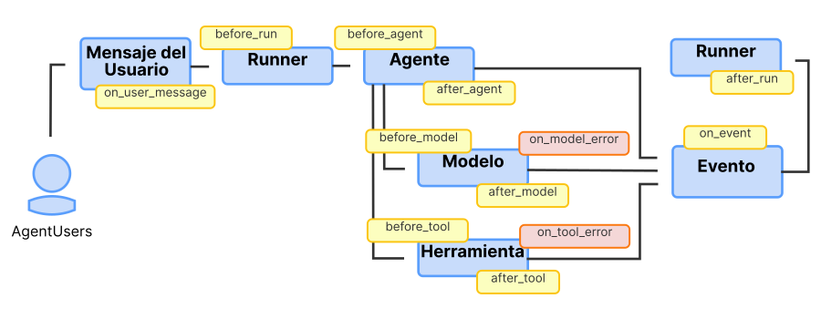

# Plugins

<div class="language-support-tag">
    <span class="lst-supported">Soportado en ADK</span><span class="lst-python">Python v1.7.0</span>
</div>

Un Plugin en Agent Development Kit (ADK) es un módulo de código personalizado que puede ser
ejecutado en varias etapas del ciclo de vida del flujo de trabajo de un agente utilizando callback hooks.
Utilizas Plugins para funcionalidad que es aplicable a través de tu flujo de trabajo de agente.
Algunas aplicaciones típicas de Plugins son las siguientes:

-   **Registro y rastreo**: Crea registros detallados de la actividad del agente, herramientas y
    modelo de IA generativa para depuración y análisis de rendimiento.
-   **Aplicación de políticas**: Implementa barreras de seguridad, como una
    función que verifica si los usuarios están autorizados para usar una herramienta específica y
    previene su ejecución si no tienen permiso.
-   **Monitoreo y métricas**: Recopila y exporta métricas sobre uso de tokens,
    tiempos de ejecución y conteos de invocaciones a sistemas de monitoreo como
    Prometheus o
    [Google Cloud Observability](https://cloud.google.com/stackdriver/docs)
    (anteriormente Stackdriver).
-   **Caché de respuestas**: Verifica si una solicitud se ha hecho antes, para que puedas
    devolver una respuesta en caché, omitiendo llamadas costosas o que consumen mucho tiempo al modelo de IA
    o herramientas.
-   **Modificación de solicitudes o respuestas**: Agrega dinámicamente información a los
    prompts del modelo de IA o estandariza las respuestas de salida de herramientas.

!!! tip
    Al implementar barreras de seguridad y políticas, usa Plugins de ADK para
    mejor modularidad y flexibilidad que con Callbacks. Para más detalles, consulta
    [Callbacks y Plugins para Barreras de Seguridad](/adk-docs/safety/#callbacks-and-plugins-for-security-guardrails).

!!! warning "Precaución"
    Los Plugins no son soportados por la
    [interfaz web de ADK](../evaluate/index.md#1-adk-web-run-evaluations-via-the-web-ui).
    Si tu flujo de trabajo de ADK usa Plugins, debes ejecutar tu flujo de trabajo sin la
    interfaz web.

## ¿Cómo funcionan los Plugins?

Un Plugin de ADK extiende la clase `BasePlugin` y contiene uno o más
métodos `callback`, indicando dónde en el ciclo de vida del agente el Plugin debe ser
ejecutado. Integras Plugins en un agente registrándolos en la
clase `Runner` de tu agente. Para más información sobre cómo y dónde puedes activar
Plugins en tu aplicación de agente, consulta
[Plugin callback hooks](#plugin-callback-hooks).

La funcionalidad de Plugin se construye sobre
[Callbacks](../callbacks/index.md), que es un elemento de diseño clave
de la arquitectura extensible del ADK. Mientras que un Callback de Agente típico está
configurado en un *único agente, una única herramienta* para una *tarea específica*, un Plugin está
registrado *una vez* en el `Runner` y sus callbacks se aplican *globalmente* a cada
agente, herramienta y llamada LLM gestionada por ese runner. Los Plugins te permiten empaquetar
funciones de callback relacionadas para ser usadas a través de un flujo de trabajo. Esto hace
a los Plugins una solución ideal para implementar características que cruzan toda tu
aplicación de agente.

## Plugins Preconstruidos

ADK incluye varios plugins que puedes agregar a tus flujos de trabajo de agente
inmediatamente:

*   [**Reflect and Retry Tools**](/adk-docs/plugins/reflect-and-retry/):
    Rastrea fallos de herramientas e intenta nuevamente las solicitudes de herramientas de manera inteligente.
*   [**BigQuery Analytics**](/adk-docs/observability/bigquery-agent-analytics/):
    Habilita el registro y análisis de agentes con BigQuery.
*   [**Context Filter**](https://github.com/google/adk-python/blob/main/src/google/adk/plugins/context_filter_plugin.py):
    Filtra el contexto de IA generativa para reducir su tamaño.
*   [**Global Instruction**](https://github.com/google/adk-python/blob/main/src/google/adk/plugins/global_instruction_plugin.py):
    Plugin que proporciona funcionalidad de instrucciones globales a nivel de App.
*   [**Save Files as Artifacts**](https://github.com/google/adk-python/blob/main/src/google/adk/plugins/save_files_as_artifacts_plugin.py):
    Guarda archivos incluidos en mensajes de usuario como Artefactos.
*   [**Logging**](https://github.com/google/adk-python/blame/main/src/google/adk/plugins/logging_plugin.py):
    Registra información importante en cada punto de callback del flujo de trabajo del agente.

## Definir y registrar Plugins

Esta sección explica cómo definir clases de Plugin y registrarlas como parte de
tu flujo de trabajo de agente. Para un ejemplo de código completo, consulta
[Plugin Basic](https://github.com/google/adk-python/tree/main/contributing/samples/plugin_basic)
en el repositorio.

### Crear clase Plugin

Comienza extendiendo la clase `BasePlugin` y agrega uno o más métodos `callback`,
como se muestra en el siguiente ejemplo de código:

=== "Python"

    ```py title="count_plugin.py"
    from google.adk.agents.base_agent import BaseAgent
    from google.adk.agents.callback_context import CallbackContext
    from google.adk.models.llm_request import LlmRequest
    from google.adk.plugins.base_plugin import BasePlugin

    class CountInvocationPlugin(BasePlugin):
    """Un plugin personalizado que cuenta invocaciones de agente y herramienta."""

    def __init__(self) -> None:
        """Inicializa el plugin con contadores."""
        super().__init__(name="count_invocation")
        self.agent_count: int = 0
        self.tool_count: int = 0
        self.llm_request_count: int = 0

    async def before_agent_callback(
        self, *, agent: BaseAgent, callback_context: CallbackContext
    ) -> None:
        """Cuenta ejecuciones de agente."""
        self.agent_count += 1
        print(f"[Plugin] Agent run count: {self.agent_count}")

    async def before_model_callback(
        self, *, callback_context: CallbackContext, llm_request: LlmRequest
    ) -> None:
        """Cuenta solicitudes LLM."""
        self.llm_request_count += 1
        print(f"[Plugin] LLM request count: {self.llm_request_count}")
    ```

=== "Typescript"

    ```typescript title="count_plugin.ts"
    import { BaseAgent, BasePlugin, CallbackContext } from "@google/adk";
    import type { LlmRequest, LlmResponse } from "@google/adk";
    import type { Content } from "@google/genai";


    /**
     * Un plugin personalizado que cuenta invocaciones de agente y herramienta.
     */
    export class CountInvocationPlugin extends BasePlugin {
        public agentCount = 0;
        public toolCount = 0;
        public llmRequestCount = 0;

        constructor() {
            super("count_invocation");
        }

        /**
         * Cuenta ejecuciones de agente.
         */
        async beforeAgentCallback(
            agent: BaseAgent,
            callbackContext: CallbackContext
        ): Promise<Content | undefined> {
            this.agentCount++;
            console.log(`[Plugin] Agent run count: ${this.agentCount}`);
            return undefined;
        }

        /**
         * Cuenta solicitudes LLM.
         */
        async beforeModelCallback(
            callbackContext: CallbackContext,
            llmRequest: LlmRequest
        ): Promise<LlmResponse | undefined> {
            this.llmRequestCount++;
            console.log(`[Plugin] LLM request count: ${this.llmRequestCount}`);
            return undefined;
        }
    }    
    ```

Este código de ejemplo implementa callbacks para `before_agent_callback` y
`before_model_callback` para contar la ejecución de estas tareas durante el ciclo de vida
del agente.

### Registrar clase Plugin

Integra tu clase Plugin registrándola durante la inicialización de tu agente
como parte de tu clase `Runner`, usando el parámetro `plugins`. Puedes especificar
múltiples Plugins con este parámetro. El siguiente ejemplo de código muestra cómo
registrar el plugin `CountInvocationPlugin` definido en la sección anterior con
un agente ADK simple.

=== "Python"

    ```py
    from google.adk.runners import InMemoryRunner
    from google.adk import Agent
    from google.adk.tools.tool_context import ToolContext
    from google.genai import types
    import asyncio

    # Importa el plugin.
    from .count_plugin import CountInvocationPlugin

    async def hello_world(tool_context: ToolContext, query: str):
    print(f'Hello world: query is [{query}]')

    root_agent = Agent(
        model='gemini-2.0-flash',
        name='hello_world',
        description='Prints hello world with user query.',
        instruction="""Use hello_world tool to print hello world and user query.
        """,
        tools=[hello_world],
    )

    async def main():
    """Punto de entrada principal para el agente."""
    prompt = 'hello world'
    runner = InMemoryRunner(
        agent=root_agent,
        app_name='test_app_with_plugin',

        # Agrega tu plugin aquí. Puedes agregar múltiples plugins.
        plugins=[CountInvocationPlugin()],
    )

    # El resto es igual que iniciar un runner ADK regular.
    session = await runner.session_service.create_session(
        user_id='user',
        app_name='test_app_with_plugin',
    )

    async for event in runner.run_async(
        user_id='user',
        session_id=session.id,
        new_message=types.Content(
            role='user', parts=[types.Part.from_text(text=prompt)]
        )
    ):
        print(f'** Got event from {event.author}')

    if __name__ == "__main__":
    asyncio.run(main())
    ```

=== "Typescript"

    ```typescript
    import { InMemoryRunner, LlmAgent, FunctionTool } from "@google/adk";
    import type { Content } from "@google/genai";
    import { z } from "zod";

    // Importa el plugin.
    import { CountInvocationPlugin } from "./count_plugin.ts";

    const HelloWorldInput = z.object({
        query: z.string().describe("The query string to print."),
    });

    async function helloWorld({ query }: z.infer<typeof HelloWorldInput>): Promise<{ result: string }> {
        const output = `Hello world: query is [${query}]`;
        console.log(output);
        // Tools should return a string or JSON-compatible object
        return { result: output };
    }

    const helloWorldTool = new FunctionTool({
        name: "hello_world",
        description: "Prints hello world with user query.",
        parameters: HelloWorldInput,
        execute: helloWorld,
    });

    const rootAgent = new LlmAgent({
        model: "gemini-2.5-flash", // Preserved from your Python code
        name: "hello_world",
        description: "Prints hello world with user query.",
        instruction: `Use hello_world tool to print hello world and user query.`,
        tools: [helloWorldTool],
    });

    /**
    * Punto de entrada principal para el agente.
    */
    async function main(): Promise<void> {
        const prompt = "hello world";
        const runner = new InMemoryRunner({
            agent: rootAgent,
            appName: "test_app_with_plugin",

            // Agrega tu plugin aquí. Puedes agregar múltiples plugins.
            plugins: [new CountInvocationPlugin()],
        });

        // El resto es igual que iniciar un runner ADK regular.
        const session = await runner.sessionService.createSession({
            userId: "user",
            appName: "test_app_with_plugin",
        });

        // runAsync returns an async iterable stream in TypeScript
        const runStream = runner.runAsync({
            userId: "user",
            sessionId: session.id,
            newMessage: {
            role: "user",
            parts: [{ text: prompt }],
            },
        });

        // Use 'for await...of' to loop through the async stream
        for await (const event of runStream) {
            console.log(`** Got event from ${event.author}`);
        }
    }

    main();
    ```

### Ejecutar el agente con el Plugin

Ejecuta el plugin como lo harías típicamente. Lo siguiente muestra cómo ejecutar el
comando en línea:

=== "Python"

    ```sh
    python3 -m path.to.main.py
    ```

=== "Typescript"

    ```sh
    npx ts-node path.to.main.ts
    ```

Los Plugins no son soportados por la
[interfaz web de ADK](../evaluate/index.md#1-adk-web-run-evaluations-via-the-web-ui).
Si tu flujo de trabajo de ADK usa Plugins, debes ejecutar tu flujo de trabajo sin la
interfaz web.

La salida de este agente descrito previamente debería verse similar a lo
siguiente:

```log
[Plugin] Agent run count: 1
[Plugin] LLM request count: 1
** Got event from hello_world
Hello world: query is [hello world]
** Got event from hello_world
[Plugin] LLM request count: 2
** Got event from hello_world
```


Para más información sobre ejecutar agentes ADK, consulta la guía
[Inicio Rápido](/adk-docs/get-started/quickstart/#run-your-agent).

## Construir flujos de trabajo con Plugins

Los callback hooks de Plugin son un mecanismo para implementar lógica que intercepta,
modifica e incluso controla el ciclo de vida de ejecución del agente. Cada hook es un
método específico en tu clase Plugin que puedes implementar para ejecutar código en un momento
clave. Tienes una elección entre dos modos de operación basados en el valor de retorno de tu hook:

-   **Para Observar:** Implementa un hook sin valor de retorno (`None`). Este
    enfoque es para tareas como registro o recopilación de métricas, ya que permite
    que el flujo de trabajo del agente proceda al siguiente paso sin interrupción. Por
    ejemplo, podrías usar `after_tool_callback` en un Plugin para registrar el resultado de cada
    herramienta para depuración.
-   **Para Intervenir:** Implementa un hook y devuelve un valor. Este enfoque
    hace un cortocircuito del flujo de trabajo. El `Runner` detiene el procesamiento, omite cualquier
    plugin subsiguiente y la acción original prevista, como una llamada al Model, y
    usa el valor de retorno del callback del Plugin como resultado. Un caso de uso común es
    implementar `before_model_callback` para devolver un `LlmResponse` en caché,
    previniendo una llamada API redundante y costosa.
-   **Para Modificar:** Implementa un hook y modifica el objeto Context. Este
    enfoque te permite modificar los datos de contexto para que el módulo sea
    ejecutado sin interrumpir de otra manera la ejecución de ese módulo. Por
    ejemplo, agregar texto de prompt adicional y estandarizado para la ejecución del objeto Model.

**Precaución:** Las funciones de callback de Plugin tienen precedencia sobre los callbacks
implementados a nivel de objeto. Este comportamiento significa que cualquier código de callbacks de Plugin
se ejecuta *antes* de que se ejecute cualquier callback de objetos Agent, Model o Tool.
Además, si un callback de agente a nivel de Plugin devuelve cualquier valor, y
no una respuesta vacía (`None`), el callback a nivel de Agent, Model o Tool *no se
ejecuta* (se omite).

El diseño de Plugin establece una jerarquía de ejecución de código y separa
preocupaciones globales de la lógica local del agente. Un Plugin es el *módulo* con estado que
construyes, como `PerformanceMonitoringPlugin`, mientras que los callback hooks son las
*funciones* específicas dentro de ese módulo que se ejecutan. Esta arquitectura
difiere fundamentalmente de los Callbacks de Agente estándar en estas formas críticas:

-   **Alcance:** Los hooks de Plugin son *globales*. Registras un Plugin una vez en el
    `Runner`, y sus hooks se aplican universalmente a cada Agent, Model y Tool
    que gestiona. En contraste, los Callbacks de Agente son *locales*, configurados
    individualmente en una instancia específica de agente.
-   **Orden de Ejecución:** Los Plugins tienen *precedencia*. Para cualquier evento dado, los
    hooks de Plugin siempre se ejecutan antes que cualquier Callback de Agente correspondiente. Este
    comportamiento del sistema hace que los Plugins sean la opción arquitectónica correcta para
    implementar características transversales como políticas de seguridad, caché universal
    y registro consistente a través de toda tu aplicación.

### Callbacks de Agente y Plugins

Como se mencionó en la sección anterior, hay algunas similitudes funcionales
entre Plugins y Callbacks de Agente. La siguiente tabla compara las
diferencias entre Plugins y Callbacks de Agente con más detalle.

<table>
  <thead>
    <tr>
      <th></th>
      <th><strong>Plugins</strong></th>
      <th><strong>Callbacks de Agente</strong></th>
    </tr>
  </thead>
  <tbody>
    <tr>
      <td><strong>Alcance</strong></td>
      <td><strong>Global</strong>: Se aplica a todos los agentes/herramientas/LLMs en el
<code>Runner</code>.</td>
      <td><strong>Local</strong>: Se aplica solo a la instancia específica de agente
en la que están configurados.</td>
    </tr>
    <tr>
      <td><strong>Caso de Uso Principal</strong></td>
      <td><strong>Características Horizontales</strong>: Registro, política, monitoreo,
caché global.</td>
      <td><strong>Lógica Específica de Agente</strong>: Modificar el comportamiento o
estado de un único agente.</td>
    </tr>
    <tr>
      <td><strong>Configuración</strong></td>
      <td>Configura una vez en el <code>Runner</code>.</td>
      <td>Configura individualmente en cada instancia <code>BaseAgent</code>.</td>
    </tr>
    <tr>
      <td><strong>Orden de Ejecución</strong></td>
      <td>Los callbacks de Plugin se ejecutan <strong>antes</strong> que los Callbacks de Agente.</td>
      <td>Los callbacks de agente se ejecutan <strong>después</strong> de los callbacks de Plugin.</td>
    </tr>
  </tbody>
</table>

## Plugin callback hooks

Defines cuándo se llama un Plugin con las funciones de callback para definir en
tu clase Plugin. Los Callbacks están disponibles cuando se recibe un mensaje de usuario,
antes y después de que se llame un `Runner`, `Agent`, `Model` o `Tool`, para
`Events`, y cuando ocurre un error de `Model` o `Tool`. Estos callbacks incluyen,
y tienen precedencia sobre, cualquier callback definido dentro de tus clases Agent, Model
y Tool.

El siguiente diagrama ilustra puntos de callback donde puedes adjuntar y ejecutar
funcionalidad de Plugin durante el flujo de trabajo de tus agentes:


**Figura 1.** Diagrama del flujo de trabajo del agente ADK con ubicaciones de callback hook de
Plugin.

Las siguientes secciones describen los callback hooks disponibles para Plugins con
más detalle.

-   [Callbacks de Mensaje de Usuario](#user-message-callbacks)
-   [Callbacks de inicio de Runner](#runner-start-callbacks)
-   [Callbacks de ejecución de Agent](#agent-execution-callbacks)
-   [Callbacks de Model](#model-callbacks)
-   [Callbacks de Tool](#tool-callbacks)
-   [Callbacks de fin de Runner](#runner-end-callbacks)

### Callbacks de Mensaje de Usuario

Un callback de *Mensaje de Usuario* (`on_user_message_callback`) ocurre cuando un usuario
envía un mensaje. El `on_user_message_callback` es el primer hook en ejecutarse,
dándote la oportunidad de inspeccionar o modificar la entrada inicial.\

-   **Cuándo Se Ejecuta:** Este callback ocurre inmediatamente después de
    `runner.run()`, antes de cualquier otro procesamiento.
-   **Propósito:** La primera oportunidad para inspeccionar o modificar la entrada bruta
    del usuario.
-   **Control de Flujo:** Devuelve un objeto `types.Content` para **reemplazar** el
    mensaje original del usuario.

El siguiente ejemplo de código muestra la sintaxis básica de este callback:

=== "Python"

    ```py
    async def on_user_message_callback(
        self,
        *,
        invocation_context: InvocationContext,
        user_message: types.Content,
    ) -> Optional[types.Content]:
    ```

=== "Typescript"

    ```typescript
    async onUserMessageCallback(
        invocationContext: InvocationContext,
        user_message: Content
    ): Promise<Content | undefined> {
      // Tu implementación aquí
    }
    ```

### Callbacks de inicio de Runner

Un callback de *inicio de Runner* (`before_run_callback`) ocurre cuando el objeto `Runner`
toma el mensaje de usuario potencialmente modificado y se prepara para la ejecución.
El `before_run_callback` se dispara aquí, permitiendo configuración global antes de que comience cualquier lógica
de agente.

-   **Cuándo Se Ejecuta:** Inmediatamente después de que se llama `runner.run()`, antes de
    cualquier otro procesamiento.
-   **Propósito:** La primera oportunidad para inspeccionar o modificar la entrada bruta
    del usuario.
-   **Control de Flujo:** Devuelve un objeto `types.Content` para **reemplazar** el
    mensaje original del usuario.

El siguiente ejemplo de código muestra la sintaxis básica de este callback:

=== "Python"

    ```py
    async def before_run_callback(
        self, *, invocation_context: InvocationContext
    ) -> Optional[types.Content]:
    ```

=== "Typescript"

    ```typescript
    async beforeRunCallback(invocationContext: InvocationContext): Promise<Content | undefined> {
      // Tu implementación aquí
    }
    ```

### Callbacks de ejecución de Agent

Los callbacks de *ejecución de Agent* (`before_agent`, `after_agent`) ocurren cuando un
objeto `Runner` invoca un agente. El `before_agent_callback` se ejecuta inmediatamente
antes de que comience el trabajo principal del agente. El trabajo principal abarca todo el proceso del agente
para manejar la solicitud, que podría involucrar llamar a modelos o
herramientas. Después de que el agente ha terminado todos sus pasos y preparado un resultado, el
`after_agent_callback` se ejecuta.

**Precaución:** Los Plugins que implementan estos callbacks se ejecutan *antes* de que se ejecuten
los callbacks a nivel de Agent. Además, si un callback de agente a nivel de Plugin
devuelve algo distinto de una respuesta `None` o null, el callback a nivel de Agent *no se
ejecuta* (se omite).

Para más información sobre Callbacks de Agent definidos como parte de un objeto Agent,
consulta
[Tipos de Callbacks](../callbacks/types-of-callbacks.md#agent-lifecycle-callbacks).

### Callbacks de Model

Los callbacks de Model **(`before_model`, `after_model`, `on_model_error`)** ocurren
antes y después de que se ejecuta un objeto Model. La característica de Plugins también soporta un
callback en caso de error, como se detalla a continuación:

-   Si un agente necesita llamar a un modelo de IA, `before_model_callback` se ejecuta primero.
-   Si la llamada al modelo es exitosa, `after_model_callback` se ejecuta a continuación.
-   Si la llamada al modelo falla con una excepción, el `on_model_error_callback`
    se activa en su lugar, permitiendo una recuperación elegante.

**Precaución:** Los Plugins que implementan los métodos de callback **`before_model`** y `**after_model`
**se ejecutan *antes* de que se ejecuten los callbacks a nivel de Model.
Además, si un callback de modelo a nivel de Plugin devuelve algo distinto de una
respuesta `None` o null, el callback a nivel de Model *no se ejecuta* (se omite).

#### Detalles del callback on error de Model

El callback on error para objetos Model solo es soportado por la característica de Plugins
y funciona de la siguiente manera:

-   **Cuándo Se Ejecuta:** Cuando se genera una excepción durante la llamada al modelo.
-   **Casos de Uso Comunes:** Manejo de errores elegante, registro del error específico
    o devolución de una respuesta alternativa, como "El servicio de IA está
    actualmente no disponible."
-   **Control de Flujo:**
    -   Devuelve un objeto `LlmResponse` para **suprimir la excepción**
        y proporcionar un resultado alternativo.
    -   Devuelve `None` para permitir que se genere la excepción original.

**Nota**: Si la ejecución del objeto Model devuelve un `LlmResponse`, el
sistema reanuda el flujo de ejecución, y `after_model_callback` se activará
normalmente.****

El siguiente ejemplo de código muestra la sintaxis básica de este callback:

=== "Python"

    ```py
    async def on_model_error_callback(
        self,
        *,
        callback_context: CallbackContext,
        llm_request: LlmRequest,
        error: Exception,
    ) -> Optional[LlmResponse]:
    ```

=== "Typescript"

    ```typescript
    async onModelErrorCallback(
        callbackContext: CallbackContext,
        llmRequest: LlmRequest,
        error: Error
    ): Promise<LlmResponse | undefined> {
        // Tu implementación aquí
    }  
    ```

### Callbacks de Tool

Los callbacks de Tool **(`before_tool`, `after_tool`, `on_tool_error`)** para Plugins
ocurren antes o después de la ejecución de una herramienta, o cuando ocurre un error. La
característica de Plugins también soporta un callback en caso de error, como se detalla
a continuación:\

-   Cuando un agente ejecuta una Tool, `before_tool_callback` se ejecuta primero.
-   Si la herramienta se ejecuta exitosamente, `after_tool_callback` se ejecuta a continuación.
-   Si la herramienta genera una excepción, el `on_tool_error_callback` se
    activa en su lugar, dándote la oportunidad de manejar la falla. Si
    `on_tool_error_callback` devuelve un dict, `after_tool_callback` se
    activará normalmente.

**Precaución:** Los Plugins que implementan estos callbacks se ejecutan *antes* de que se ejecuten
los callbacks a nivel de Tool. Además, si un callback de herramienta a nivel de Plugin
devuelve algo distinto de una respuesta `None` o null, el callback a nivel de Tool
*no se ejecuta* (se omite).

#### Detalles del callback on error de Tool

El callback on error para objetos Tool solo es soportado por la característica de Plugins y
funciona de la siguiente manera:

-   **Cuándo Se Ejecuta:** Cuando se genera una excepción durante la ejecución del
    método `run` de una herramienta.
-   **Propósito:** Capturar excepciones específicas de herramientas (como `APIError`),
    registrar la falla y proporcionar un mensaje de error amigable de vuelta al
    LLM.
-   **Control de Flujo:** Devuelve un `dict` para **suprimir la excepción**, proporcionar
    un resultado alternativo. Devuelve `None` para permitir que se genere la excepción original.

**Nota**: Al devolver un `dict`, esto reanuda el flujo de ejecución, y
`after_tool_callback` se activará normalmente.

El siguiente ejemplo de código muestra la sintaxis básica de este callback:

=== "Python"
    ```py
    async def on_tool_error_callback(
        self,
        *,
        tool: BaseTool,
        tool_args: dict[str, Any],
        tool_context: ToolContext,
        error: Exception,
    ) -> Optional[dict]:
    ```

=== "Typescript"

    ```typescript
    async onToolErrorCallback(
        tool: BaseTool,
        toolArgs: { [key: string]: any },
        toolContext: ToolContext,
        error: Error
    ): Promise<{ [key:string]: any } | undefined> {
        // Tu implementación aquí
    }    
    ```

### Callbacks de Event

Un callback de *Event* (`on_event_callback`) ocurre cuando un agente produce
salidas como una respuesta de texto o un resultado de llamada a herramienta, las produce como objetos `Event`.
El `on_event_callback` se dispara para cada evento, permitiéndote modificarlo
antes de que se transmita al cliente.

-   **Cuándo Se Ejecuta:** Después de que un agente produce un `Event` pero antes de que se envíe
    al usuario. La ejecución de un agente puede producir múltiples eventos.
-   **Propósito:** Útil para modificar o enriquecer eventos (por ejemplo, agregar
    metadatos) o para activar efectos secundarios basados en eventos específicos.
-   **Control de Flujo:** Devuelve un objeto `Event` para **reemplazar** el
    evento original.

El siguiente ejemplo de código muestra la sintaxis básica de este callback:

=== "Python"

    ```py
    async def on_event_callback(
        self, *, invocation_context: InvocationContext, event: Event
    ) -> Optional[Event]:
    ```

=== "Typescript"

    ```typescript
    async onEventCallback(
        invocationContext: InvocationContext,
        event: Event
    ): Promise<Event | undefined> {
        // Tu implementación aquí
    }    
    ```

### Callbacks de fin de Runner

El callback de *fin de Runner* **(`after_run_callback`)** ocurre cuando el agente ha
terminado todo su proceso y todos los eventos han sido manejados, el `Runner`
completa su ejecución. El `after_run_callback` es el hook final, perfecto para
limpieza e informes finales.

-   **Cuándo Se Ejecuta:** Después de que el `Runner` completa totalmente la ejecución de una
    solicitud.
-   **Propósito:** Ideal para tareas de limpieza global, como cerrar conexiones
    o finalizar registros y datos de métricas.
-   **Control de Flujo:** Este callback es solo para limpieza y no puede alterar
    el resultado final.

El siguiente ejemplo de código muestra la sintaxis básica de este callback:

=== "Python"

    ```py
    async def after_run_callback(
        self, *, invocation_context: InvocationContext
    ) -> Optional[None]:
    ```

=== "Typescript"

    ```typescript
    async afterRunCallback(invocationContext: InvocationContext): Promise<void> {
        // Tu implementación aquí
    }    
    ```

## Próximos pasos

Consulta estos recursos para desarrollar y aplicar Plugins a tus proyectos ADK:

-   Para más ejemplos de código de Plugin de ADK, consulta el
    [repositorio de ADK Python](https://github.com/google/adk-python/tree/main/src/google/adk/plugins).
-   Para información sobre aplicar Plugins con fines de seguridad, consulta
    [Callbacks y Plugins para Barreras de Seguridad](/adk-docs/safety/#callbacks-and-plugins-for-security-guardrails).