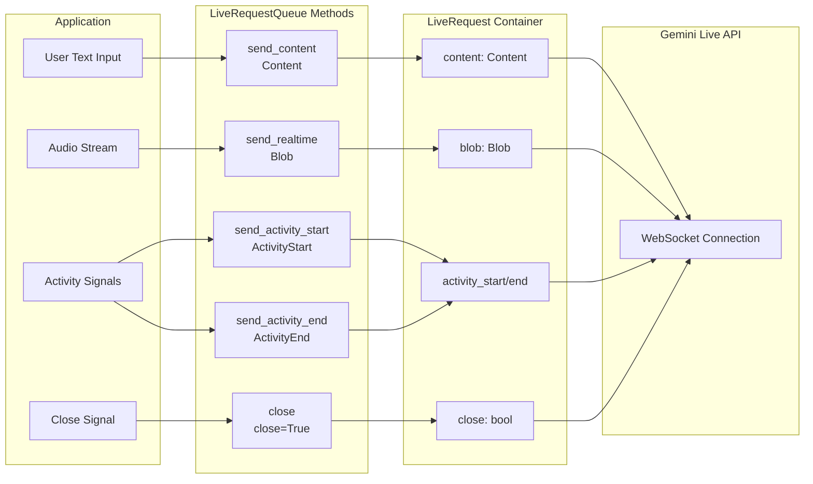

# Parte 2: Envío de mensajes con LiveRequestQueue

En la Parte 1, aprendiste el ciclo de vida de cuatro fases de las aplicaciones ADK Bidi-streaming. Esta parte se enfoca en el flujo ascendente: cómo tu aplicación envía mensajes al agente utilizando `LiveRequestQueue`.

A diferencia de las APIs tradicionales donde diferentes tipos de mensajes requieren diferentes endpoints o canales, ADK proporciona una única interfaz unificada a través de `LiveRequestQueue` y su modelo de mensaje `LiveRequest`. Esta parte cubre:

- **Tipos de mensajes**: Envío de texto mediante `send_content()`, streaming de audio/imagen/video mediante `send_realtime()`, control de turnos de conversación con señales de actividad, y terminación elegante de sesiones con señales de control
- **Patrones de concurrencia**: Comprensión de la gestión de colas asíncronas y seguridad de hilos del event-loop
- **Mejores prácticas**: Creación de colas en contexto asíncrono, garantía de limpieza adecuada de recursos, y comprensión de las garantías de orden de mensajes
- **Solución de problemas**: Diagnóstico de problemas comunes como mensajes que no se procesan y problemas del ciclo de vida de la cola

Comprender `LiveRequestQueue` es esencial para construir aplicaciones de streaming responsivas que manejen entradas multimodales sin problemas dentro de event loops asíncronos.

## LiveRequestQueue y LiveRequest

El `LiveRequestQueue` es tu interfaz principal para enviar mensajes al Agente en conversaciones de streaming. En lugar de gestionar canales separados para texto, audio y señales de control, ADK proporciona un contenedor unificado `LiveRequest` que maneja todos los tipos de mensajes a través de una única API elegante:

```python title='Source reference: <a href="https://github.com/google/adk-python/blob/29c1115959b0084ac1169748863b35323da3cf50/src/google/adk/agents/live_request_queue.py" target="_blank">live_request_queue.py</a>'
class LiveRequest(BaseModel):
    content: Optional[Content] = None           # Contenido basado en texto y datos estructurados
    blob: Optional[Blob] = None                 # Datos de audio/video y flujos binarios
    activity_start: Optional[ActivityStart] = None  # Señal de inicio de actividad del usuario
    activity_end: Optional[ActivityEnd] = None      # Señal de fin de actividad del usuario
    close: bool = False                         # Señal de terminación elegante de conexión
```

Este diseño simplificado maneja cada escenario de streaming que encontrarás. Los campos `content` y `blob` manejan diferentes tipos de datos, los campos `activity_start` y `activity_end` habilitan señalización de actividad, y la bandera `close` proporciona semántica de terminación elegante.

Los campos `content` y `blob` son mutuamente excluyentes: solo uno puede ser establecido por LiveRequest. Aunque ADK no impone esto del lado del cliente e intentará enviar ambos si se establecen, el backend de Live API rechazará esto con un error de validación. Los métodos convenientes de ADK `send_content()` y `send_realtime()` automáticamente aseguran que esta restricción se cumpla al establecer solo un campo, por lo que **usar estos métodos (en lugar de crear manualmente objetos `LiveRequest`) es el enfoque recomendado**.

El siguiente diagrama ilustra cómo diferentes tipos de mensajes fluyen desde tu aplicación a través de los métodos de `LiveRequestQueue`, hacia contenedores `LiveRequest`, y finalmente a la Live API:



## Envío de diferentes tipos de mensajes

`LiveRequestQueue` proporciona métodos convenientes para enviar diferentes tipos de mensajes al agente. Esta sección demuestra patrones prácticos para mensajes de texto, streaming de audio/video, señales de actividad para control manual de turnos, y terminación de sesión.

### send_content(): Envía texto con turno por turno

El método `send_content()` envía mensajes de texto en modo turno por turno, donde cada mensaje representa un turno de conversación discreto. Esto señala un turno completo al modelo, desencadenando la generación de respuesta inmediata.

```python title='Demo implementation: <a href="https://github.com/google/adk-samples/blob/31847c0723fbf16ddf6eed411eb070d1c76afd1a/python/agents/bidi-demo/app/main.py#L194-L199" target="_blank">main.py:194-199</a>'
content = types.Content(parts=[types.Part(text=json_message["text"])])
live_request_queue.send_content(content)
```

**Uso de Content y Part con ADK Bidi-streaming:**

- **`Content`** (`google.genai.types.Content`): Un contenedor que representa un único mensaje o turno en la conversación. Contiene un arreglo de objetos `Part` que juntos componen el mensaje completo.

- **`Part`** (`google.genai.types.Part`): Una pieza individual de contenido dentro de un mensaje. Para ADK Bidi-streaming con Live API, usarás:
  - `text`: Contenido de texto (incluyendo código) que envías al modelo

En la práctica, la mayoría de los mensajes usan un único Part de texto para ADK Bidi-streaming. La estructura multi-parte está diseñada para escenarios como:
- Mezclar texto con respuestas de función (manejado automáticamente por ADK)
- Combinar explicaciones de texto con datos estructurados
- Extensibilidad futura para nuevos tipos de contenido

Para Live API, las entradas multimodales (audio/video) usan mecanismos diferentes (ver `send_realtime()` más abajo), no Content multi-parte.

!!! note "Uso de Content y Part en ADK Bidi-streaming"
    
    Aunque el tipo `Part` de la API Gemini soporta muchos campos (`inline_data`, `file_data`, `function_call`, `function_response`, etc.), la mayoría son manejados automáticamente por ADK o usan mecanismos diferentes en Live API:
    
    - **Llamadas a función**: ADK maneja automáticamente el ciclo de llamadas a función - recibiendo llamadas a función del modelo, ejecutando tus funciones registradas, y enviando respuestas de vuelta. No construyes estos manualmente.
    - **Imágenes/Video**: NO uses `send_content()` con `inline_data`. En su lugar, usa `send_realtime(Blob(mime_type="image/jpeg", data=...))` para streaming continuo. Ver [Parte 5: Cómo usar imagen y video](part5.md#how-to-use-image-and-video).

### send_realtime(): Envía audio, imagen y video en tiempo real

El método `send_realtime()` envía flujos de datos binarios—principalmente audio, imagen y video—fluyen a través del tipo `Blob`, que maneja la transmisión en modo tiempo real. A diferencia del contenido de texto que se procesa en modo turno por turno, los blobs están diseñados para escenarios de streaming continuo donde los datos llegan en fragmentos. Proporcionas bytes crudos, y Pydantic maneja automáticamente la codificación base64 durante la serialización JSON para transmisión de red segura (configurado en `LiveRequest.model_config`). El tipo MIME ayuda al modelo a entender el formato del contenido.

```python title='Demo implementation: <a href="https://github.com/google/adk-samples/blob/31847c0723fbf16ddf6eed411eb070d1c76afd1a/python/agents/bidi-demo/app/main.py#L181-L184" target="_blank">main.py:181-184</a>'
audio_blob = types.Blob(
    mime_type="audio/pcm;rate=16000",
    data=audio_data
)
live_request_queue.send_realtime(audio_blob)
```

!!! note "Aprender más"
    
    Para detalles completos sobre especificaciones de audio, imagen y video, formatos, y mejores prácticas, ver [Parte 5: Cómo usar audio, imagen y video](part5.md).

### Señales de actividad

Las señales de actividad (`ActivityStart`/`ActivityEnd`) **SOLO** pueden enviarse cuando la Detección de Actividad de Voz (VAD) automática (del lado del servidor) está **explícitamente deshabilitada** en tu `RunConfig`. Úsalas cuando tu aplicación requiere control manual de actividad de voz, tales como:

- **Interfaces push-to-talk**: El usuario controla explícitamente cuándo está hablando (ej., manteniendo presionado un botón)
- **Entornos ruidosos**: El ruido de fondo hace que VAD automático sea poco confiable, por lo que usas VAD del lado del cliente o control manual
- **VAD del lado del cliente**: Implementas tu propio algoritmo VAD en el cliente para reducir sobrecarga de red enviando audio solo cuando se detecta habla
- **Patrones de interacción personalizados**: Escenarios sin habla como interacciones activadas por gestos o segmentos de audio temporizados

**Lo que las señales de actividad le dicen al modelo:**

- `ActivityStart`: "El usuario está ahora hablando - comienza a acumular audio para procesamiento"
- `ActivityEnd`: "El usuario ha terminado de hablar - procesa el audio acumulado y genera una respuesta"

Sin estas señales (cuando VAD está deshabilitado), el modelo no sabe cuándo empezar/detener la escucha del habla, por lo que debes marcar explícitamente los límites de turno.

**Envío de señales de actividad:**

```python
from google.genai import types

# Patrón de señal de actividad manual (ej., push-to-talk)
live_request_queue.send_activity_start()  # Señal: el usuario comenzó a hablar

# Transmite fragmentos de audio mientras el usuario mantiene presionado el botón de hablar
while user_is_holding_button:
    audio_blob = types.Blob(mime_type="audio/pcm;rate=16000", data=audio_chunk)
    live_request_queue.send_realtime(audio_blob)

live_request_queue.send_activity_end()  # Señal: el usuario dejó de hablar
```

**Comportamiento predeterminado (VAD automático):** Si no envías señales de actividad, el VAD integrado de Live API detecta automáticamente los límites del habla en el flujo de audio que envías mediante `send_realtime()`. Este es el enfoque recomendado para la mayoría de las aplicaciones.

!!! note "Aprender más"
    
    Para comparación detallada de VAD automático vs señales de actividad manual, incluyendo cuándo deshabilitar VAD y mejores prácticas, ver [Parte 5: Detección de actividad de voz](part5.md#voice-activity-detection-vad).

### Señales de control

La señal `close` proporciona semántica de terminación elegante para sesiones de streaming. Señala al sistema que cierre limpiamente la conexión del modelo y finalice el Bidi-stream. En ADK Bidi-streaming, tu aplicación es responsable de enviar la señal `close` explícitamente:

**Cierre manual en modo BIDI:** Cuando usas `StreamingMode.BIDI` (Bidi-streaming), tu aplicación debe llamar manualmente `close()` cuando la sesión termina o cuando ocurren errores. Esta práctica minimiza el uso de recursos de sesión.

**Cierre automático en modo SSE:** Cuando usas el legado `StreamingMode.SSE` (no Bidi-streaming), ADK automáticamente llama `close()` en la cola cuando recibe un evento `turn_complete=True` del modelo (ver [`base_llm_flow.py:781`](https://github.com/google/adk-python/blob/fd2c0f556b786417a9f6add744827b07e7a06b7d/src/google/adk/flows/llm_flows/base_llm_flow.py#L780)).

Ver [Parte 4: Comprender RunConfig](part4.md#streamingmode-bidi-or-sse) para comparación detallada y cuándo usar cada modo.

```python title='Demo implementation: <a href="https://github.com/google/adk-samples/blob/31847c0723fbf16ddf6eed411eb070d1c76afd1a/python/agents/bidi-demo/app/main.py#L238-L253" target="_blank">main.py:238-253</a>'
try:
    logger.debug("Starting asyncio.gather for upstream and downstream tasks")
    await asyncio.gather(
        upstream_task(),
        downstream_task()
    )
    logger.debug("asyncio.gather completed normally")
except WebSocketDisconnect:
    logger.debug("Client disconnected normally")
except Exception as e:
    logger.error(f"Unexpected error in streaming tasks: {e}", exc_info=True)
finally:
    # Siempre cierra la cola, incluso si ocurrieron excepciones
    logger.debug("Closing live_request_queue")
    live_request_queue.close()
```

**¿Qué sucede si no llamas close()?**

Aunque ADK limpia recursos locales automáticamente, fallar al llamar `close()` en modo BIDI previene el envío de una señal de terminación elegante a Live API, que entonces recibirá una desconexión abrupta después de cierto período de tiempo de espera. Esto puede llevar a sesiones "zombie" de Live API que permanecen abiertas en el servicio en la nube, incluso aunque tu aplicación haya terminado con ellas. Estas sesiones abandonadas pueden disminuir significativamente el número de sesiones concurrentes que tu aplicación puede manejar, ya que continúan contando contra tus límites de cuota hasta que eventualmente expiran.

!!! note "Aprender más"
    
    Para patrones comprensivos de manejo de errores durante streaming, incluyendo cuándo usar `break` vs `continue` y manejo de diferentes tipos de errores, ver [Parte 3: Eventos de error](part3.md#error-events).

## Concurrencia y seguridad de hilos

Comprender cómo `LiveRequestQueue` maneja la concurrencia es esencial para construir aplicaciones de streaming confiables. La cola está construida sobre `asyncio.Queue`, lo que significa que es segura para acceso concurrente **dentro del mismo hilo del event loop** (el caso común), pero requiere manejo especial cuando se llama desde **diferentes hilos** (el caso avanzado). Esta sección explica las decisiones de diseño detrás de la API de `LiveRequestQueue`, cuándo puedes usarla de manera segura sin precauciones extra, y cuándo necesitas mecanismos de seguridad de hilos como `loop.call_soon_threadsafe()`.

### Gestión de cola asíncrona

`LiveRequestQueue` usa métodos síncronos (`send_content()`, `send_realtime()`) en lugar de métodos asíncronos, aunque la cola subyacente se consume de manera asíncrona. Esta decisión de diseño usa `asyncio.Queue.put_nowait()` - una operación no bloqueante que no requiere `await`.

**¿Por qué métodos de envío síncronos?** Conveniencia y simplicidad. Puedes llamarlos desde cualquier lugar en tu código asíncrono sin `await`:

```python title='Demo implementation: <a href="https://github.com/google/adk-samples/blob/31847c0723fbf16ddf6eed411eb070d1c76afd1a/python/agents/bidi-demo/app/main.py#L169-L199" target="_blank">main.py:169-199</a>'
async def upstream_task() -> None:
    """Recibe mensajes de WebSocket y los envía a LiveRequestQueue."""
    while True:
        message = await websocket.receive()

        if "bytes" in message:
            audio_data = message["bytes"]
            audio_blob = types.Blob(
                mime_type="audio/pcm;rate=16000",
                data=audio_data
            )
            live_request_queue.send_realtime(audio_blob)

        elif "text" in message:
            text_data = message["text"]
            json_message = json.loads(text_data)

            if json_message.get("type") == "text":
                content = types.Content(parts=[types.Part(text=json_message["text"])])
                live_request_queue.send_content(content)
```

Este patrón mezcla operaciones de I/O asíncronas con operaciones de CPU síncronas naturalmente. Los métodos de envío regresan inmediatamente sin bloquear, permitiendo que tu aplicación permanezca responsiva.

#### Mejor práctica: Crear cola en contexto asíncrono

Siempre crea `LiveRequestQueue` dentro de un contexto asíncrono (función async o corrutina) para asegurar que use el event loop correcto:

```python
# ✅ Recomendado - Crear en contexto asíncrono
async def main():
    queue = LiveRequestQueue()  # Usa el event loop existente del contexto asíncrono
    # Este es el patrón preferido - asegura que la cola use el event loop correcto
    # que ejecutará tus operaciones de streaming

# ❌ No recomendado - Crea event loop automáticamente
queue = LiveRequestQueue()  # Funciona pero ADK auto-crea nuevo loop
# Esto funciona debido al mecanismo de seguridad de ADK, pero puede causar problemas con
# coordinación de loop en aplicaciones complejas o escenarios multi-hilo
```

**Por qué esto importa:** `LiveRequestQueue` requiere que exista un event loop cuando se instancia. ADK incluye un mecanismo de seguridad que auto-crea un loop si no existe ninguno, pero confiar en esto puede causar comportamiento inesperado en escenarios multi-hilo o con configuraciones personalizadas de event loop.

## Garantías de orden de mensajes

`LiveRequestQueue` proporciona comportamiento de entrega de mensajes predecible:

| Garantía | Descripción | Impacto |
|-----------|-------------|--------|
| **Orden FIFO** | Mensajes procesados en orden de envío (garantizado por el `asyncio.Queue` subyacente) | Mantiene contexto de conversación y consistencia de interacción |
| **Sin coalescencia** | Cada mensaje entregado independientemente | Sin agrupamiento automático—cada operación de envío crea una solicitud |
| **Sin límite por defecto** | La cola acepta mensajes ilimitados sin bloquear | **Beneficio**: Simplifica el código del cliente (sin bloqueo en envío)<br>**Riesgo**: Crecimiento de memoria si envía más rápido que el procesamiento<br>**Mitigación**: Monitorear profundidad de cola en producción |

> **Consejo de producción**: Para streaming de audio/video de alto rendimiento, monitorea `live_request_queue._queue.qsize()` para detectar contrapresión. Si la profundidad de la cola crece continuamente, desacelera tu tasa de envío o implementa agrupamiento. Nota: `_queue` es un atributo interno y puede cambiar en versiones futuras; usa con precaución.

## Resumen

En esta parte, aprendiste cómo `LiveRequestQueue` proporciona una interfaz unificada para enviar mensajes a agentes de streaming ADK dentro de un event loop asíncrono. Cubrimos el modelo de mensaje `LiveRequest` y exploramos cómo enviar diferentes tipos de mensajes: contenido de texto mediante `send_content()`, blobs de audio/video mediante `send_realtime()`, señales de actividad para control manual de turnos, y señales de control para terminación elegante mediante `close()`. También aprendiste mejores prácticas para gestión de cola asíncrona, creación de colas en contexto asíncrono, limpieza de recursos, y orden de mensajes. Ahora comprendes cómo usar `LiveRequestQueue` como el canal de comunicación ascendente en tus aplicaciones Bidi-streaming, permitiendo a los usuarios enviar mensajes concurrentemente mientras reciben respuestas del agente. A continuación, aprenderás cómo manejar el flujo descendente—procesando los eventos que los agentes generan en respuesta a estos mensajes.

---

← [Anterior: Parte 1: Introducción a ADK Bidi-streaming](part1.md) | [Siguiente: Parte 3: Manejo de eventos con run_live()](part3.md) →