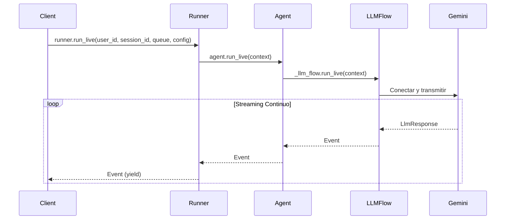

# Parte 3: Gestión de eventos con run_live()

El método `run_live()` es el punto de entrada principal de ADK para conversaciones en streaming, implementando un generador asíncrono que produce eventos a medida que se desarrolla la conversación. Esta parte se centra en comprender y gestionar estos eventos—el mecanismo de comunicación central que permite la interacción en tiempo real entre tu aplicación, los usuarios y los modelos de IA.

Aprenderás a procesar diferentes tipos de eventos (texto, audio, transcripciones, llamadas a herramientas), gestionar el flujo de conversación con señales de interrupción y finalización de turno, serializar eventos para transporte en red y aprovechar la ejecución automática de herramientas de ADK. Comprender la gestión de eventos es esencial para construir aplicaciones de streaming receptivas que se sientan naturales y en tiempo real para los usuarios.

!!! note "Contexto Asíncrono Requerido"

    Todo el código de `run_live()` requiere contexto asíncrono. Consulta [Parte 1: Ejemplo de Aplicación FastAPI](part1.md#fastapi-application-example) para detalles y ejemplos de producción.
    
## Cómo Funciona run_live()

`run_live()` es un generador asíncrono que transmite eventos de conversación en tiempo real. Produce eventos inmediatamente a medida que se generan—sin almacenamiento en búfer, sin sondeo, sin callbacks. Los eventos se transmiten sin almacenamiento en búfer interno. La memoria general depende de la persistencia de sesión (p. ej., en memoria vs base de datos), lo que lo hace adecuado tanto para intercambios rápidos como para sesiones extendidas.

### Firma del Método y Flujo

**Uso:**

```python title='Referencia de código: <a href="https://github.com/google/adk-python/blob/29c1115959b0084ac1169748863b35323da3cf50/src/google/adk/runners.py" target="_blank">runners.py</a>'
# La firma del método revela el diseño reflexivo
async def run_live(
    self,
    *,                                      # Argumentos solo de palabra clave
    user_id: Optional[str] = None,          # Identificación de usuario (requerido a menos que se proporcione session)
    session_id: Optional[str] = None,       # Seguimiento de sesión (requerido a menos que se proporcione session)
    live_request_queue: LiveRequestQueue,   # El canal de comunicación bidireccional
    run_config: Optional[RunConfig] = None, # Configuración del comportamiento de streaming
    session: Optional[Session] = None,      # Obsoleto: usar user_id y session_id en su lugar
) -> AsyncGenerator[Event, None]:           # Generador que produce eventos de conversación
```

Como indica su firma, cada conversación en streaming necesita identidad (user_id), continuidad (session_id), comunicación (live_request_queue) y configuración (run_config). El tipo de retorno—un generador asíncrono de Events—promete entrega en tiempo real sin abrumar los recursos del sistema.
    

    
### Patrón de Uso Básico

La forma más simple de consumir eventos desde `run_live()` es iterar sobre el generador asíncrono con un bucle for:

```python title='Implementación de demostración: <a href="https://github.com/google/adk-samples/blob/31847c0723fbf16ddf6eed411eb070d1c76afd1a/python/agents/bidi-demo/app/main.py#L225-L233" target="_blank">main.py:225-233</a>'
async for event in runner.run_live(
    user_id=user_id,
    session_id=session_id,
    live_request_queue=live_request_queue,
    run_config=run_config
):
    event_json = event.model_dump_json(exclude_none=True, by_alias=True)
    logger.debug(f"[SERVER] Event: {event_json}")
    await websocket.send_text(event_json)
```

!!! note "Identificadores de Sesión"

    Tanto `user_id` como `session_id` deben coincidir con los identificadores que usaste al crear la sesión mediante `SessionService.create_session()`. Estos pueden ser cualquier valor de cadena basado en las necesidades de tu aplicación (p. ej., UUIDs, direcciones de correo electrónico, tokens personalizados). Consulta [Parte 1: Obtener o Crear Sesión](part1.md#get-or-create-session) para orientación detallada sobre los identificadores de sesión.

### Ciclo de Vida de Conexión en run_live()

El método `run_live()` gestiona el ciclo de vida de la conexión de Live API subyacente automáticamente:

**Estados de Conexión:**
1. **Inicialización**: La conexión se establece cuando se llama a `run_live()`
2. **Streaming Activo**: Comunicación bidireccional a través de `LiveRequestQueue` (upstream al modelo) y `run_live()` (downstream desde el modelo)
3. **Cierre Elegante**: La conexión se cierra cuando se llama a `LiveRequestQueue.close()`
4. **Recuperación de Errores**: ADK admite la reanudación transparente de sesión; habilítalo mediante `RunConfig.session_resumption` para manejar fallos transitorios. Consulta [Parte 4: Reanudación de Sesión de Live API](part4.md#live-api-session-resumption) para detalles.

#### Qué Produce run_live()

El método `run_live()` produce un flujo de objetos `Event` en tiempo real a medida que el agente procesa la entrada del usuario y genera respuestas. Comprender los diferentes tipos de eventos te ayuda a construir interfaces de usuario receptivas que manejan texto, audio, transcripciones, llamadas a herramientas, metadatos y errores adecuadamente. Cada tipo de evento se explica en detalle en las secciones siguientes.

| Tipo de Evento | Descripción |
|------------|-------------|
| **[Eventos de Texto](#text-events)** | Respuestas de texto del modelo cuando se usa `response_modalities=["TEXT"]`; incluye flags `partial`, `turn_complete` e `interrupted` para gestión de UI en streaming |
| **[Eventos de Audio con Datos en Línea](#audio-events)** | Bytes de audio sin procesar (`inline_data`) transmitidos en tiempo real cuando se usa `response_modalities=["AUDIO"]`; efímeros (no persistidos en la sesión) |
| **[Eventos de Audio con Datos de Archivo](#audio-events-with-file-data)** | Audio agregado en archivos y almacenado en artifacts; contiene referencias `file_data` en lugar de bytes sin procesar; puede persistirse en el historial de sesión |
| **[Eventos de Metadatos](#metadata-events)** | Información de uso de tokens (`prompt_token_count`, `candidates_token_count`, `total_token_count`) para monitoreo de costos y seguimiento de cuotas |
| **[Eventos de Transcripción](#transcription-events)** | Conversión de voz a texto para entrada del usuario (`input_transcription`) y salida del modelo (`output_transcription`) cuando la transcripción está habilitada en `RunConfig` |
| **[Eventos de Llamada a Herramientas](#tool-call-events)** | Solicitudes de llamadas a funciones del modelo; ADK maneja la ejecución automáticamente |
| **[Eventos de Error](#error-events)** | Errores del modelo y problemas de conexión con campos `error_code` y `error_message` |

!!! note "Referencia de Código"

    Consulta la implementación completa de gestión de tipos de eventos en [`runners.py`](https://github.com/google/adk-python/blob/29c1115959b0084ac1169748863b35323da3cf50/src/google/adk/runners.py)

#### Cuándo Sale run_live()

El bucle de eventos de `run_live()` puede salir en varias condiciones. Comprender estos escenarios de salida es crucial para una limpieza adecuada de recursos y gestión de errores:

| Condición de Salida | Disparador | ¿Elegante? | Descripción |
|---|---|---|---|
| **Cierre manual** | `live_request_queue.close()` | ✅ Sí | El usuario cierra explícitamente la cola, enviando señal `LiveRequest(close=True)` |
| **Todos los agentes completan** | El último agente en SequentialAgent llama a `task_completed()` | ✅ Sí | Después de que todos los agentes secuenciales terminen sus tareas |
| **Tiempo de espera de sesión** | Se alcanza el límite de duración de Live API | ⚠️ Conexión cerrada | La sesión excede la duración máxima (ver límites abajo) |
| **Salida temprana** | Flag `end_invocation` establecido | ✅ Sí | Establecido durante el preprocesamiento o por herramientas/callbacks para terminar temprano |
| **Evento vacío** | Señal de cierre de cola | ✅ Sí | Señal interna que indica que el flujo de eventos ha terminado |
| **Errores** | Errores de conexión, excepciones | ❌ No | Excepciones no manejadas o fallos de conexión |

!!! warning "Comportamiento de SequentialAgent"

    Cuando usas `SequentialAgent`, la función `task_completed()` NO sale del bucle `run_live()` de tu aplicación. Solo señala el fin del trabajo del agente actual, desencadenando una transición fluida al siguiente agente en la secuencia. Tu bucle de eventos continúa recibiendo eventos de los agentes subsiguientes. El bucle solo sale cuando el **último** agente en la secuencia completa.

!!! note "Aprende Más"

    Para detalles sobre reanudación de sesión y recuperación de conexión, consulta [Parte 4: Reanudación de Sesión de Live API](part4.md#live-api-session-resumption). Para flujos de trabajo multi-agente, consulta [Mejores Prácticas para Flujos de Trabajo Multi-Agente](#best-practices-for-multi-agent-workflows).

#### Eventos Guardados en la `Session` de ADK

No todos los eventos producidos por `run_live()` se persisten en la `Session` de ADK. Cuando `run_live()` sale, solo ciertos eventos se guardan en la sesión mientras que otros permanecen efímeros. Comprender qué eventos se guardan versus cuáles son efímeros es crucial para aplicaciones que usan persistencia de sesión, reanudación o necesitan revisar el historial de conversación.

!!! note "Referencia de Código"

    Consulta la lógica de persistencia de eventos de sesión en [`runners.py`](https://github.com/google/adk-python/blob/29c1115959b0084ac1169748863b35323da3cf50/src/google/adk/runners.py)

**Eventos Guardados en la `Session` de ADK:**

Estos eventos se persisten en la `Session` de ADK y están disponibles en el historial de sesión:

- **Eventos de Audio con Datos de Archivo**: Guardados en la `Session` de ADK solo si `RunConfig.save_live_blob` es `True`; los datos de audio se agregan en archivos en artifacts con referencias `file_data`
- **Eventos de Metadatos de Uso**: Siempre guardados para rastrear el consumo de tokens a lo largo de la `Session` de ADK
- **Eventos de Transcripción No Parciales**: Las transcripciones finales se guardan; las transcripciones parciales no se persisten
- **Eventos de Llamada y Respuesta a Funciones**: Siempre guardados para mantener el historial de ejecución de herramientas
- **Otros Eventos de Control**: La mayoría de los eventos de control (p. ej., `turn_complete`, `finish_reason`) se guardan

**Eventos NO Guardados en la `Session` de ADK:**

Estos eventos son efímeros y solo se producen para los llamadores durante el streaming activo:

- **Eventos de Audio con Datos en Línea**: Los datos de audio `Blob` sin procesar en `inline_data` nunca se guardan en la `Session` de ADK (solo se producen para reproducción en tiempo real)
- **Eventos de Transcripción Parciales**: Solo se producen para visualización en tiempo real; las transcripciones finales se guardan

!!! note "Persistencia de Audio"

    Para guardar conversaciones de audio en la `Session` de ADK para revisión o reanudación, habilita `RunConfig.save_live_blob = True`. Esto persiste flujos de audio en artifacts. Consulta [Parte 4: save_live_blob](part4.md#save_live_blob) para detalles de configuración.

## Comprendiendo los Eventos

Los eventos son el mecanismo de comunicación central en el sistema de Bidi-streaming de ADK. Esta sección explora el ciclo de vida completo de los eventos—desde cómo se generan a través de múltiples capas de pipeline, hasta patrones de procesamiento concurrente que permiten una interacción verdaderamente en tiempo real, hasta el manejo práctico de interrupciones y finalización de turno. Aprenderás sobre tipos de eventos (texto, audio, transcripciones, llamadas a herramientas), estrategias de serialización para transporte en red y el ciclo de vida de conexión que gestiona sesiones de streaming en las plataformas Gemini Live API y Vertex AI Live API.

### La Clase Event

La clase `Event` de ADK es un modelo Pydantic que representa toda la comunicación en una conversación en streaming. Extiende `LlmResponse` y sirve como el contenedor unificado para respuestas del modelo, entrada del usuario, transcripciones y señales de control.

!!! note "Referencia de Código"

    Consulta la implementación de la clase Event en [`event.py:30-128`](https://github.com/google/adk-python/blob/29c1115959b0084ac1169748863b35323da3cf50/src/google/adk/events/event.py#L30-L128) y [`llm_response.py:28-200`](https://github.com/google/adk-python/blob/29c1115959b0084ac1169748863b35323da3cf50/src/google/adk/models/llm_response.py#L28-L200)

#### Campos Clave

**Esenciales para todas las aplicaciones:**
- `content`: Contiene texto, audio o llamadas a funciones como `Content.parts`
- `author`: Identifica quién creó el evento (`"user"` o nombre del agente)
- `partial`: Distingue fragmentos incrementales de texto completo
- `turn_complete`: Señala cuándo habilitar la entrada del usuario nuevamente
- `interrupted`: Indica cuándo dejar de renderizar la salida actual

**Para aplicaciones de voz/audio:**
- `input_transcription`: Palabras habladas del usuario (cuando está habilitado en `RunConfig`)
- `output_transcription`: Palabras habladas del modelo (cuando está habilitado en `RunConfig`)
- `content.parts[].inline_data`: Datos de audio para reproducción

**Para ejecución de herramientas:**
- `content.parts[].function_call`: Solicitudes de invocación de herramientas del modelo
- `content.parts[].function_response`: Resultados de ejecución de herramientas
- `long_running_tool_ids`: Rastrear ejecución asíncrona de herramientas

**Para depuración y diagnósticos:**
- `usage_metadata`: Recuentos de tokens e información de facturación
- `cache_metadata`: Estadísticas de aciertos/fallos del caché de contexto
- `finish_reason`: Por qué el modelo dejó de generar (p. ej., STOP, MAX_TOKENS, SAFETY)
- `error_code` / `error_message`: Diagnósticos de fallos

!!! note "Semántica del Autor"

    Los eventos de transcripción tienen autor `"user"`; las respuestas/eventos del modelo usan el nombre del agente como `author` (no `"model"`). Consulta [Autoría de Eventos](#event-authorship) para detalles.

#### Comprendiendo la Identidad de Eventos

Los eventos tienen dos campos de ID importantes:

- **`event.id`**: Identificador único para este evento específico (formato: UUID). Cada evento obtiene un nuevo ID, incluso fragmentos de texto parciales.
- **`event.invocation_id`**: Identificador compartido para todos los eventos en la invocación actual (formato: `"e-" + UUID`). En `run_live()`, todos los eventos de una sola sesión de streaming comparten el mismo invocation_id. (Consulta [InvocationContext](#invocationcontext-the-execution-state-container) para más sobre invocaciones)

**Uso:**

```python
# Todos los eventos en esta sesión de streaming tendrán el mismo invocation_id
async for event in runner.run_live(...):
    print(f"Event ID: {event.id}")              # Único por evento
    print(f"Invocation ID: {event.invocation_id}")  # Igual para todos los eventos en la sesión
```

**Casos de uso:**
- **event.id**: Rastrear eventos individuales en logs, deduplicar eventos
- **event.invocation_id**: Agrupar eventos por sesión de conversación, filtrar eventos específicos de sesión

### Autoría de Eventos

En modo de streaming en vivo, el campo `Event.author` sigue una semántica especial para mantener la claridad de la conversación:

**Respuestas del modelo**: Autoradas por el **nombre del agente** (p. ej., `"my_agent"`), no la cadena literal `"model"`

- Esto habilita escenarios multi-agente donde necesitas rastrear qué agente generó la respuesta
- Ejemplo: `Event(author="customer_service_agent", content=...)`

**Transcripciones del usuario**: Autoradas como `"user"` cuando el evento contiene audio transcrito del usuario

**Cómo funciona**:

1. Gemini Live API devuelve transcripciones de audio del usuario con `content.role == 'user'`
2. La función `get_author_for_event()` de ADK verifica este marcador de rol
3. Si `content.role == 'user'`, ADK establece `Event.author` a `"user"`
4. De lo contrario, ADK establece `Event.author` al nombre del agente (p. ej., `"my_agent"`)

Esta transformación asegura que la entrada transcrita del usuario se atribuya correctamente al usuario en el historial de conversación de tu aplicación, aunque fluya a través del flujo de respuestas del modelo.

- Ejemplo: Transcripción de audio de entrada → `Event(author="user", input_transcription=..., content.role="user")`

**Por qué esto importa**:

- En aplicaciones multi-agente, puedes filtrar eventos por agente: `events = [e for e in stream if e.author == "my_agent"]`
- Al mostrar el historial de conversación, usa `event.author` para mostrar quién dijo qué
- Los eventos de transcripción se atribuyen correctamente al usuario aunque fluyan a través del modelo

!!! note "Referencia de Código"

    Consulta la lógica de atribución de autor en [`base_llm_flow.py:292-326`](https://github.com/google/adk-python/blob/fd2c0f556b786417a9f6add744827b07e7a06b7d/src/google/adk/flows/llm_flows/base_llm_flow.py#L287-L321)

### Tipos de Eventos y Gestión

ADK transmite tipos de eventos distintos a través de `runner.run_live()` para admitir diferentes modalidades de interacción: respuestas de texto para chat tradicional, fragmentos de audio para salida de voz, transcripciones para accesibilidad y registro, y notificaciones de llamadas a herramientas para ejecución de funciones. Cada evento incluye flags de metadatos (`partial`, `turn_complete`, `interrupted`) que controlan las transiciones de estado de la UI y permiten flujos de conversación naturales, similares a los humanos. Comprender cómo reconocer y gestionar estos tipos de eventos es esencial para construir aplicaciones de streaming receptivas.

### Eventos de Texto

El tipo de evento más común, que contiene las respuestas de texto del modelo cuando especificas `response_modalities` en `RunConfig` en modo `["TEXT"]`:

**Uso:**

```python
async for event in runner.run_live(...):
    if event.content and event.content.parts:
        if event.content.parts[0].text:
            text = event.content.parts[0].text

            if not event.partial:
                # Tu lógica para actualizar la visualización de streaming
                update_streaming_display(text)
```

#### Comportamiento Predeterminado de Modalidad de Respuesta

Cuando `response_modalities` no se establece explícitamente (es decir, `None`), ADK automáticamente establece por defecto el modo `["AUDIO"]` al inicio de `run_live()`. Esto significa:

- **Si no proporcionas RunConfig**: Por defecto es `["AUDIO"]`
- **Si proporcionas RunConfig sin response_modalities**: Por defecto es `["AUDIO"]`
- **Si estableces explícitamente response_modalities**: Usa tu configuración (no se aplica predeterminado)

**Por qué existe este predeterminado**: Algunos modelos de audio nativos requieren que la modalidad de respuesta se establezca explícitamente. Para garantizar compatibilidad con todos los modelos, ADK establece por defecto `["AUDIO"]`.

**Para aplicaciones solo de texto**: Siempre establece explícitamente `response_modalities=["TEXT"]` en tu RunConfig para evitar recibir eventos de audio inesperados.

**Ejemplo:**

```python
# Modo de texto explícito
run_config = RunConfig(
    response_modalities=["TEXT"],
    streaming_mode=StreamingMode.BIDI
)
```

**Flags de Evento Clave:**

Estos flags te ayudan a gestionar la visualización de texto en streaming y el flujo de conversación en tu UI:

- `event.partial`: `True` para fragmentos de texto incrementales durante streaming; `False` para texto completo fusionado
- `event.turn_complete`: `True` cuando el modelo ha terminado su respuesta completa
- `event.interrupted`: `True` cuando el usuario interrumpió la respuesta del modelo

!!! note "Aprende Más"

    Para orientación detallada sobre el uso de los flags `partial` `turn_complete` e `interrupted` para gestionar el flujo de conversación y el estado de la UI, consulta [Gestión de Eventos de Texto](#handling-text-events).

### Eventos de Audio

Cuando `response_modalities` está configurado como `["AUDIO"]` en tu `RunConfig`, el modelo genera salida de audio en lugar de texto, y recibirás datos de audio en el flujo de eventos:

**Configuración:**

```python
# Configurar RunConfig para respuestas de audio
run_config = RunConfig(
    response_modalities=["AUDIO"],
    streaming_mode=StreamingMode.BIDI
)

# El audio llega como inline_data en event.content.parts
async for event in runner.run_live(..., run_config=run_config):
    if event.content and event.content.parts:
        part = event.content.parts[0]
        if part.inline_data:
            # Estructura del evento de audio:
            # part.inline_data.data: bytes (audio PCM sin procesar)
            # part.inline_data.mime_type: str (p. ej., "audio/pcm")
            audio_data = part.inline_data.data
            mime_type = part.inline_data.mime_type

            print(f"Received {len(audio_data)} bytes of {mime_type}")
            # Tu lógica para reproducir audio
            await play_audio(audio_data)
```

!!! note "Aprende Más"

    - **`response_modalities` controla cómo el modelo genera la salida**—debes elegir `["TEXT"]` para respuestas de texto o `["AUDIO"]` para respuestas de audio por sesión. No puedes usar ambas modalidades simultáneamente. Consulta [Parte 4: Modalidades de Respuesta](part4.md#response-modalities) para detalles de configuración.
    - Para cobertura completa de formatos de audio, envío/recepción de audio y flujo de procesamiento de audio, consulta [Parte 5: Cómo Usar Audio, Imagen y Video](part5.md).

### Eventos de Audio con Datos de Archivo

Cuando los datos de audio se agregan y guardan como archivos en artifacts, ADK produce eventos que contienen referencias `file_data` en lugar de `inline_data` sin procesar. Esto es útil para persistir audio en el historial de sesión.

!!! note "Referencia de Código"

    Consulta la lógica de agregación de archivos de audio en [`audio_cache_manager.py:156-178`](https://github.com/google/adk-python/blob/29c1115959b0084ac1169748863b35323da3cf50/src/google/adk/flows/llm_flows/audio_cache_manager.py#L156-L178)

**Recibiendo Referencias de Archivos de Audio:**

```python
async for event in runner.run_live(
    user_id=user_id,
    session_id=session_id,
    live_request_queue=queue,
    run_config=run_config
):
    if event.content and event.content.parts:
        for part in event.content.parts:
            if part.file_data:
                # Audio agregado en un archivo guardado en artifacts
                file_uri = part.file_data.file_uri
                mime_type = part.file_data.mime_type

                print(f"Audio file saved: {file_uri} ({mime_type})")
                # Recuperar archivo de audio del servicio de artifacts para reproducción
```

**File Data vs Inline Data:**

- **Inline Data** (`part.inline_data`): Bytes de audio sin procesar transmitidos en tiempo real; efímeros y no guardados en la sesión
- **File Data** (`part.file_data`): Referencia a archivo de audio almacenado en artifacts; puede persistirse en el historial de sesión

Tanto los datos de audio de entrada como de salida se agregan en archivos de audio y se guardan en el servicio de artifacts. La referencia del archivo se incluye en el evento como `file_data`, permitiéndote recuperar el audio más tarde.

!!! note "Persistencia de Sesión"

    Para guardar eventos de audio con datos de archivo en el historial de sesión, habilita `RunConfig.save_live_blob = True`. Esto permite que las conversaciones de audio se revisen o reproduzcan desde sesiones persistidas.

### Eventos de Metadatos

Los eventos de metadatos de uso contienen información de uso de tokens para monitorear costos y consumo de cuotas. El método `run_live()` produce estos eventos separadamente de los eventos de contenido.

!!! note "Referencia de Código"

    Consulta la estructura de metadatos de uso en [`llm_response.py:105`](https://github.com/google/adk-python/blob/29c1115959b0084ac1169748863b35323da3cf50/src/google/adk/models/llm_response.py#L105)

**Accediendo al Uso de Tokens:**

```python
async for event in runner.run_live(
    user_id=user_id,
    session_id=session_id,
    live_request_queue=queue,
    run_config=run_config
):
    if event.usage_metadata:
        print(f"Prompt tokens: {event.usage_metadata.prompt_token_count}")
        print(f"Response tokens: {event.usage_metadata.candidates_token_count}")
        print(f"Total tokens: {event.usage_metadata.total_token_count}")

        # Rastrear uso acumulativo a través de la sesión
        total_tokens += event.usage_metadata.total_token_count or 0
```

**Campos de Metadatos Disponibles:**

- `prompt_token_count`: Número de tokens en la entrada (prompt y contexto)
- `candidates_token_count`: Número de tokens en la respuesta del modelo
- `total_token_count`: Suma de tokens de prompt y respuesta
- `cached_content_token_count`: Número de tokens servidos desde el caché (cuando se usa almacenamiento en caché de contexto)

!!! note "Monitoreo de Costos"

    Los eventos de metadatos de uso permiten el seguimiento de costos en tiempo real durante las sesiones de streaming. Puedes implementar límites de cuota, mostrar el uso a los usuarios o registrar métricas para facturación y análisis.

### Eventos de Transcripción

Cuando la transcripción está habilitada en `RunConfig`, recibes transcripciones como eventos separados:

**Configuración:**

```python
async for event in runner.run_live(...):
    # Palabras habladas del usuario (cuando input_audio_transcription está habilitado)
    if event.input_transcription:
        # Tu lógica para mostrar la transcripción del usuario
        display_user_transcription(event.input_transcription)

    # Palabras habladas del modelo (cuando output_audio_transcription está habilitado)
    if event.output_transcription:
        # Tu lógica para mostrar la transcripción del modelo
        display_model_transcription(event.output_transcription)
```

Estos habilitan características de accesibilidad y registro de conversaciones sin servicios de transcripción separados.

!!! note "Aprende Más"

    Para detalles sobre habilitar la transcripción en `RunConfig` y comprender la entrega de transcripción, consulta [Parte 5: Transcripción de Audio](part5.md#audio-transcription).

### Eventos de Llamada a Herramientas

Cuando el modelo solicita la ejecución de una herramienta:

**Uso:**

```python
async for event in runner.run_live(...):
    if event.content and event.content.parts:
        for part in event.content.parts:
            if part.function_call:
                # El modelo está solicitando una ejecución de herramienta
                tool_name = part.function_call.name
                tool_args = part.function_call.args
                # ADK maneja la ejecución automáticamente
```

ADK procesa las llamadas a herramientas automáticamente—típicamente no necesitas manejarlas directamente a menos que implementes lógica de ejecución de herramientas personalizada.

!!! note "Aprende Más"

    Para detalles sobre cómo ADK ejecuta herramientas automáticamente, maneja respuestas de funciones y admite herramientas de larga duración y streaming, consulta [Ejecución Automática de Herramientas en run_live()](#automatic-tool-execution-in-run_live).

### Eventos de Error

Las aplicaciones de producción necesitan un manejo robusto de errores para gestionar elegantemente errores del modelo y problemas de conexión. ADK muestra errores a través de los campos `error_code` y `error_message`:

**Uso:**

```python
import logging

logger = logging.getLogger(__name__)

try:
    async for event in runner.run_live(...):
        # Manejar errores del modelo o conexión
        if event.error_code:
            logger.error(f"Model error: {event.error_code} - {event.error_message}")

            # Enviar notificación de error al cliente
            await websocket.send_json({
                "type": "error",
                "code": event.error_code,
                "message": event.error_message
            })

            # Decidir si continuar o romper basándose en la gravedad del error
            if event.error_code in ["SAFETY", "PROHIBITED_CONTENT", "BLOCKLIST"]:
                # Violaciones de política de contenido - usualmente no se puede reintentar
                break  # Error terminal - salir del bucle
            elif event.error_code == "MAX_TOKENS":
                # Límite de tokens alcanzado - puede necesitar ajustar la configuración
                break
            # Para otros errores, podrías continuar o implementar lógica de reintento
            continue  # Error transitorio - seguir procesando

        # Procesamiento de evento normal solo si no hay error
        if event.content and event.content.parts:
            # ... manejar contenido
            pass
finally:
    queue.close()  # Siempre limpiar la conexión
```

!!! note

    El ejemplo anterior muestra la estructura básica para verificar `error_code` y `error_message`. Para manejo de errores listo para producción con notificaciones de usuario, lógica de reintento y registro de contexto, consulta los escenarios del mundo real a continuación.

**Cuándo usar `break` vs `continue`:**

La decisión clave es: *¿Puede continuar significativamente la respuesta del modelo?*

**Escenario 1: Violación de Política de Contenido (Usar `break`)**

Estás construyendo un chatbot de soporte al cliente. Un usuario hace una pregunta inapropiada que activa un filtro SAFETY:

**Ejemplo:**

```python
if event.error_code in ["SAFETY", "PROHIBITED_CONTENT", "BLOCKLIST"]:
    # El modelo ha dejado de generar - la continuación es imposible
    await websocket.send_json({
        "type": "error",
        "message": "No puedo ayudar con esa solicitud. Por favor pregunta algo más."
    })
    break  # Salir del bucle - el modelo no enviará más eventos para este turno
```

**¿Por qué `break`?** El modelo ha terminado su respuesta. No llegarán más eventos para este turno. Continuar solo desperdiciaría recursos esperando eventos que no llegarán.

---

**Escenario 2: Problema de Red Durante Streaming (Usar `continue`)**

Estás construyendo un servicio de transcripción de voz. A mitad de la transcripción, hay un breve problema de red:

**Ejemplo:**

```python
if event.error_code == "UNAVAILABLE":
    # Problema temporal de red
    logger.warning(f"Network hiccup: {event.error_message}")
    # No notificar al usuario por problemas transitorios breves que pueden resolverse solos
    continue  # Seguir escuchando - el modelo puede recuperarse y continuar
```

**¿Por qué `continue`?** Este es un error transitorio. La conexión podría recuperarse, y el modelo puede continuar transmitiendo la transcripción. Romper terminaría prematuramente un flujo potencialmente recuperable.

!!! note "Notificaciones de Usuario"

    Para errores transitorios breves (que duran <1 segundo), no notifiques al usuario—no notarán el problema. Pero si el error persiste o impacta la experiencia del usuario (p. ej., el streaming se pausa por >3 segundos), notifícalos elegantemente: "Experimentando problemas de conexión, reintentando..."

---

**Escenario 3: Límite de Tokens Alcanzado (Usar `break`)**

Estás generando un artículo de formato largo y alcanzas el límite máximo de tokens:

**Ejemplo:**

```python
if event.error_code == "MAX_TOKENS":
    # El modelo ha alcanzado el límite de salida
    await websocket.send_json({
        "type": "complete",
        "message": "La respuesta alcanzó la longitud máxima",
        "truncated": True
    })
    break  # El modelo ha terminado - no se generarán más tokens
```

**¿Por qué `break`?** El modelo ha alcanzado su límite de salida y se detuvo. Continuar no producirá más tokens.

---

**Escenario 4: Límite de Tasa con Lógica de Reintento (Usar `continue` con retroceso)**

Estás ejecutando una aplicación de alto tráfico que ocasionalmente alcanza límites de tasa:

**Ejemplo:**

```python
retry_count = 0
max_retries = 3

async for event in runner.run_live(...):
    if event.error_code == "RESOURCE_EXHAUSTED":
        retry_count += 1
        if retry_count > max_retries:
            logger.error("Max retries exceeded")
            break  # Rendirse después de múltiples fallos

        # Esperar y reintentar
        await asyncio.sleep(2 ** retry_count)  # Retroceso exponencial
        continue  # Seguir escuchando - el límite de tasa puede aclararse

    # Resetear contador en evento exitoso
    retry_count = 0
```

**¿Por qué `continue` (inicialmente)?** Los límites de tasa son a menudo temporales. Con retroceso exponencial, el flujo puede recuperarse. Pero después de múltiples fallos, `break` para evitar espera infinita.

---

**Marco de Decisión:**

| Tipo de Error | Acción | Razón |
|------------|--------|--------|
| `SAFETY`, `PROHIBITED_CONTENT` | `break` | El modelo terminó la respuesta |
| `MAX_TOKENS` | `break` | El modelo terminó de generar |
| `UNAVAILABLE`, `DEADLINE_EXCEEDED` | `continue` | Problema transitorio de red/tiempo de espera |
| `RESOURCE_EXHAUSTED` (límite de tasa) | `continue` con lógica de reintento | Puede recuperarse después de breve espera |
| Errores desconocidos | `continue` (con registro) | Errar por el lado de la precaución |

**Crítico: Siempre usar `finally` para limpieza**

**Uso:**

```python
try:
    async for event in runner.run_live(...):
        # ... manejo de errores ...
finally:
    queue.close()  # La limpieza se ejecuta ya sea que rompas o termines normalmente
```

Ya sea que hagas `break` o el bucle termine naturalmente, `finally` asegura que la conexión se cierre adecuadamente.

**Referencia de Códigos de Error:**

Los códigos de error de ADK provienen de la API Gemini subyacente. Aquí están los códigos de error más comunes que encontrarás:

| Código de Error | Categoría | Descripción | Acción Recomendada |
|------------|----------|-------------|-------------------|
| `SAFETY` | Política de Contenido | El contenido viola las políticas de seguridad | `break` - Informar al usuario, registrar incidente |
| `PROHIBITED_CONTENT` | Política de Contenido | El contenido contiene material prohibido | `break` - Mostrar mensaje de violación de política |
| `BLOCKLIST` | Política de Contenido | El contenido coincide con la lista de bloqueo | `break` - Alertar al usuario, no reintentar |
| `MAX_TOKENS` | Límites | La salida alcanzó el límite máximo de tokens | `break` - Truncar elegantemente, resumir |
| `RESOURCE_EXHAUSTED` | Limitación de Tasa | Cuota o límite de tasa excedido | `continue` con retroceso - Reintentar después de retraso |
| `UNAVAILABLE` | Transitorio | Servicio temporalmente no disponible | `continue` - Reintentar, puede resolverse solo |
| `DEADLINE_EXCEEDED` | Transitorio | Tiempo de espera de solicitud excedido | `continue` - Considerar reintento con retroceso |
| `CANCELLED` | Cliente | El cliente canceló la solicitud | `break` - Limpiar recursos |
| `UNKNOWN` | Sistema | Ocurrió un error no especificado | `continue` con registro - Registrar para análisis |

Para listas completas de códigos de error y descripciones, consulta la documentación oficial:

!!! note "Documentación Oficial"

    - **FinishReason** (cuando el modelo deja de generar tokens): [Google AI para Desarrolladores](https://ai.google.dev/api/python/google/ai/generativelanguage/Candidate/FinishReason) | [Vertex AI](https://cloud.google.com/vertex-ai/generative-ai/docs/model-reference/gemini)
    - **BlockedReason** (cuando los prompts son bloqueados por filtros de contenido): [Google AI para Desarrolladores](https://ai.google.dev/api/python/google/ai/generativelanguage/GenerateContentResponse/PromptFeedback/BlockReason) | [Vertex AI](https://cloud.google.com/vertex-ai/generative-ai/docs/multimodal/configure-safety-attributes)
    - **Implementación de ADK**: [`llm_response.py:145-200`](https://github.com/google/adk-python/blob/29c1115959b0084ac1169748863b35323da3cf50/src/google/adk/models/llm_response.py#L145-L200)

**Mejores prácticas para el manejo de errores:**

- **Siempre verificar errores primero**: Procesar `error_code` antes de manejar contenido para evitar procesar eventos inválidos
- **Registrar errores con contexto**: Incluir session_id y user_id en los registros de errores para depuración
- **Categorizar errores**: Distinguir entre errores reintentables (fallos transitorios) y errores terminales (violaciones de política de contenido)
- **Notificar a los usuarios elegantemente**: Mostrar mensajes de error amigables en lugar de códigos de error sin procesar
- **Implementar lógica de reintento**: Para errores transitorios, considerar reintento automático con retroceso exponencial
- **Monitorear tasas de error**: Rastrear tipos y frecuencias de errores para identificar problemas sistémicos
- **Manejar errores de política de contenido**: Para errores `SAFETY`, `PROHIBITED_CONTENT` y `BLOCKLIST`, informar a los usuarios que su contenido viola las políticas

## Gestión de Eventos de Texto

Comprender los flags `partial`, `interrupted` y `turn_complete` es esencial para construir interfaces de usuario de streaming receptivas. Estos flags te permiten proporcionar retroalimentación en tiempo real durante el streaming, manejar interrupciones de usuario elegantemente y detectar límites de conversación para una gestión adecuada del estado.

### Gestión de `partial`

Este flag te ayuda a distinguir entre fragmentos de texto incrementales y texto fusionado completo, permitiendo visualizaciones de streaming suaves con confirmación final adecuada.

**Uso:**

```python
async for event in runner.run_live(...):
    if event.content and event.content.parts:
        if event.content.parts[0].text:
            text = event.content.parts[0].text

            if event.partial:
                # Tu lógica de actualización de UI de streaming aquí
                update_streaming_display(text)
            else:
                # Tu lógica de visualización de mensaje completo aquí
                display_complete_message(text)
```

**Semántica del Flag `partial`:**

- `partial=True`: El texto en este evento es **incremental**—contiene SOLO el texto nuevo desde el último evento
- `partial=False`: El texto en este evento es **completo**—contiene el texto fusionado completo para este segmento de respuesta

!!! note

    El flag `partial` solo es significativo para contenido de texto (`event.content.parts[].text`). Para otros tipos de contenido:

    - **Eventos de audio**: Cada fragmento de audio en `inline_data` es independiente (no ocurre fusión)
    - **Llamadas a herramientas**: Las llamadas y respuestas de funciones siempre son completas (partial no aplica)
    - **Transcripciones**: Los eventos de transcripción siempre son completos cuando se producen

**Flujo de Ejemplo:**

```text
Event 1: partial=True,  text="Hola",         turn_complete=False
Event 2: partial=True,  text=" mundo",       turn_complete=False
Event 3: partial=False, text="Hola mundo",   turn_complete=False
Event 4: partial=False, text="",             turn_complete=True  # Turno completado
```

**Relaciones de tiempo importantes**:
- `partial=False` puede ocurrir **múltiples veces** en un turno (p. ej., después de cada oración)
- `turn_complete=True` ocurre **una vez** al final de la respuesta completa del modelo, en un **evento separado**
- Puedes recibir: `partial=False` (oración 1) → `partial=False` (oración 2) → `turn_complete=True`
- El evento de texto fusionado (`partial=False` con contenido) siempre se produce **antes** del evento `turn_complete=True`

!!! note

    ADK internamente acumula todo el texto de los eventos `partial=True`. Cuando recibes un evento con `partial=False`, el contenido de texto es igual a la suma de todos los fragmentos `partial=True` anteriores. Esto significa:

    - Puedes ignorar con seguridad todos los eventos `partial=True` y solo procesar eventos `partial=False` si no necesitas visualización de streaming
    - Si muestras eventos `partial=True`, el evento `partial=False` proporciona el texto fusionado completo para validación o almacenamiento
    - Esta acumulación es manejada automáticamente por el `StreamingResponseAggregator` de ADK—no necesitas concatenar manualmente fragmentos de texto parciales

#### Gestión del Flag `interrupted`

Esto permite un flujo de conversación natural al detectar cuándo los usuarios interrumpen al modelo a mitad de respuesta, permitiéndote dejar de renderizar contenido obsoleto inmediatamente.

Cuando los usuarios envían nueva entrada mientras el modelo todavía está generando una respuesta (común en conversaciones de voz), recibirás un evento con `interrupted=True`:

**Uso:**

```python
async for event in runner.run_live(...):
    if event.interrupted:
        # Tu lógica para dejar de mostrar texto parcial y limpiar indicadores de escritura
        stop_streaming_display()

        # Tu lógica para mostrar la interrupción en la UI (opcional)
        show_user_interruption_indicator()
```

**Ejemplo - Escenario de Interrupción:**

```text
Modelo: "El clima en San Francisco actualmente es..."
Usuario: [interrumpe] "En realidad, me refería a San Diego"
→ event.interrupted=True recibido
→ Tu app: detener renderizado de respuesta del modelo, limpiar UI
→ El modelo procesa la nueva entrada
Modelo: "El clima en San Diego es..."
```

**Cuándo usar el manejo de interrupciones:**

- **Conversaciones de voz**: Detener la reproducción de audio inmediatamente cuando el usuario comienza a hablar
- **Limpiar estado de UI**: Eliminar indicadores de escritura y visualizaciones de texto parcial
- **Registro de conversación**: Marcar qué respuestas fueron interrumpidas (incompletas)
- **Retroalimentación del usuario**: Mostrar indicación visual de que la interrupción fue reconocida

#### Gestión del Flag `turn_complete`

Esto señala límites de conversación, permitiéndote actualizar el estado de la UI (habilitar controles de entrada, ocultar indicadores) y marcar límites de turno adecuados en registros y análisis.

Cuando el modelo termina su respuesta completa, recibirás un evento con `turn_complete=True`:

**Uso:**

```python
async for event in runner.run_live(...):
    if event.turn_complete:
        # Tu lógica para actualizar la UI para mostrar estado "listo para entrada"
        enable_user_input()
        # Tu lógica para ocultar indicador de escritura
        hide_typing_indicator()

        # Tu lógica para marcar límite de conversación en registros
        log_turn_boundary()
```

**Combinaciones de Flags de Evento:**

Comprender cómo `turn_complete` e `interrupted` se combinan te ayuda a manejar todos los estados de conversación:

| Escenario | turn_complete | interrupted | Tu App Debería |
|----------|---------------|-------------|-----------------|
| Finalización normal | True | False | Habilitar entrada, mostrar estado "listo" |
| Usuario interrumpió a mitad de respuesta | False | True | Detener visualización, limpiar contenido parcial |
| Interrumpido al final | True | True | Igual que finalización normal (el turno está completo) |
| A mitad de respuesta (texto parcial) | False | False | Continuar mostrando texto de streaming |

**Implementación:**

```python
async for event in runner.run_live(...):
    # Manejar texto de streaming
    if event.content and event.content.parts and event.content.parts[0].text:
        if event.partial:
            # Tu lógica para mostrar indicador de escritura y actualizar texto parcial
            update_streaming_text(event.content.parts[0].text)
        else:
            # Tu lógica para mostrar fragmento de texto completo
            display_text(event.content.parts[0].text)

    # Manejar interrupción
    if event.interrupted:
        # Tu lógica para detener reproducción de audio y limpiar indicadores
        stop_audio_playback()
        clear_streaming_indicators()

    # Manejar finalización de turno
    if event.turn_complete:
        # Tu lógica para habilitar entrada del usuario
        show_input_ready_state()
        enable_microphone()
```

**Casos de Uso Comunes:**

- **Gestión de estado de UI**: Mostrar/ocultar indicadores de "listo para entrada", animaciones de escritura, estados de micrófono
- **Control de reproducción de audio**: Saber cuándo dejar de renderizar fragmentos de audio del modelo
- **Registro de conversación**: Marcar límites claros entre turnos para historial/análisis
- **Optimización de streaming**: Detener el almacenamiento en búfer cuando el turno está completo

**Finalización de turno y caché:** Los cachés de audio/transcripción se vacían automáticamente en puntos específicos durante el streaming:
- **En finalización de turno** (`turn_complete=True`): Los cachés de audio tanto del usuario como del modelo se vacían
- **En interrupción** (`interrupted=True`): El caché de audio del modelo se vacía
- **En finalización de generación**: El caché de audio del modelo se vacía

## Serialización de Eventos a JSON

Los objetos `Event` de ADK son modelos Pydantic, lo que significa que vienen con capacidades de serialización poderosas. El método `model_dump_json()` es particularmente útil para transmitir eventos a través de protocolos de red como WebSockets o Server-Sent Events (SSE).

### Usando event.model_dump_json()

Esto proporciona una simple línea de código para convertir eventos de ADK en formato JSON que puede enviarse a través de protocolos de red como WebSockets o SSE.

El método `model_dump_json()` serializa un objeto `Event` a una cadena JSON:

```python title='Implementación de demostración: <a href="https://github.com/google/adk-samples/blob/31847c0723fbf16ddf6eed411eb070d1c76afd1a/python/agents/bidi-demo/app/main.py#L219-L234" target="_blank">main.py:219-234</a>'
async def downstream_task() -> None:
    """Recibe Events de run_live() y envía a WebSocket."""
    async for event in runner.run_live(
        user_id=user_id,
        session_id=session_id,
        live_request_queue=live_request_queue,
        run_config=run_config
    ):
        event_json = event.model_dump_json(exclude_none=True, by_alias=True)
        await websocket.send_text(event_json)
```

**Qué se serializa:**

- Metadatos de evento (author, campos server_content)
- Contenido (texto, datos de audio, llamadas a funciones)
- Flags de evento (partial, turn_complete, interrupted)
- Datos de transcripción (input_transcription, output_transcription)
- Información de ejecución de herramientas

**Cuándo usar `model_dump_json()`:**

- ✅ Transmitir eventos a través de red (WebSocket, SSE)
- ✅ Registro/persistencia a archivos JSON
- ✅ Depuración e inspección
- ✅ Integración con APIs basadas en JSON

**Cuándo NO usarlo:**

- ❌ Procesamiento en memoria (usar objetos de evento directamente)
- ❌ Eventos de alta frecuencia donde importa la sobrecarga de serialización
- ❌ Cuando solo necesitas unos pocos campos (extráelos directamente en su lugar)

!!! warning "Advertencia de Rendimiento"

    Los datos de audio binarios en `event.content.parts[].inline_data` serán codificados en base64 cuando se serialicen a JSON, aumentando significativamente el tamaño de la carga útil (~133% de sobrecarga). Para aplicaciones de producción con audio, envía datos binarios por separado usando marcos binarios de WebSocket o HTTP multiparte. Consulta [Optimización para Transmisión de Audio](#optimization-for-audio-transmission) para detalles.

### Opciones de serialización

Esto te permite reducir los tamaños de carga útil excluyendo campos innecesarios, mejorando el rendimiento de red y la velocidad de procesamiento del cliente.

El `model_dump_json()` de Pydantic admite varios parámetros útiles:

**Uso:**

```python
# Excluir valores None para cargas útiles más pequeñas (con nombres de campo en camelCase)
event_json = event.model_dump_json(exclude_none=True, by_alias=True)

# Exclusiones personalizadas (p. ej., omitir audio binario grande)
event_json = event.model_dump_json(
    exclude={'content': {'parts': {'__all__': {'inline_data'}}}},
    by_alias=True
)

# Incluir solo campos específicos
event_json = event.model_dump_json(
    include={'content', 'author', 'turn_complete', 'interrupted'},
    by_alias=True
)

# JSON con formato bonito (para depuración)
event_json = event.model_dump_json(indent=2, by_alias=True)
```

La bidi-demo usa `exclude_none=True` para minimizar el tamaño de la carga útil omitiendo campos con valores None.

### Deserialización en el Cliente

Esto muestra cómo analizar y manejar eventos serializados en el lado del cliente, permitiendo actualizaciones de UI receptivas basadas en propiedades de eventos como finalización de turno e interrupciones.

En el lado del cliente (JavaScript/TypeScript), analiza el JSON de vuelta a objetos:

```javascript title='Implementación de demostración: <a href="https://github.com/google/adk-samples/blob/2f7b82f182659e0990bfb86f6ef400dd82633c07/python/agents/bidi-demo/app/static/js/app.js#L341-L690" target="_blank">app.js:339-688</a>'
// Manejar mensajes entrantes
websocket.onmessage = function (event) {
    // Analizar el Event de ADK entrante
    const adkEvent = JSON.parse(event.data);

    // Manejar evento de turno completo
    if (adkEvent.turnComplete === true) {
        // Eliminar indicador de escritura del mensaje actual
        if (currentBubbleElement) {
            const textElement = currentBubbleElement.querySelector(".bubble-text");
            const typingIndicator = textElement.querySelector(".typing-indicator");
            if (typingIndicator) {
                typingIndicator.remove();
            }
        }
        currentMessageId = null;
        currentBubbleElement = null;
        return;
    }

    // Manejar evento interrumpido
    if (adkEvent.interrupted === true) {
        // Detener reproducción de audio si está reproduciéndose
        if (audioPlayerNode) {
            audioPlayerNode.port.postMessage({ command: "endOfAudio" });
        }

        // Mantener el mensaje parcial pero marcarlo como interrumpido
        if (currentBubbleElement) {
            const textElement = currentBubbleElement.querySelector(".bubble-text");

            // Eliminar indicador de escritura
            const typingIndicator = textElement.querySelector(".typing-indicator");
            if (typingIndicator) {
                typingIndicator.remove();
            }

            // Agregar marcador de interrumpido
            currentBubbleElement.classList.add("interrupted");
        }

        currentMessageId = null;
        currentBubbleElement = null;
        return;
    }

    // Manejar eventos de contenido (texto o audio)
    if (adkEvent.content && adkEvent.content.parts) {
        const parts = adkEvent.content.parts;

        for (const part of parts) {
            // Manejar texto
            if (part.text) {
                // Agregar una nueva burbuja de mensaje para un nuevo turno
                if (currentMessageId == null) {
                    currentMessageId = Math.random().toString(36).substring(7);
                    currentBubbleElement = createMessageBubble(part.text, false, true);
                    currentBubbleElement.id = currentMessageId;
                    messagesDiv.appendChild(currentBubbleElement);
                } else {
                    // Actualizar la burbuja de mensaje existente con texto acumulado
                    const existingText = currentBubbleElement.querySelector(".bubble-text").textContent;
                    const cleanText = existingText.replace(/\.\.\.$/, '');
                    updateMessageBubble(currentBubbleElement, cleanText + part.text, true);
                }

                scrollToBottom();
            }
        }
    }
};
```

!!! note "Implementación de Demostración"

    Consulta el manejador completo de mensajes WebSocket en [`app.js:339-688`](https://github.com/google/adk-samples/blob/2f7b82f182659e0990bfb86f6ef400dd82633c07/python/agents/bidi-demo/app/static/js/app.js#L341-L690)

### Optimización para Transmisión de Audio

El audio binario codificado en base64 en JSON aumenta significativamente el tamaño de la carga útil. Para aplicaciones de producción, usa una sola conexión WebSocket con tanto marcos binarios (para audio) como marcos de texto (para metadatos):

**Uso:**

```python
async for event in runner.run_live(...):
    # Verificar audio binario
    has_audio = (
        event.content and
        event.content.parts and
        any(p.inline_data for p in event