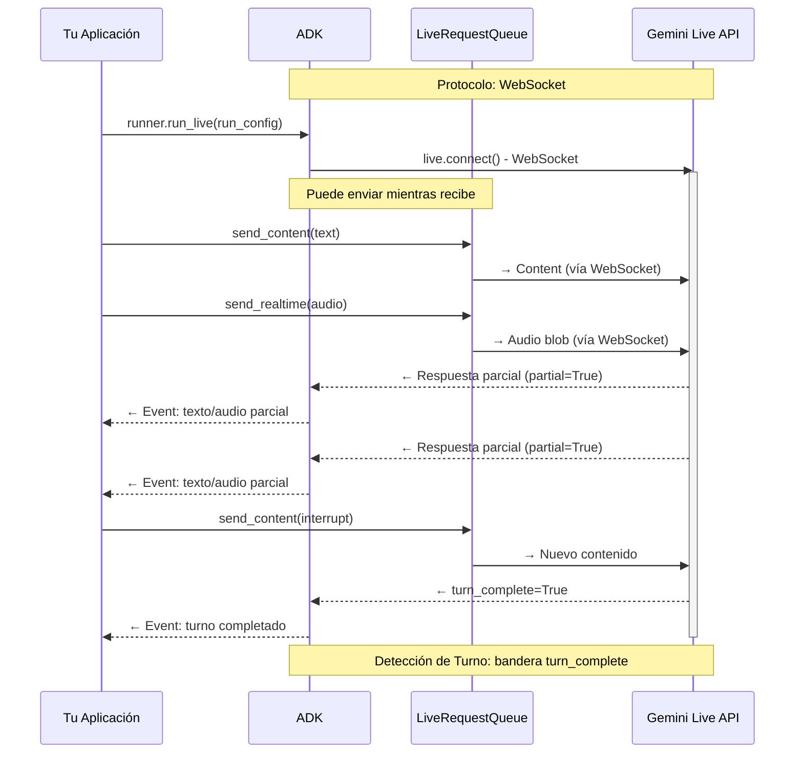
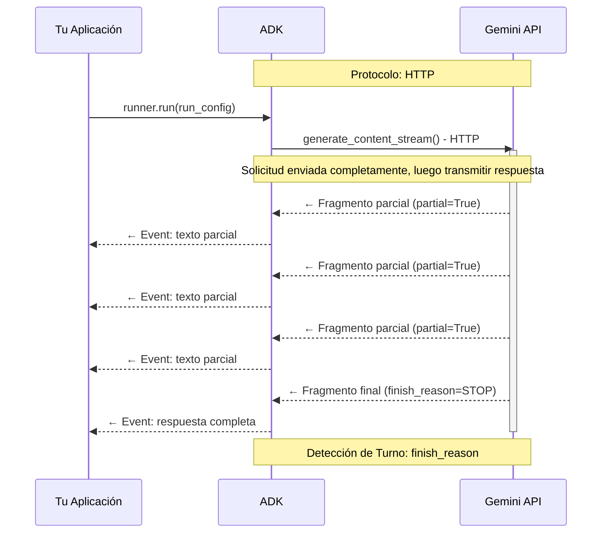
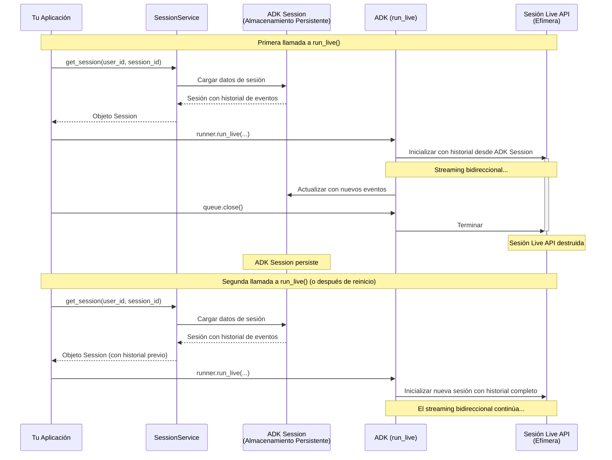
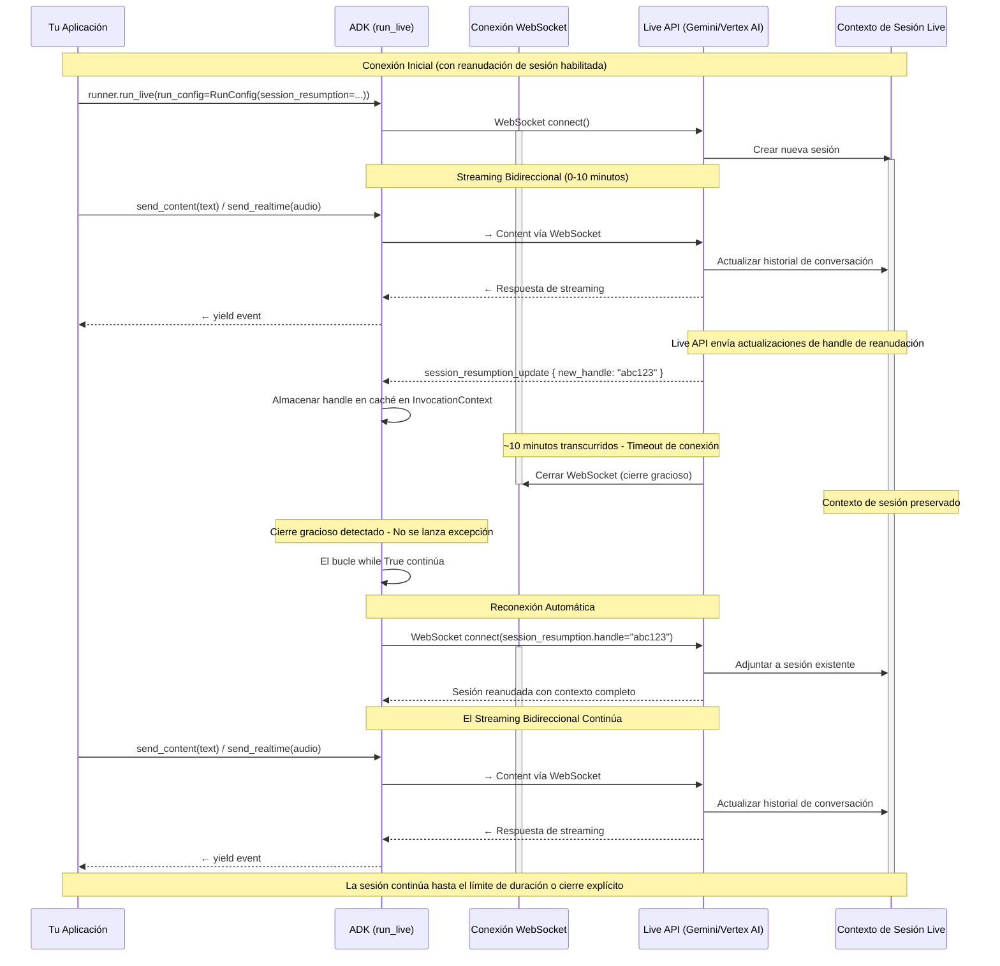

# Parte 4: Comprendiendo RunConfig

En la Parte 3, aprendiste cómo manejar eventos de `run_live()` para procesar respuestas del modelo, llamadas a herramientas y actualizaciones de streaming. Esta parte te muestra cómo configurar esas sesiones de streaming a través de `RunConfig`—controlando formatos de respuesta, gestionando ciclos de vida de sesiones y aplicando restricciones de producción.

**Lo que aprenderás**: Esta parte cubre las modalidades de respuesta y sus restricciones, explora las diferencias entre los modos de streaming BIDI y SSE, examina la relación entre las Sesiones de ADK y las sesiones de Live API, y muestra cómo gestionar la duración de sesiones con reanudación de sesión y compresión de ventana de contexto. Comprenderás cómo manejar cuotas de sesiones concurrentes, implementar patrones arquitectónicos para la gestión de cuotas y configurar controles de costos a través de `max_llm_calls` y opciones de persistencia de audio. Con el dominio de RunConfig, puedes construir aplicaciones de streaming listas para producción que equilibran la riqueza de características con las restricciones operacionales.

!!! note "Aprende Más"

    Para información detallada sobre configuraciones de `RunConfig` relacionadas con audio/video, consulta [Parte 5: Audio, Imagen y Video en Live API](part5.md).

## Referencia Rápida de Parámetros de RunConfig

Esta tabla proporciona una referencia rápida para todos los parámetros de RunConfig cubiertos en esta parte:

| Parámetro | Tipo | Propósito | Soporte de Plataforma | Referencia |
|-----------|------|---------|------------------|-----------|
| **response_modalities** | list[str] | Controlar formato de salida (TEXT o AUDIO) | Ambas | [Detalles](#response-modalities) |
| **streaming_mode** | StreamingMode | Elegir modo BIDI o SSE | Ambas | [Detalles](#streamingmode-bidi-o-sse) |
| **session_resumption** | SessionResumptionConfig | Habilitar reconexión automática | Ambas | [Detalles](#live-api-session-resumption) |
| **context_window_compression** | ContextWindowCompressionConfig | Duración de sesión ilimitada | Ambas | [Detalles](#live-api-context-window-compression) |
| **max_llm_calls** | int | Limitar llamadas LLM totales por sesión | Ambas | [Detalles](#max_llm_calls) |
| **save_live_blob** | bool | Persistir flujos de audio/video | Ambas | [Detalles](#save_live_blob) |
| **custom_metadata** | dict[str, Any] | Adjuntar metadatos a eventos de invocación | Ambas | [Detalles](#custom_metadata) |
| **support_cfc** | bool | Habilitar llamadas a funciones composicionales | Gemini (solo modelos 2.x) | [Detalles](#support_cfc-experimental) |
| **speech_config** | SpeechConfig | Configuración de voz e idioma | Ambas | [Parte 5: Configuración de Voz](part5.md#voice-configuration-speech-config) |
| **input_audio_transcription** | AudioTranscriptionConfig | Transcribir habla del usuario | Ambas | [Parte 5: Transcripción de Audio](part5.md#audio-transcription) |
| **output_audio_transcription** | AudioTranscriptionConfig | Transcribir habla del modelo | Ambas | [Parte 5: Transcripción de Audio](part5.md#audio-transcription) |
| **realtime_input_config** | RealtimeInputConfig | Configuración VAD | Ambas | [Parte 5: Detección de Actividad de Voz](part5.md#voice-activity-detection-vad) |
| **proactivity** | ProactivityConfig | Habilitar audio proactivo | Gemini (solo audio nativo) | [Parte 5: Proactividad y Diálogo Afectivo](part5.md#proactivity-and-affective-dialog) |
| **enable_affective_dialog** | bool | Adaptación emocional | Gemini (solo audio nativo) | [Parte 5: Proactividad y Diálogo Afectivo](part5.md#proactivity-and-affective-dialog) |

!!! note "Referencia de Código Fuente"

    [`run_config.py`](https://github.com/google/adk-python/blob/29c1115959b0084ac1169748863b35323da3cf50/src/google/adk/agents/run_config.py)

**Leyenda de Soporte de Plataforma:**

- **Ambas**: Soportado tanto en Gemini Live API como en Vertex AI Live API
- **Gemini**: Solo soportado en Gemini Live API
- **Específico del modelo**: Requiere arquitectura de modelo específica (ej., audio nativo)

**Rutas de Importación:**

Todas las clases de tipo de configuración referenciadas en la tabla anterior se importan desde `google.genai.types`:

```python
from google.genai import types
from google.adk.agents.run_config import RunConfig, StreamingMode

# Los tipos de configuración se acceden a través del módulo types
run_config = RunConfig(
    session_resumption=types.SessionResumptionConfig(),
    context_window_compression=types.ContextWindowCompressionConfig(...),
    speech_config=types.SpeechConfig(...),
    # etc.
)
```

La clase `RunConfig` en sí y el enum `StreamingMode` se importan desde `google.adk.agents.run_config`.

## Response Modalities

Las modalidades de respuesta controlan cómo el modelo genera salida—como texto o audio. Tanto Gemini Live API como Vertex AI Live API tienen la misma restricción: solo una modalidad de respuesta por sesión.

**Configuración:**

```python
# Fase 2: Inicialización de sesión - RunConfig determina el comportamiento de streaming

# Comportamiento predeterminado: ADK establece automáticamente response_modalities a ["AUDIO"]
# cuando no se especifica (requerido por modelos de audio nativo)
run_config = RunConfig(
    streaming_mode=StreamingMode.BIDI  # Comunicación WebSocket bidireccional
)

# Lo anterior es equivalente a:
run_config = RunConfig(
    response_modalities=["AUDIO"],  # Establecido automáticamente por ADK en run_live()
    streaming_mode=StreamingMode.BIDI  # Comunicación WebSocket bidireccional
)

# ✅ CORRECTO: Respuestas solo de texto
run_config = RunConfig(
    response_modalities=["TEXT"],  # El modelo responde solo con texto
    streaming_mode=StreamingMode.BIDI  # Aún usa streaming bidireccional
)

# ✅ CORRECTO: Respuestas solo de audio (explícito)
run_config = RunConfig(
    response_modalities=["AUDIO"],  # El modelo responde solo con audio
    streaming_mode=StreamingMode.BIDI  # Comunicación WebSocket bidireccional
)
```

Tanto Gemini Live API como Vertex AI Live API restringen las sesiones a una sola modalidad de respuesta. Intentar usar ambas resultará en un error de API:

```python
# ❌ INCORRECTO: Ambas modalidades no están soportadas
run_config = RunConfig(
    response_modalities=["TEXT", "AUDIO"],  # ERROR: No se pueden usar ambas
    streaming_mode=StreamingMode.BIDI
)
# Error de Live API: "Solo una modalidad de respuesta está soportada por sesión"
```

**Comportamiento Predeterminado:**

Cuando `response_modalities` no se especifica, el método `run_live()` de ADK automáticamente lo establece en `["AUDIO"]` porque los modelos de audio nativo requieren una modalidad de respuesta explícita. Puedes anular esto estableciendo explícitamente `response_modalities=["TEXT"]` si es necesario.

**Restricciones clave:**

- Debes elegir `TEXT` o `AUDIO` al inicio de la sesión. **No puedes cambiar entre modalidades a mitad de sesión**
- Debes elegir `AUDIO` para [modelos de Audio Nativo](part5.md#understanding-audio-model-architectures). Si deseas recibir respuestas tanto de audio como de texto de modelos de audio nativo, usa la función Audio Transcript que proporciona transcripciones de texto de la salida de audio. Consulta [Transcripción de Audio](part5.md#audio-transcription) para más detalles
- La modalidad de respuesta solo afecta la salida del modelo—**siempre puedes enviar entrada de texto, voz o video (si el modelo soporta esas modalidades de entrada)** independientemente de la modalidad de respuesta elegida

## StreamingMode: BIDI o SSE

ADK soporta dos modos de streaming distintos que usan diferentes endpoints de API y protocolos:

- `StreamingMode.BIDI`: ADK usa WebSocket para conectarse a la **Live API** (el endpoint de streaming bidireccional vía `live.connect()`)
- `StreamingMode.SSE`: ADK usa streaming HTTP para conectarse a la **API estándar de Gemini** (el endpoint unario/streaming vía `generate_content_async()`)

"Live API" se refiere específicamente al endpoint bidireccional de WebSocket (`live.connect()`), mientras que "API de Gemini" o "API estándar de Gemini" se refiere al endpoint tradicional basado en HTTP (`generate_content()` / `generate_content_async()`). Ambas son parte de la plataforma API de Gemini más amplia pero usan diferentes protocolos y capacidades.

**Nota:** Estos modos se refieren al **protocolo de comunicación ADK-a-API de Gemini**, no a la arquitectura de tu aplicación cara al cliente. Puedes construir servidores WebSocket, APIs REST, endpoints SSE o cualquier otra arquitectura para tus clientes con cualquier modo.

Esta guía se enfoca en `StreamingMode.BIDI`, que es requerido para interacciones de audio/video en tiempo real y características de Live API. Sin embargo, vale la pena entender las diferencias entre los modos BIDI y SSE para elegir el enfoque correcto para tu caso de uso.

**Configuración:**

```python
from google.adk.agents.run_config import RunConfig, StreamingMode

# Streaming BIDI para audio/video en tiempo real
run_config = RunConfig(
    streaming_mode=StreamingMode.BIDI,
    response_modalities=["AUDIO"]  # Soporta modalidades de audio/video
)

# Streaming SSE para interacciones basadas en texto
run_config = RunConfig(
    streaming_mode=StreamingMode.SSE,
    response_modalities=["TEXT"]  # Modalidad solo de texto
)
```

### Diferencias de Protocolo e Implementación

Los dos modos de streaming difieren fundamentalmente en sus patrones de comunicación y capacidades. El modo BIDI habilita verdadera comunicación bidireccional donde puedes enviar nueva entrada mientras recibes respuestas del modelo, mientras que el modo SSE sigue un patrón tradicional de solicitud-luego-respuesta donde envías una solicitud completa y transmites de vuelta la respuesta.

**StreamingMode.BIDI - Comunicación WebSocket Bidireccional:**

El modo BIDI establece una conexión WebSocket persistente que permite envío y recepción simultáneos. Esto habilita características en tiempo real como interrupciones, streaming de audio en vivo y toma de turnos inmediata:



**StreamingMode.SSE - Streaming HTTP Unidireccional:**

El modo SSE (Server-Sent Events) usa streaming HTTP donde envías una solicitud completa por adelantado, luego recibes la respuesta como un flujo de fragmentos. Este es un patrón más simple y tradicional adecuado para aplicaciones de chat basadas en texto:



### Streaming SSE Progresivo

**El streaming SSE progresivo** es una característica que mejora cómo el modo SSE entrega respuestas de streaming. Esta característica mejora la agregación de respuestas mediante:

- **Preservación del orden del contenido**: Mantiene el orden original de tipos de contenido mixtos (texto, llamadas a funciones, datos en línea)
- **Fusión inteligente de texto**: Solo fusiona partes de texto consecutivas del mismo tipo (texto regular vs texto de pensamiento)
- **Entrega progresiva**: Marca todos los fragmentos intermedios como `partial=True`, con una única respuesta agregada final al final
- **Ejecución de funciones diferida**: Omite ejecutar llamadas a funciones en eventos parciales, solo ejecutándolas en el evento agregado final para asegurar que las llamadas a funciones paralelas se ejecuten juntas en lugar de secuencialmente
- **Streaming de argumentos de llamadas a funciones**: Soporta construcción progresiva de argumentos de llamadas a funciones a través de `partial_args`, habilitando visualización en tiempo real de la construcción de llamadas a funciones

**Comportamiento Predeterminado:**

Cuando usas `StreamingMode.SSE`, el streaming SSE progresivo está **habilitado por defecto**. Esto significa que automáticamente te beneficias de estas mejoras sin ninguna configuración adicional.

**Deshabilitar la característica (si es necesario):**

Si necesitas revertir al comportamiento de streaming SSE heredado (acumulación simple de texto), puedes deshabilitarlo vía variable de entorno:

```bash
export ADK_DISABLE_PROGRESSIVE_SSE_STREAMING=1
```

!!! warning "Compromisos del Comportamiento Heredado"

    Deshabilitar el streaming SSE progresivo revierte a acumulación simple de texto, lo cual:
    - Puede perder el orden original del contenido al mezclar texto y llamadas a funciones
    - No soporta streaming de argumentos de llamadas a funciones vía `partial_args`
    - Se proporciona solo para compatibilidad hacia atrás—las nuevas aplicaciones deben usar el modo progresivo predeterminado

**Cuándo ayuda el streaming SSE progresivo:**

- Estás usando `StreamingMode.SSE` y tienes tipos de contenido mixtos (texto + llamadas a funciones)
- Tus respuestas incluyen texto de pensamiento (pensamiento extendido) mezclado con texto regular
- Quieres asegurar que las llamadas a funciones se ejecuten solo una vez después de la agregación completa de respuesta
- Necesitas mostrar la construcción de llamadas a funciones en tiempo real a medida que los argumentos se transmiten

**Nota:** Esta característica solo afecta `StreamingMode.SSE`. No se aplica a `StreamingMode.BIDI` (el enfoque de esta guía), que usa el protocolo bidireccional nativo de Live API.

### Cuándo Usar Cada Modo

Tu elección entre BIDI y SSE depende de los requisitos de tu aplicación y los patrones de interacción que necesites soportar. Aquí hay una guía práctica para ayudarte a elegir:

**Usa BIDI cuando:**

- Construyas aplicaciones de voz/video con interacción en tiempo real
- Necesites comunicación bidireccional (enviar mientras recibes)
- Requieras características de Live API (transcripción de audio, VAD, proactividad, diálogo afectivo)
- Soportes interrupciones y toma de turnos natural (consulta [Parte 3: Manejo de Bandera Interrupted](part3.md#handling-interrupted-flag))
- Implementes herramientas de streaming en vivo o feeds de datos en tiempo real
- Puedas planificar para cuotas de sesiones concurrentes (50-1,000 sesiones dependiendo de la plataforma/nivel)

**Usa SSE cuando:**

- Construyas aplicaciones de chat basadas en texto
- Patrón de interacción estándar de solicitud/respuesta
- Uses modelos sin soporte de Live API (ej., Gemini 1.5 Pro, Gemini 1.5 Flash)
- Despliegue más simple sin requisitos de WebSocket
- Necesites ventanas de contexto más grandes (Gemini 1.5 soporta hasta 2M tokens)
- Prefieras límites de tasa de API estándar (RPM/TPM) sobre cuotas de sesiones concurrentes

!!! note "Modo de Streaming y Compatibilidad de Modelos"
    El modo SSE usa la API estándar de Gemini (`generate_content_async`) vía streaming HTTP, mientras que el modo BIDI usa la Live API (`live.connect()`) vía WebSocket. Los modelos Gemini 1.5 (Pro, Flash) no soportan el protocolo Live API y por lo tanto deben usarse con el modo SSE. Los modelos Gemini 2.0/2.5 Live soportan ambos protocolos pero típicamente se usan con el modo BIDI para acceder a características de audio/video en tiempo real.

### Modelos Estándar de Gemini (Serie 1.5) Accedidos vía SSE

Mientras esta guía se enfoca en Bidi-streaming con modelos Gemini 2.0 Live, ADK también soporta la familia de modelos Gemini 1.5 a través de streaming SSE. Estos modelos ofrecen diferentes compromisos—ventanas de contexto más grandes y estabilidad probada, pero sin características de audio/video en tiempo real. Aquí está lo que la serie 1.5 soporta cuando se accede vía SSE:

**Modelos:**

- `gemini-1.5-pro`
- `gemini-1.5-flash`

**Soportado:**

- ✅ Entrada/salida de texto (`response_modalities=["TEXT"]`)
- ✅ Streaming SSE (`StreamingMode.SSE`)
- ✅ Llamadas a funciones con ejecución automática
- ✅ Ventanas de contexto grandes (hasta 2M tokens para 1.5-pro)

**No Soportado:**

- ❌ Características de audio en vivo (E/S de audio, transcripción, VAD)
- ❌ Bidi-streaming vía `run_live()`
- ❌ Proactividad y diálogo afectivo
- ❌ Entrada de video

## Comprendiendo Conexiones y Sesiones de Live API

Al construir aplicaciones de Bidi-streaming de ADK, es esencial entender cómo ADK gestiona la capa de comunicación entre sí y el backend de Live API. Esta sección explora la distinción fundamental entre **conexiones** (los enlaces de transporte WebSocket que ADK establece con Live API) y **sesiones** (los contextos de conversación lógicos mantenidos por Live API). A diferencia de las APIs tradicionales de solicitud-respuesta, la arquitectura de Bidi-streaming introduce restricciones únicas: timeouts de conexión, límites de duración de sesión que varían según la modalidad (solo audio vs audio+video), ventanas de contexto finitas y cuotas de sesiones concurrentes que difieren entre Gemini Live API y Vertex AI Live API.

### `Session` de ADK vs Sesión de Live API

Entender la distinción entre **`Session` de ADK** y **sesión de Live API** es crucial para construir aplicaciones de streaming confiables con Bidi-streaming de ADK.

**`Session` de ADK** (gestionada por SessionService):
- Almacenamiento persistente de conversación para historial de conversación, eventos y estado, creado vía `SessionService.create_session()` 
- Opciones de almacenamiento: en memoria, base de datos (PostgreSQL/MySQL/SQLite) o Vertex AI
- Sobrevive a través de múltiples llamadas a `run_live()` y reinicios de aplicación (con el `SessionService` persistente)

**Sesión de Live API** (gestionada por el backend de Live API):
- Mantenida por Live API mientras el bucle de eventos `run_live()` está ejecutándose, y destruida cuando el streaming termina al llamar `LiveRequestQueue.close()`
- Sujeta a límites de duración de plataforma, y puede reanudarse a través de múltiples conexiones usando handles de reanudación de sesión (consulta [Cómo ADK Gestiona la Reanudación de Sesión](#how-adk-manages-session-resumption) abajo)

**Cómo trabajan juntas:**

1. **Cuando `run_live()` es llamado:**
   - Recupera la `Session` de ADK desde `SessionService`
   - Inicializa la sesión de Live API con historial de conversación desde `session.events`
   - Transmite eventos bidireccionalmente con el backend de Live API
   - Actualiza la `Session` de ADK con nuevos eventos a medida que ocurren
2. **Cuando `run_live()` termina**
   - La sesión de Live API termina
   - La `Session` de ADK persiste
3. **Cuando `run_live()` es llamado de nuevo** o **la aplicación se reinicia**:
    - ADK carga el historial desde la `Session` de ADK
    - Crea una nueva sesión de Live API con ese contexto

En resumen, la `Session` de ADK proporciona almacenamiento de conversación persistente a largo plazo, mientras que las sesiones de Live API son contextos de streaming efímeros. Esta separación permite que las aplicaciones de producción mantengan continuidad de conversación a través de interrupciones de red, reinicios de aplicación y múltiples sesiones de streaming.

El siguiente diagrama ilustra la relación entre la persistencia de Session de ADK y los contextos de sesión efímeros de Live API, mostrando cómo se mantiene el historial de conversación a través de múltiples llamadas a `run_live()`:



**Ideas clave:**
- La Session de ADK sobrevive a través de múltiples llamadas a `run_live()` y reinicios de aplicación
- La sesión de Live API es efímera - creada y destruida por sesión de streaming
- La continuidad de la conversación se mantiene a través del almacenamiento persistente de ADK Session
- SessionService gestiona la capa de persistencia (en memoria, base de datos o Vertex AI)

Ahora que entendemos la diferencia entre objetos `Session` de ADK y sesiones de Live API, enfoquémonos en las conexiones y sesiones de Live API—la infraestructura backend que alimenta el streaming bidireccional en tiempo real.

### Conexiones y Sesiones de Live API

Entender la distinción entre **conexiones** y **sesiones** a nivel de Live API es crucial para construir aplicaciones de Bidi-streaming de ADK confiables.

**Conexión**: El enlace físico de WebSocket entre ADK y el servidor de Live API. Esta es la capa de transporte de red que lleva datos de streaming bidireccional.

**Sesión**: El contexto de conversación lógico mantenido por Live API, incluyendo historial de conversación, estado de llamadas a herramientas y contexto del modelo. Una sesión puede abarcar múltiples conexiones.

| **Aspecto** | **Conexión** | **Sesión** |
|--------|-----------|---------|
| **¿Qué es?** | Conexión de red WebSocket | Contexto de conversación lógico |
| **Alcance** | Capa de transporte | Capa de aplicación |
| **¿Puede abarcar?** | Enlace de red único | Múltiples conexiones vía reanudación |
| **Impacto de falla** | Error de red o timeout | Historial de conversación perdido |

#### Límites de Conexión y Sesión de Live API por Plataforma

Entender las restricciones de cada plataforma es crítico para la planificación de producción. Gemini Live API y Vertex AI Live API tienen diferentes límites que afectan cuánto tiempo pueden ejecutarse las conversaciones y cuántos usuarios pueden conectarse simultáneamente. La distinción más importante es entre **duración de conexión** (cuánto tiempo permanece abierta una sola conexión WebSocket) y **duración de sesión** (cuánto tiempo puede continuar una conversación lógica).

| Tipo de Restricción | Gemini Live API<br>(Google AI Studio) | Vertex AI Live API<br>(Google Cloud) | Notas |
|----------------|---------------------------------------|--------------------------------------|-------|
| **Duración de conexión** | ~10 minutos | No documentado por separado | Cada conexión WebSocket de Gemini se auto-termina; ADK se reconecta transparentemente con reanudación de sesión |
| **Duración de Sesión (Solo audio)** | 15 minutos | 10 minutos | Duración máxima de sesión sin compresión de ventana de contexto. Ambas plataformas: ilimitada con compresión de ventana de contexto habilitada |
| **Duración de Sesión (Audio + video)** | 2 minutos | 10 minutos | Gemini tiene límite más corto para video; Vertex trata todas las sesiones por igual. Ambas plataformas: ilimitada con compresión de ventana de contexto habilitada |
| **Sesiones concurrentes** | 50 (Nivel 1)<br>1,000 (Nivel 2+) | Hasta 1,000 | Los límites de Gemini varían según el nivel de API; el límite de Vertex es por proyecto de Google Cloud |

!!! note "Referencias de Fuentes"

    - [Guía de Capacidades de Gemini Live API](https://ai.google.dev/gemini-api/docs/live-guide)
    - [Cuotas de API de Gemini](https://ai.google.dev/gemini-api/docs/quota)
    - [Vertex AI Live API](https://cloud.google.com/vertex-ai/generative-ai/docs/live-api)

## Reanudación de Sesión de Live API

Por defecto, Live API limita la duración de conexión a aproximadamente 10 minutos—cada conexión WebSocket se cierra automáticamente después de esta duración. Para superar este límite y habilitar conversaciones más largas, **Live API proporciona [Reanudación de Sesión](https://ai.google.dev/gemini-api/docs/live#session-resumption)**, una característica que migra transparentemente una sesión a través de múltiples conexiones. Cuando se habilita, Live API genera handles de reanudación que permiten reconectarse al mismo contexto de sesión, preservando el historial completo de conversación y estado.

**ADK automatiza esto completamente**: Cuando habilitas la reanudación de sesión en RunConfig, ADK maneja automáticamente toda la lógica de reconexión—detectando cierres de conexión, almacenando en caché handles de reanudación y reconectándose sin problemas en segundo plano. No necesitas escribir ningún código de reconexión. Las sesiones continúan sin problemas más allá del límite de conexión de 10 minutos, manejando timeouts de conexión, interrupciones de red y reconexiones planificadas automáticamente.

### Alcance de la Gestión de Reconexión de ADK

ADK gestiona la **conexión ADK-a-Live API** (el WebSocket entre ADK y el backend de Gemini/Vertex Live API). Esto es transparente para el código de tu aplicación.

**Tu aplicación sigue siendo responsable de**:

- Gestionar conexiones de clientes a tu aplicación (ej., WebSocket del usuario a tu servidor FastAPI)
- Implementar lógica de reconexión del lado del cliente si es necesario
- Manejar fallas de red entre clientes y tu aplicación

Cuando ADK se reconecta a Live API, el bucle de eventos de tu aplicación continúa normalmente—sigues recibiendo eventos de `run_live()` sin interrupción. Desde la perspectiva de tu aplicación, la sesión de Live API continúa sin problemas.

**Configuración:**

```python
from google.genai import types

run_config = RunConfig(
    session_resumption=types.SessionResumptionConfig()
)
```

**Cuándo NO Habilitar la Reanudación de Sesión:**

Mientras que la reanudación de sesión se recomienda para la mayoría de las aplicaciones de producción, considera estos escenarios donde podrías no necesitarla:

- **Sesiones cortas (<10 minutos)**: Si tus sesiones típicamente se completan dentro del timeout de conexión de ~10 minutos, la reanudación agrega sobrecarga innecesaria
- **Interacciones sin estado**: Interacciones estilo solicitud-respuesta donde cada turno es independiente no se benefician de la continuidad de sesión
- **Desarrollo/pruebas**: Depuración más simple cuando cada sesión comienza fresca sin arrastrar estado
- **Despliegues sensibles a costos**: La reanudación de sesión puede incurrir en costos adicionales de plataforma o uso de recursos (verifica con tu plataforma)

**Mejor práctica**: Habilita la reanudación de sesión por defecto para producción, deshabilita solo cuando tengas una razón específica para no usarla.

### Cómo ADK Gestiona la Reanudación de Sesión

Mientras que la reanudación de sesión está soportada tanto por Gemini Live API como por Vertex AI Live API, usarla directamente requiere gestionar handles de reanudación, detectar cierres de conexión e implementar lógica de reconexión. ADK asume la responsabilidad completa de esta complejidad, utilizando automáticamente la reanudación de sesión detrás de escena para que los desarrolladores no necesiten escribir ningún código de reconexión. Simplemente la habilitas en RunConfig, y ADK maneja todo transparentemente.

**Gestión automática de ADK:**

1. **Conexión Inicial**: ADK establece una conexión WebSocket a Live API
2. **Actualizaciones de Handle**: A lo largo de la sesión, Live API envía mensajes `session_resumption_update` conteniendo handles actualizados. ADK automáticamente almacena en caché el handle más reciente en `InvocationContext.live_session_resumption_handle`
3. **Cierre Gracioso de Conexión**: Cuando se alcanza el límite de conexión de ~10 minutos, el WebSocket se cierra graciosamente (sin excepción)
4. **Reconexión Automática**: El bucle interno de ADK detecta el cierre y automáticamente se reconecta usando el handle más reciente en caché
5. **Continuación de Sesión**: La misma sesión continúa sin problemas con contexto completo preservado

!!! note "Detalle de Implementación"

    Durante la reconexión, ADK recupera el handle en caché desde `InvocationContext.live_session_resumption_handle` y lo incluye en el nuevo `LiveConnectConfig` para la llamada `live.connect()`. Esto es manejado completamente por el bucle de reconexión interno de ADK—los desarrolladores nunca necesitan acceder o gestionar estos handles directamente.

### Diagrama de Secuencia: Reconexión Automática

El siguiente diagrama de secuencia ilustra cómo ADK gestiona automáticamente la reanudación de sesión de Live API cuando se alcanza el timeout de conexión de ~10 minutos. ADK detecta el cierre gracioso, recupera el handle de reanudación en caché y se reconecta transparentemente sin cambios en el código de la aplicación:



!!! note "Eventos y Persistencia de Sesión"

    Para detalles sobre qué eventos se guardan en la `Session` de ADK versus cuáles solo se devuelven durante el streaming, consulta [Parte 3: Eventos Guardados en ADK Session](part3.md#events-saved-to-adk-session).

## Compresión de Ventana de Contexto de Live API

**Problema:** Las sesiones de Live API enfrentan dos restricciones críticas que limitan la duración de la conversación. Primero, **los límites de duración de sesión** imponen topes de tiempo duros: sin compresión, Gemini Live API limita las sesiones de solo audio a 15 minutos y las sesiones de audio+video a solo 2 minutos, mientras que Vertex AI limita todas las sesiones a 10 minutos. Segundo, **los límites de ventana de contexto** restringen la longitud de la conversación: los modelos tienen capacidades de tokens finitas (128k tokens para `gemini-2.5-flash-native-audio-preview-12-2025`, 32k-128k para modelos de Vertex AI). Las conversaciones largas—especialmente sesiones extendidas de soporte al cliente, interacciones de tutoría o diálogos de voz de varias horas—alcanzarán el límite de tiempo o el límite de tokens, causando que la sesión termine o pierda historial de conversación crítico.

**Solución:** La [compresión de ventana de contexto](https://ai.google.dev/gemini-api/docs/live-session#context-window-compression) resuelve ambas restricciones simultáneamente. Usa un enfoque de ventana deslizante para comprimir o resumir automáticamente el historial de conversación anterior cuando el conteo de tokens alcanza un umbral configurado. Live API preserva el contexto reciente con detalle completo mientras comprime porciones más antiguas. **Críticamente, habilitar la compresión de ventana de contexto extiende la duración de sesión a tiempo ilimitado**, eliminando los límites de duración de sesión (15 minutos para solo audio / 2 minutos para audio+video en Gemini Live API; 10 minutos para todas las sesiones en Vertex AI) mientras también previene el agotamiento del límite de tokens. Sin embargo, hay un compromiso: como la característica resume el historial de conversación anterior en lugar de retenerlo todo, el detalle del contexto pasado se perderá gradualmente con el tiempo. El modelo tendrá acceso a resúmenes comprimidos de intercambios más antiguos, no al historial completo textual.

### Comportamiento de Plataforma y Límites Oficiales

La gestión de duración de sesión y la compresión de ventana de contexto son **características de plataforma de Live API**. ADK configura estas características vía RunConfig y pasa la configuración a Live API, pero la aplicación real y la implementación son manejadas por los backends de Gemini/Vertex AI Live API.

**Importante**: Los límites de duración y el comportamiento de sesión "ilimitada" mencionados en esta guía están basados en el comportamiento actual de Live API. Estos límites están sujetos a cambios por Google. Siempre verifica los límites actuales de duración de sesión y comportamiento de compresión en la documentación oficial:

- [Documentación de Gemini Live API](https://ai.google.dev/gemini-api/docs/live)
- [Documentación de Vertex AI Live API](https://cloud.google.com/vertex-ai/generative-ai/docs/live-api)

ADK proporciona una forma fácil de configurar la compresión de ventana de contexto a través de RunConfig. Sin embargo, los desarrolladores son responsables de configurar apropiadamente los parámetros de compresión (`trigger_tokens` y `target_tokens`) basándose en sus requisitos específicos—tamaño de ventana de contexto del modelo, patrones de conversación esperados y necesidades de calidad:

```python
from google.genai import types
from google.adk.agents.run_config import RunConfig

# Para gemini-2.5-flash-native-audio-preview-12-2025 (ventana de contexto de 128k)
run_config = RunConfig(
    context_window_compression=types.ContextWindowCompressionConfig(
        trigger_tokens=100000,  # Iniciar compresión en ~78% del contexto de 128k
        sliding_window=types.SlidingWindow(
            target_tokens=80000  # Comprimir a ~62% del contexto, preservando turnos recientes
        )
    )
)
```

**Cómo funciona:**

Cuando la compresión de ventana de contexto está habilitada:

1. Live API monitorea el conteo total de tokens del contexto de conversación
2. Cuando el contexto alcanza el umbral `trigger_tokens`, la compresión se activa
3. El historial de conversación anterior se comprime o resume usando un enfoque de ventana deslizante
4. El contexto reciente (los últimos `target_tokens` en valor) se preserva con detalle completo
5. **Dos efectos críticos ocurren simultáneamente:**
   - Los límites de duración de sesión se eliminan (no más topes de 15 minutos/2 minutos en Gemini Live API o topes de 10 minutos en Vertex AI)
   - Los límites de tokens se gestionan (las sesiones pueden continuar indefinidamente independientemente de la longitud de la conversación)

**Eligiendo umbrales apropiados:**

- Establece `trigger_tokens` al 70-80% de la ventana de contexto de tu modelo para permitir margen
- Establece `target_tokens` al 60-70% para proporcionar compresión suficiente
- Prueba con tus patrones de conversación reales para optimizar estos valores

**Estrategia de Selección de Parámetros:**

Los ejemplos anteriores usan 78% para `trigger_tokens` y 62% para `target_tokens`. Aquí está el razonamiento:

1. **trigger_tokens al 78%**: Proporciona un búfer antes de alcanzar el límite duro
   - Permite espacio para que el turno actual se complete
   - Previene interrupciones de compresión a mitad de respuesta
   - Las conversaciones típicas pueden continuar por varios turnos más

2. **target_tokens al 62%**: Deja espacio sustancial después de la compresión
   - 16 puntos porcentuales (78% - 62%) liberados por compresión
   - Permite múltiples turnos antes de la siguiente compresión
   - Equilibra la preservación de contexto con la frecuencia de compresión

3. **Ajustando para tu caso de uso**:
   - **Turnos largos** (discusiones técnicas detalladas): Aumentar búfer → 70% trigger, 50% target
   - **Turnos cortos** (P&R rápida): Márgenes más ajustados → 85% trigger, 70% target
   - **Crítico de contexto** (requiere detalle histórico): Target más alto → 80% trigger, 70% target
   - **Sensible al rendimiento** (minimizar sobrecarga de compresión): Trigger más bajo → 70% trigger, 50% target

Siempre prueba con tus patrones de conversación reales para encontrar valores óptimos.

### Cuándo NO Usar Compresión de Ventana de Contexto

Mientras que la compresión habilita duración de sesión ilimitada, considera estos compromisos:

**Compromisos de Compresión de Ventana de Contexto:**

| Aspecto | Con Compresión | Sin Compresión | Mejor Para |
|--------|------------------|---------------------|----------|
| **Duración de Sesión** | Ilimitada | 15 min (audio)<br>2 min (video) Gemini<br>10 min Vertex | Compresión: Sesiones largas<br>Sin compresión: Sesiones cortas |
| **Calidad de Contexto** | Contexto antiguo resumido | Historial textual completo | Compresión: Conversación general<br>Sin compresión: Crítico de precisión |
| **Latencia** | Sobrecarga de compresión | Sin sobrecarga | Compresión: Escenarios asíncronos<br>Sin compresión: Tiempo real |
| **Uso de Memoria** | Acotado | Crece con la sesión | Compresión: Sesiones largas<br>Sin compresión: Sesiones cortas |
| **Implementación** | Configurar umbrales | Sin configuración | Compresión: Producción<br>Sin compresión: Prototipos |

**Casos de Uso Comunes:**

✅ **Habilita compresión cuando:**
- Las sesiones necesitan exceder los límites de duración de plataforma (15/2/10 minutos)
- Las conversaciones extendidas pueden alcanzar límites de tokens (128k para 2.5-flash)
- Sesiones de soporte al cliente que pueden durar horas
- Tutoría educativa con interacciones largas

❌ **Deshabilita compresión cuando:**
- Todas las sesiones se completan dentro de los límites de duración
- El recuerdo preciso de conversación temprana es crítico
- Fase de desarrollo/prueba (el historial completo ayuda a la depuración)
- La degradación de calidad de la resumición es inaceptable

**Mejor práctica**: Habilita la compresión solo cuando necesites sesiones más largas que los límites de duración de plataforma O cuando las conversaciones puedan exceder los límites de tokens de ventana de contexto.

## Mejores Prácticas para la Gestión de Conexión y Sesión de Live API

### Esencial: Habilitar Reanudación de Sesión

- ✅ **Siempre habilita la reanudación de sesión** en RunConfig para aplicaciones de producción
- ✅ Esto permite que ADK maneje automáticamente los timeouts de conexión de ~10 minutos de Gemini transparentemente
- ✅ Las sesiones continúan sin problemas a través de múltiples conexiones WebSocket sin interrupción del usuario
- ✅ Almacenamiento en caché de handle de reanudación de sesión y gestión

```python
from google.genai import types

run_config = RunConfig(
    response_modalities=["AUDIO"],
    session_resumption=types.SessionResumptionConfig()
)
```

### Recomendado: Habilitar Compresión de Ventana de Contexto para Sesiones Ilimitadas

- ✅ **Habilita la compresión de ventana de contexto** si necesitas sesiones más largas de 15 minutos (solo audio) o 2 minutos (audio+video)
- ✅ Una vez habilitada, la duración de sesión se vuelve ilimitada—no hay necesidad de monitorear límites basados en tiempo
- ✅ Configura `trigger_tokens` y `target_tokens` basándose en la ventana de contexto de tu modelo
- ✅ Prueba la configuración de compresión con patrones de conversación realistas
- ⚠️ **Usa juiciosamente**: La compresión agrega latencia durante la resumición y puede perder matices conversacionales—solo habilita cuando las sesiones extendidas sean verdaderamente necesarias para tu caso de uso

```python
from google.genai import types
from google.adk.agents.run_config import RunConfig

run_config = RunConfig(
    response_modalities=["AUDIO"],
    session_resumption=types.SessionResumptionConfig(),
    context_window_compression=types.ContextWindowCompressionConfig(
        trigger_tokens=100000,
        sliding_window=types.SlidingWindow(target_tokens=80000)
    )
)
```

### Opcional: Monitorear Duración de Sesión

**Solo aplica si NO estás usando compresión de ventana de contexto:**

- ✅ Enfócate en **límites de duración de sesión**, no en timeouts de conexión (ADK los maneja automáticamente)
- ✅ **Gemini Live API**: Monitorea el límite de 15 minutos (solo audio) o límite de 2 minutos (audio+video)
- ✅ **Vertex AI Live API**: Monitorea el límite de sesión de 10 minutos
- ✅ Advierte a los usuarios 1-2 minutos antes de los límites de duración de sesión
- ✅ Implementa transiciones de sesión graciosas para conversaciones que excedan los límites de sesión

## Sesiones Concurrentes de Live API y Gestión de Cuotas

**Problema:** Las aplicaciones de voz de producción típicamente sirven a múltiples usuarios simultáneamente, cada uno requiriendo su propia sesión de Live API. Sin embargo, tanto Gemini Live API como Vertex AI Live API imponen límites estrictos de sesiones concurrentes que varían según la plataforma y nivel de precios. Sin planificación de cuotas apropiada y gestión de sesiones, las aplicaciones pueden alcanzar estos límites rápidamente, causando fallas de conexión para nuevos usuarios o calidad de servicio degradada durante el uso pico.

**Solución:** Entiende las cuotas específicas de la plataforma, diseña tu arquitectura para mantenerte dentro de los límites de sesiones concurrentes, implementa estrategias de pooling de sesiones o encolado cuando sea necesario, y monitorea el uso de cuotas proactivamente. ADK maneja el ciclo de vida de sesiones individuales automáticamente, pero los desarrolladores deben arquitecturar sus aplicaciones para gestionar múltiples usuarios concurrentes dentro de restricciones de cuota.

### Comprendiendo Cuotas de Sesiones Concurrentes de Live API

Ambas plataformas limitan cuántas sesiones de Live API pueden ejecutarse simultáneamente, pero los límites y mecanismos difieren significativamente:

**Gemini Live API (Google AI Studio) - Cuotas basadas en niveles:**

| **Nivel** | **Sesiones Concurrentes** | **TPM (Tokens Por Minuto)** | **Acceso** |
|----------|------------------------:|----------------------------:|------------|
| **Nivel Gratuito** | Limitado* | 1,000,000 | Clave API gratuita |
| **Nivel 1** | 50 | 4,000,000 | Pago por uso |
| **Nivel 2** | 1,000 | 10,000,000 | Nivel de uso más alto |
| **Nivel 3** | 1,000 | 10,000,000 | Nivel de uso más alto |

*Los límites de sesiones concurrentes del nivel gratuito no están documentados explícitamente pero son significativamente menores que los niveles pagos.

!!! note "Fuente"

    [Cuotas de API de Gemini](https://ai.google.dev/gemini-api/docs/quota)

**Vertex AI Live API (Google Cloud) - Cuotas basadas en proyecto:**

| **Tipo de Recurso** | **Límite** | **Alcance** |
|---------------|------:|-------|
| **Conexiones bidireccionales en vivo concurrentes** | 10 por minuto | Por proyecto, por región |
| **Sesiones concurrentes máximas** | Hasta 1,000 | Por proyecto |
| **Creación/eliminación/actualización de sesión** | 100 por minuto | Por proyecto, por región |

!!! note "Fuente"

    [Vertex AI Live API](https://cloud.google.com/vertex-ai/generative-ai/docs/live-api) | [Cuotas de Vertex AI](https://cloud.google.com/vertex-ai/generative-ai/docs/quotas)

**Solicitando un aumento de cuota:**

Para solicitar un aumento para sesiones concurrentes de Live API, navega a la [página de Cuotas](https://console.cloud.google.com/iam-admin/quotas) en Google Cloud Console. Filtra por la cuota llamada **"Bidi generate content concurrent requests"** para encontrar valores de cuota para cada proyecto, región y modelo base, y envía una solicitud de aumento de cuota. Necesitarás el rol de Administrador de Cuotas (`roles/servicemanagement.quotaAdmin`) para hacer la solicitud. Consulta [Ver y gestionar cuotas](https://cloud.google.com/docs/quotas/view-manage) para instrucciones detalladas.


**Diferencias clave:**

1. **Gemini Live API**: Los límites de sesiones concurrentes escalan dramáticamente con el nivel de API (50 → 1,000 sesiones). Mejor para aplicaciones con bases de usuarios impredecibles o escalado rápido dispuestas a pagar por niveles más altos.

2. **Vertex AI Live API**: Limitado por tasa por tasa de establecimiento de conexión (10/min) pero soporta hasta 1,000 sesiones concurrentes totales. Mejor para aplicaciones empresariales con patrones de escalado gradual e infraestructura de Google Cloud existente. Además, puedes solicitar aumentos de cuota para prepararte para despliegues de producción con requisitos de concurrencia más altos.

### Patrones Arquitectónicos para Gestionar Cuotas

Una vez que entiendas tus cuotas de sesiones concurrentes, el siguiente desafío es arquitecturar tu aplicación para operar efectivamente dentro de esos límites. El enfoque correcto depende de tu concurrencia de usuario esperada, requisitos de escalado y tolerancia al encolado. Esta sección presenta dos patrones arquitectónicos—desde mapeo directo simple para aplicaciones de baja concurrencia hasta pooling de sesiones con encolado para aplicaciones que pueden exceder límites de cuota durante uso pico. Elige el patrón que coincida con tu escala actual y diseñalo para evolucionar a medida que crece tu base de usuarios.

**Eligiendo la Arquitectura Correcta:**

```text
                Inicio: Diseñando Gestión de Cuotas
                              |
                              v
                   ¿Usuarios Concurrentes Esperados?
                     /                    \
            < Límite de Cuota       > Límite de Cuota o Impredecible
                   |                              |
                   v                              v
          Patrón 1: Mapeo Directo    Patrón 2: Pooling de Sesiones
          - Mapeo simple 1:1         - Encolar usuarios en espera
          - Sin lógica de cuota      - Degradación graciosa
          - Desarrollo rápido        - Manejo de picos
                   |                              |
                   v                              v
              Bueno para:                    Bueno para:
              - Prototipos                   - Producción a escala
              - Equipos pequeños             - Carga impredecible
              - Usuarios controlados         - Aplicaciones públicas
```

**Guía de Decisión Rápida:**

| Factor | Mapeo Directo | Pooling de Sesiones |
|--------|----------------|-----------------|
| **Usuarios esperados** | Siempre < cuota | Puede exceder cuota |
| **Experiencia de usuario** | Siempre instantáneo | Puede esperar durante picos |
| **Complejidad de implementación** | Baja | Media |
| **Sobrecarga operacional** | Ninguna | Monitorear profundidad de cola |
| **Mejor para** | Prototipos, herramientas internas | Producción, aplicaciones públicas |

#### Patrón 1: Mapeo Directo (Aplicaciones Simples)

Para aplicaciones de pequeña escala donde los usuarios concurrentes nunca excederán los límites de cuota, crea una sesión de Live API dedicada para cada usuario conectado con un simple mapeo 1:1:

1. **Cuando un usuario se conecta:** Inicia inmediatamente una sesión `run_live()` para ellos
2. **Cuando se desconectan:** La sesión termina
3. **Sin lógica de gestión de cuotas:** Asume que tus usuarios concurrentes totales siempre permanecerán por debajo de tus límites de cuota

Esta es la arquitectura más simple posible y funciona bien para prototipos, entornos de desarrollo y aplicaciones de pequeña escala con cargas de usuario predecibles.

#### Patrón 2: Pooling de Sesiones con Encolado

Para aplicaciones que pueden exceder los límites de sesiones concurrentes durante uso pico, rastrea el número de sesiones de Live API activas y aplica tu límite de cuota a nivel de aplicación:

1. **Cuando un nuevo usuario se conecta:** Verifica si tienes espacios de sesión disponibles
2. **Si hay espacios disponibles:** Inicia una sesión inmediatamente
3. **Si has alcanzado tu límite de cuota:**
   - Coloca al usuario en una cola de espera
   - Notifícales que están esperando un espacio disponible
4. **A medida que las sesiones terminan:** Procesa automáticamente la cola para iniciar sesiones para usuarios en espera

Esto proporciona degradación graciosa—los usuarios esperan brevemente durante tiempos pico en lugar de experimentar fallas de conexión duras.

## Controles Misceláneos

ADK proporciona opciones adicionales de RunConfig para controlar el comportamiento de sesiones, gestionar costos y persistir datos de audio para propósitos de depuración y cumplimiento.

```python
run_config = RunConfig(
    # Limitar llamadas LLM totales por invocación
    max_llm_calls=500,  # Predeterminado: 500 (