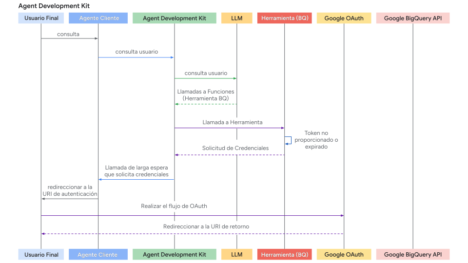
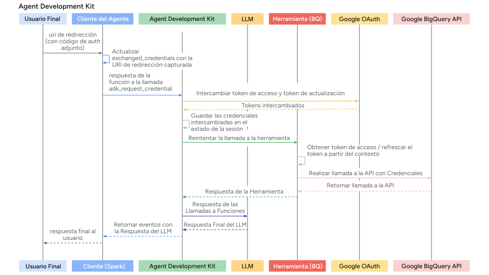

# Autenticación con Herramientas

<div class="language-support-tag">
  <span class="lst-supported">Soportado en ADK</span><span class="lst-python">Python v0.1.0</span>
</div>

Muchas herramientas necesitan acceder a recursos protegidos (como datos de usuario en Google Calendar, registros de Salesforce, etc.) y requieren autenticación. ADK proporciona un sistema para manejar varios métodos de autenticación de forma segura.

Los componentes clave involucrados son:

1. **`AuthScheme`**: Define *cómo* una API espera las credenciales de autenticación (por ejemplo, como una API Key en un encabezado, un token Bearer de OAuth 2.0). ADK soporta los mismos tipos de esquemas de autenticación que OpenAPI 3.0. Para saber más sobre qué es cada tipo de credencial, consulta [OpenAPI doc: Authentication](https://swagger.io/docs/specification/v3_0/authentication/). ADK usa clases específicas como `APIKey`, `HTTPBearer`, `OAuth2`, `OpenIdConnectWithConfig`.
2. **`AuthCredential`**: Contiene la información *inicial* necesaria para *iniciar* el proceso de autenticación (por ejemplo, el OAuth Client ID/Secret de tu aplicación, un valor de API key). Incluye un `auth_type` (como `API_KEY`, `OAUTH2`, `SERVICE_ACCOUNT`) que especifica el tipo de credencial.

El flujo general involucra proporcionar estos detalles al configurar una herramienta. ADK luego intenta intercambiar automáticamente la credencial inicial por una utilizable (como un access token) antes de que la herramienta haga una llamada a la API. Para flujos que requieren interacción del usuario (como el consentimiento OAuth), se activa un proceso interactivo específico que involucra la aplicación Agent Client.

## Tipos de Credenciales Iniciales Soportados

* **API\_KEY:** Para autenticación simple de clave/valor. Usualmente no requiere intercambio.
* **HTTP:** Puede representar autenticación básica (no recomendada/soportada para intercambio) o tokens Bearer ya obtenidos. Si es un token Bearer, no se necesita intercambio.
* **OAUTH2:** Para flujos estándar de OAuth 2.0. Requiere configuración (client ID, secret, scopes) y frecuentemente activa el flujo interactivo para el consentimiento del usuario.
* **OPEN\_ID\_CONNECT:** Para autenticación basada en OpenID Connect. Similar a OAuth2, frecuentemente requiere configuración e interacción del usuario.
* **SERVICE\_ACCOUNT:** Para credenciales de Service Account de Google Cloud (clave JSON o Application Default Credentials). Típicamente se intercambian por un token Bearer.

## Configuración de Autenticación en Herramientas

Configuras la autenticación al definir tu herramienta:

* **RestApiTool / OpenAPIToolset**: Pasa `auth_scheme` y `auth_credential` durante la inicialización

* **Herramientas de GoogleApiToolSet**: ADK tiene herramientas de primera parte incorporadas como Google Calendar, BigQuery, etc. Usa el método específico del toolset.

* **APIHubToolset / ApplicationIntegrationToolset**: Pasa `auth_scheme` y `auth_credential` durante la inicialización, si la API gestionada en API Hub / proporcionada por Application Integration requiere autenticación.

!!! tip "ADVERTENCIA"
    Almacenar credenciales sensibles como access tokens y especialmente refresh tokens directamente en el estado de sesión podría plantear riesgos de seguridad dependiendo de tu backend de almacenamiento de sesión (`SessionService`) y la postura de seguridad general de la aplicación.

    *   **`InMemorySessionService`:** Adecuado para pruebas y desarrollo, pero los datos se pierden cuando el proceso termina. Menor riesgo ya que es transitorio.
    *   **Base de Datos/Almacenamiento Persistente:** **Considera fuertemente encriptar** los datos del token antes de almacenarlos en la base de datos usando una biblioteca de encriptación robusta (como `cryptography`) y gestionar las claves de encriptación de forma segura (por ejemplo, usando un servicio de gestión de claves).
    *   **Almacenes de Secretos Seguros:** Para entornos de producción, almacenar credenciales sensibles en un gestor de secretos dedicado (como Google Cloud Secret Manager o HashiCorp Vault) es el **enfoque más recomendado**. Tu herramienta podría potencialmente almacenar solo access tokens de corta duración o referencias seguras (no el refresh token en sí) en el estado de sesión, obteniendo los secretos necesarios del almacén seguro cuando sea necesario.

---

## Recorrido 1: Construcción de Aplicaciones Agénticas con Herramientas Autenticadas

Esta sección se enfoca en usar herramientas preexistentes (como aquellas de `RestApiTool/ OpenAPIToolset`, `APIHubToolset`, `GoogleApiToolSet`) que requieren autenticación dentro de tu aplicación agéntica. Tu responsabilidad principal es configurar las herramientas y manejar la parte del lado del cliente de los flujos de autenticación interactivos (si son requeridos por la herramienta).

### 1. Configuración de Herramientas con Autenticación

Al agregar una herramienta autenticada a tu agente, necesitas proporcionar su `AuthScheme` requerido y la `AuthCredential` inicial de tu aplicación.

**A. Usando Toolsets basados en OpenAPI (`OpenAPIToolset`, `APIHubToolset`, etc.)**

Pasa el scheme y la credential durante la inicialización del toolset. El toolset los aplica a todas las herramientas generadas. Aquí hay algunas formas de crear herramientas con autenticación en ADK.

=== "API Key"

      Crear una herramienta que requiere una API Key.

      ```py
      from google.adk.tools.openapi_tool.auth.auth_helpers import token_to_scheme_credential
      from google.adk.tools.openapi_tool.openapi_spec_parser.openapi_toolset import OpenAPIToolset

      auth_scheme, auth_credential = token_to_scheme_credential(
          "apikey", "query", "apikey", "YOUR_API_KEY_STRING"
      )
      sample_api_toolset = OpenAPIToolset(
          spec_str="...",  # Completa esto con una cadena de especificación OpenAPI
          spec_str_type="yaml",
          auth_scheme=auth_scheme,
          auth_credential=auth_credential,
      )
      ```

=== "OAuth2"

      Crear una herramienta que requiere OAuth2.

      ```py
      from google.adk.tools.openapi_tool.openapi_spec_parser.openapi_toolset import OpenAPIToolset
      from fastapi.openapi.models import OAuth2
      from fastapi.openapi.models import OAuthFlowAuthorizationCode
      from fastapi.openapi.models import OAuthFlows
      from google.adk.auth import AuthCredential
      from google.adk.auth import AuthCredentialTypes
      from google.adk.auth import OAuth2Auth

      auth_scheme = OAuth2(
          flows=OAuthFlows(
              authorizationCode=OAuthFlowAuthorizationCode(
                  authorizationUrl="https://accounts.google.com/o/oauth2/auth",
                  tokenUrl="https://oauth2.googleapis.com/token",
                  scopes={
                      "https://www.googleapis.com/auth/calendar": "calendar scope"
                  },
              )
          )
      )
      auth_credential = AuthCredential(
          auth_type=AuthCredentialTypes.OAUTH2,
          oauth2=OAuth2Auth(
              client_id=YOUR_OAUTH_CLIENT_ID,
              client_secret=YOUR_OAUTH_CLIENT_SECRET
          ),
      )

      calendar_api_toolset = OpenAPIToolset(
          spec_str=google_calendar_openapi_spec_str, # Completa esto con una especificación openapi
          spec_str_type='yaml',
          auth_scheme=auth_scheme,
          auth_credential=auth_credential,
      )
      ```

=== "Service Account"

      Crear una herramienta que requiere Service Account.

      ```py
      from google.adk.tools.openapi_tool.auth.auth_helpers import service_account_dict_to_scheme_credential
      from google.adk.tools.openapi_tool.openapi_spec_parser.openapi_toolset import OpenAPIToolset

      service_account_cred = json.loads(service_account_json_str)
      auth_scheme, auth_credential = service_account_dict_to_scheme_credential(
          config=service_account_cred,
          scopes=["https://www.googleapis.com/auth/cloud-platform"],
      )
      sample_toolset = OpenAPIToolset(
          spec_str=sa_openapi_spec_str, # Completa esto con una especificación openapi
          spec_str_type='json',
          auth_scheme=auth_scheme,
          auth_credential=auth_credential,
      )
      ```

=== "OpenID connect"

      Crear una herramienta que requiere OpenID connect.

      ```py
      from google.adk.auth.auth_schemes import OpenIdConnectWithConfig
      from google.adk.auth.auth_credential import AuthCredential, AuthCredentialTypes, OAuth2Auth
      from google.adk.tools.openapi_tool.openapi_spec_parser.openapi_toolset import OpenAPIToolset

      auth_scheme = OpenIdConnectWithConfig(
          authorization_endpoint=OAUTH2_AUTH_ENDPOINT_URL,
          token_endpoint=OAUTH2_TOKEN_ENDPOINT_URL,
          scopes=['openid', 'YOUR_OAUTH_SCOPES"]
      )
      auth_credential = AuthCredential(
          auth_type=AuthCredentialTypes.OPEN_ID_CONNECT,
          oauth2=OAuth2Auth(
              client_id="...",
              client_secret="...",
          )
      )

      userinfo_toolset = OpenAPIToolset(
          spec_str=content, # Completa con una especificación actual
          spec_str_type='yaml',
          auth_scheme=auth_scheme,
          auth_credential=auth_credential,
      )
      ```

**B. Usando Google API Toolsets (por ejemplo, `calendar_tool_set`)**

Estos toolsets frecuentemente tienen métodos de configuración dedicados.

Consejo: Para saber cómo crear un Google OAuth Client ID & Secret, consulta esta guía: [Get your Google API Client ID](https://developers.google.com/identity/gsi/web/guides/get-google-api-clientid#get_your_google_api_client_id)

```py
# Ejemplo: Configuración de Google Calendar Tools
from google.adk.tools.google_api_tool import calendar_tool_set

client_id = "YOUR_GOOGLE_OAUTH_CLIENT_ID.apps.googleusercontent.com"
client_secret = "YOUR_GOOGLE_OAUTH_CLIENT_SECRET"

# Usa el método de configuración específico para este tipo de toolset
calendar_tool_set.configure_auth(
    client_id=oauth_client_id, client_secret=oauth_client_secret
)

# agent = LlmAgent(..., tools=calendar_tool_set.get_tool('calendar_tool_set'))
```

El diagrama de secuencia del flujo de solicitud de autenticación (donde las herramientas solicitan credenciales de autenticación) se ve así:




### 2. Manejo del Flujo Interactivo OAuth/OIDC (Lado del Cliente)

Si una herramienta requiere inicio de sesión/consentimiento del usuario (típicamente OAuth 2.0 u OIDC), el framework ADK pausa la ejecución y señala a tu aplicación **Agent Client**. Hay dos casos:

* La aplicación **Agent Client** ejecuta el agente directamente (vía `runner.run_async`) en el mismo proceso. Por ejemplo, backend de UI, aplicación CLI o trabajo Spark, etc.
* La aplicación **Agent Client** interactúa con el servidor fastapi de ADK vía el endpoint `/run` o `/run_sse`. Mientras que el servidor fastapi de ADK podría estar configurado en el mismo servidor o en un servidor diferente que la aplicación **Agent Client**

El segundo caso es un caso especial del primer caso, porque el endpoint `/run` o `/run_sse` también invoca `runner.run_async`. Las únicas diferencias son:

* Si llamar a una función python para ejecutar el agente (primer caso) o llamar a un endpoint de servicio para ejecutar el agente (segundo caso).
* Si los eventos de resultado son objetos en memoria (primer caso) o cadenas json serializadas en la respuesta http (segundo caso).

Las secciones siguientes se enfocan en el primer caso y deberías poder mapearlo al segundo caso de manera muy directa. También describiremos algunas diferencias a manejar para el segundo caso si es necesario.

Aquí está el proceso paso a paso para tu aplicación cliente:

**Paso 1: Ejecutar Agente y Detectar Solicitud de Autenticación**

* Inicia la interacción del agente usando `runner.run_async`.
* Itera a través de los eventos generados.
* Busca un evento específico de llamada a función cuya llamada a función tiene un nombre especial: `adk_request_credential`. Este evento señala que se necesita interacción del usuario. Puedes usar funciones auxiliares para identificar este evento y extraer la información necesaria. (Para el segundo caso, la lógica es similar. Deserializas el evento de la respuesta http).

```py

# runner = Runner(...)
# session = await session_service.create_session(...)
# content = types.Content(...) # Consulta inicial del usuario

print("\nRunning agent...")
events_async = runner.run_async(
    session_id=session.id, user_id='user', new_message=content
)

auth_request_function_call_id, auth_config = None, None

async for event in events_async:
    # Usa un helper para verificar el evento específico de solicitud de autenticación
    if (auth_request_function_call := get_auth_request_function_call(event)):
        print("--> Authentication required by agent.")
        # Almacena el ID necesario para responder más tarde
        if not (auth_request_function_call_id := auth_request_function_call.id):
            raise ValueError(f'Cannot get function call id from function call: {auth_request_function_call}')
        # Obtén el AuthConfig que contiene el auth_uri, etc.
        auth_config = get_auth_config(auth_request_function_call)
        break # Detén el procesamiento de eventos por ahora, necesitas interacción del usuario

if not auth_request_function_call_id:
    print("\nAuth not required or agent finished.")
    # return # O maneja la respuesta final si se recibió

```

*Funciones auxiliares `helpers.py`:*

```py
from google.adk.events import Event
from google.adk.auth import AuthConfig # Importa el tipo necesario
from google.genai import types

def get_auth_request_function_call(event: Event) -> types.FunctionCall:
    # Obtiene la llamada a función especial de solicitud de autenticación del evento
    if not event.content or not event.content.parts:
        return
    for part in event.content.parts:
        if (
            part
            and part.function_call
            and part.function_call.name == 'adk_request_credential'
            and event.long_running_tool_ids
            and part.function_call.id in event.long_running_tool_ids
        ):

            return part.function_call

def get_auth_config(auth_request_function_call: types.FunctionCall) -> AuthConfig:
    # Extrae el objeto AuthConfig de los argumentos de la llamada a función de solicitud de autenticación
    if not auth_request_function_call.args or not (auth_config := auth_request_function_call.args.get('authConfig')):
        raise ValueError(f'Cannot get auth config from function call: {auth_request_function_call}')
    if isinstance(auth_config, dict):
        auth_config = AuthConfig.model_validate(auth_config)
    elif not isinstance(auth_config, AuthConfig):
        raise ValueError(f'Cannot get auth config {auth_config} is not an instance of AuthConfig.')
    return auth_config
```

**Paso 2: Redirigir al Usuario para Autorización**

* Obtén la URL de autorización (`auth_uri`) del `auth_config` extraído en el paso anterior.
* **Crucialmente, agrega tu** redirect\_uri **de aplicación como un parámetro de consulta a este** `auth_uri`. Este `redirect_uri` debe estar pre-registrado con tu proveedor OAuth (por ejemplo, [Google Cloud Console](https://developers.google.com/identity/protocols/oauth2/web-server#creatingcred), [panel de administración de Okta](https://developer.okta.com/docs/guides/sign-into-web-app-redirect/spring-boot/main/#create-an-app-integration-in-the-admin-console)).
* Dirige al usuario a esta URL completa (por ejemplo, ábrela en su navegador).

```py
# (Continuando después de detectar que se necesita autenticación)

if auth_request_function_call_id and auth_config:
    # Obtén la URL base de autorización del AuthConfig
    base_auth_uri = auth_config.exchanged_auth_credential.oauth2.auth_uri

    if base_auth_uri:
        redirect_uri = 'http://localhost:8000/callback' # DEBE coincidir con la configuración de tu aplicación cliente OAuth
        # Agrega redirect_uri (usa urlencode en producción)
        auth_request_uri = base_auth_uri + f'&redirect_uri={redirect_uri}'
        # Ahora necesitas redirigir a tu usuario final a esta auth_request_uri o pedirle que abra esta auth_request_uri en su navegador
        # Esta auth_request_uri debe ser servida por el proveedor de autenticación correspondiente y el usuario final debe iniciar sesión y autorizar a tu aplicación para acceder a sus datos
        # Y luego el proveedor de autenticación redirigirá al usuario final al redirect_uri que proporcionaste
        # Siguiente paso: Obtén esta URL de callback del usuario (o tu manejador de servidor web)
    else:
         print("ERROR: Auth URI not found in auth_config.")
         # Maneja el error

```

**Paso 3. Manejar el Callback de Redirección (Cliente):**

* Tu aplicación debe tener un mecanismo (por ejemplo, una ruta de servidor web en el `redirect_uri`) para recibir al usuario después de que autorice la aplicación con el proveedor.
* El proveedor redirige al usuario a tu `redirect_uri` y agrega un `authorization_code` (y potencialmente `state`, `scope`) como parámetros de consulta a la URL.
* Captura la **URL de callback completa** de esta solicitud entrante.
* (Este paso ocurre fuera del bucle principal de ejecución del agente, en tu servidor web o manejador de callback equivalente.)

**Paso 4. Enviar Resultado de Autenticación de Vuelta a ADK (Cliente):**

* Una vez que tengas la URL de callback completa (que contiene el código de autorización), recupera el `auth_request_function_call_id` y el objeto `auth_config` guardados en el Paso 1 del Cliente.
* Establece la URL de callback capturada en el campo `exchanged_auth_credential.oauth2.auth_response_uri`. También asegúrate de que `exchanged_auth_credential.oauth2.redirect_uri` contenga el redirect URI que usaste.
* Crea un objeto `types.Content` que contenga un `types.Part` con un `types.FunctionResponse`.
      * Establece `name` a `"adk_request_credential"`. (Nota: Este es un nombre especial para que ADK proceda con la autenticación. No uses otros nombres.)
      * Establece `id` al `auth_request_function_call_id` que guardaste.
      * Establece `response` al objeto `AuthConfig` actualizado *serializado* (por ejemplo, `.model_dump()`).
* Llama a `runner.run_async` **nuevamente** para la misma sesión, pasando este contenido `FunctionResponse` como el `new_message`.

```py
# (Continuando después de la interacción del usuario)

    # Simula obtener la URL de callback (por ejemplo, del pegado del usuario o manejador web)
    auth_response_uri = await get_user_input(
        f'Paste the full callback URL here:\n> '
    )
    auth_response_uri = auth_response_uri.strip() # Limpia la entrada

    if not auth_response_uri:
        print("Callback URL not provided. Aborting.")
        return

    # Actualiza el AuthConfig recibido con los detalles del callback
    auth_config.exchanged_auth_credential.oauth2.auth_response_uri = auth_response_uri
    # También incluye el redirect_uri usado, ya que el intercambio de token podría necesitarlo
    auth_config.exchanged_auth_credential.oauth2.redirect_uri = redirect_uri

    # Construye el objeto Content de FunctionResponse
    auth_content = types.Content(
        role='user', # El rol puede ser 'user' al enviar un FunctionResponse
        parts=[
            types.Part(
                function_response=types.FunctionResponse(
                    id=auth_request_function_call_id,       # Vincula a la solicitud original
                    name='adk_request_credential', # Nombre especial de función del framework
                    response=auth_config.model_dump() # Envía de vuelta el AuthConfig *actualizado*
                )
            )
        ],
    )

    # --- Reanudar Ejecución ---
    print("\nSubmitting authentication details back to the agent...")
    events_async_after_auth = runner.run_async(
        session_id=session.id,
        user_id='user',
        new_message=auth_content, # Envía el FunctionResponse de vuelta
    )

    # --- Procesar Salida Final del Agente ---
    print("\n--- Agent Response after Authentication ---")
    async for event in events_async_after_auth:
        # Procesa los eventos normalmente, esperando que la llamada a la herramienta tenga éxito ahora
        print(event) # Imprime el evento completo para inspección

```

!!! note "Nota: Respuesta de autorización con la función Resume"

    Si tu flujo de trabajo del agente ADK está configurado con la
    función [Resume](/runtime/resume/), también debes incluir
    el ID de Invocación (`invocation_id`) como parámetro con la respuesta
    de autorización. El ID de Invocación que proporciones debe ser la misma
    invocación que generó la solicitud de autorización, de lo contrario el
    sistema inicia una nueva invocación con la respuesta de autorización. Si tu
    agente usa la función Resume, considera incluir el ID de Invocación
    como un parámetro con tu solicitud de autorización, para que pueda ser incluido
    con la respuesta de autorización. Para más detalles sobre el uso de la función
    Resume, consulta
    [Resume stopped agents](/runtime/resume/).

**Paso 5: ADK Maneja el Intercambio de Token y Reintento de Herramienta y obtiene el Resultado de la Herramienta**

* ADK recibe el `FunctionResponse` para `adk_request_credential`.
* Usa la información en el `AuthConfig` actualizado (incluyendo la URL de callback que contiene el código) para realizar el **intercambio de token** OAuth con el endpoint de token del proveedor, obteniendo el access token (y posiblemente el refresh token).
* ADK hace que estos tokens estén disponibles internamente estableciéndolos en el estado de sesión).
* ADK **reintenta automáticamente** la llamada a la herramienta original (la que inicialmente falló debido a la falta de autenticación).
* Esta vez, la herramienta encuentra los tokens válidos (vía `tool_context.get_auth_response()`) y ejecuta exitosamente la llamada a la API autenticada.
* El agente recibe el resultado real de la herramienta y genera su respuesta final al usuario.

---

El diagrama de secuencia del flujo de respuesta de autenticación (donde Agent Client envía de vuelta la respuesta de autenticación y ADK reintenta la llamada a la herramienta) se ve así:



## Recorrido 2: Construcción de Herramientas Personalizadas (`FunctionTool`) que Requieren Autenticación

Esta sección se enfoca en implementar la lógica de autenticación *dentro* de tu función Python personalizada al crear una nueva Herramienta ADK. Implementaremos un `FunctionTool` como ejemplo.

### Prerrequisitos

Tu firma de función *debe* incluir [`tool_context: ToolContext`](../tools-custom/index.md#tool-context). ADK inyecta automáticamente este objeto, proporcionando acceso a estado y mecanismos de autenticación.

```py
from google.adk.tools import FunctionTool, ToolContext
from typing import Dict

def my_authenticated_tool_function(param1: str, ..., tool_context: ToolContext) -> dict:
    # ... tu lógica ...
    pass

my_tool = FunctionTool(func=my_authenticated_tool_function)

```

### Lógica de Autenticación dentro de la Función de Herramienta

Implementa los siguientes pasos dentro de tu función:

**Paso 1: Verificar Credenciales en Caché y Válidas:**

Dentro de tu función de herramienta, primero verifica si credenciales válidas (por ejemplo, access/refresh tokens) ya están almacenadas de una ejecución anterior en esta sesión. Las credenciales para las sesiones actuales deben almacenarse en `tool_context.invocation_context.session.state` (un diccionario de estado). Verifica la existencia de credenciales existentes mediante `tool_context.invocation_context.session.state.get(credential_name, None)`.

```py
from google.oauth2.credentials import Credentials
from google.auth.transport.requests import Request

# Dentro de tu función de herramienta
TOKEN_CACHE_KEY = "my_tool_tokens" # Elige una clave única
SCOPES = ["scope1", "scope2"] # Define los scopes requeridos

creds = None
cached_token_info = tool_context.state.get(TOKEN_CACHE_KEY)
if cached_token_info:
    try:
        creds = Credentials.from_authorized_user_info(cached_token_info, SCOPES)
        if not creds.valid and creds.expired and creds.refresh_token:
            creds.refresh(Request())
            tool_context.state[TOKEN_CACHE_KEY] = json.loads(creds.to_json()) # Actualiza el caché
        elif not creds.valid:
            creds = None # Inválido, necesita re-autenticación
            tool_context.state[TOKEN_CACHE_KEY] = None
    except Exception as e:
        print(f"Error loading/refreshing cached creds: {e}")
        creds = None
        tool_context.state[TOKEN_CACHE_KEY] = None

if creds and creds.valid:
    # Salta al Paso 5: Hacer Llamada a API Autenticada
    pass
else:
    # Procede al Paso 2...
    pass

```

**Paso 2: Verificar Respuesta de Autenticación del Cliente**

* Si el Paso 1 no produjo credenciales válidas, verifica si el cliente acaba de completar el flujo interactivo llamando a `exchanged_credential = tool_context.get_auth_response()`.
* Esto retorna el objeto `exchanged_credential` actualizado enviado de vuelta por el cliente (que contiene la URL de callback en `auth_response_uri`).

```py
# Usa auth_scheme y auth_credential configurados en la herramienta.
# exchanged_credential: AuthCredential | None

exchanged_credential = tool_context.get_auth_response(AuthConfig(
  auth_scheme=auth_scheme,
  raw_auth_credential=auth_credential,
))
# Si exchanged_credential no es None, entonces ya hay una credencial intercambiada de la respuesta de autenticación.
if exchanged_credential:
   # ADK intercambió el access token ya por nosotros
        access_token = exchanged_credential.oauth2.access_token
        refresh_token = exchanged_credential.oauth2.refresh_token
        creds = Credentials(
            token=access_token,
            refresh_token=refresh_token,
            token_uri=auth_scheme.flows.authorizationCode.tokenUrl,
            client_id=auth_credential.oauth2.client_id,
            client_secret=auth_credential.oauth2.client_secret,
            scopes=list(auth_scheme.flows.authorizationCode.scopes.keys()),
        )
    # Almacena en caché el token en el estado de sesión y llama a la API, salta al paso 5
```

**Paso 3: Iniciar Solicitud de Autenticación**

Si no se encuentran credenciales válidas (Paso 1.) y no hay respuesta de autenticación (Paso 2.), la herramienta necesita iniciar el flujo OAuth. Define el AuthScheme y la AuthCredential inicial y llama a `tool_context.request_credential()`. Retorna una respuesta indicando que se necesita autorización.

```py
# Usa auth_scheme y auth_credential configurados en la herramienta.

  tool_context.request_credential(AuthConfig(
    auth_scheme=auth_scheme,
    raw_auth_credential=auth_credential,
  ))
  return {'pending': true, 'message': 'Awaiting user authentication.'}

# Al establecer request_credential, ADK detecta un evento de autenticación pendiente. Pausa la ejecución y pide al usuario final que inicie sesión.
```

**Paso 4: Intercambiar Código de Autorización por Tokens**

ADK genera automáticamente la URL de autorización oauth y la presenta a tu aplicación Agent Client. Tu aplicación Agent Client debe seguir la misma forma descrita en el Recorrido 1 para redirigir al usuario a la URL de autorización (con `redirect_uri` agregado). Una vez que un usuario completa el flujo de inicio de sesión siguiendo la URL de autorización y ADK extrae la URL de callback de autenticación de las aplicaciones Agent Client, analiza automáticamente el código de autenticación y genera el token de autenticación. En la siguiente llamada a la Herramienta, `tool_context.get_auth_response` en el paso 2 contendrá una credencial válida para usar en llamadas API subsecuentes.

**Paso 5: Almacenar en Caché las Credenciales Obtenidas**

Después de obtener exitosamente el token de ADK (Paso 2) o si el token todavía es válido (Paso 1), **almacena inmediatamente** el nuevo objeto `Credentials` en `tool_context.state` (serializado, por ejemplo, como JSON) usando tu clave de caché.

```py
# Dentro de tu función de herramienta, después de obtener 'creds' (ya sea refrescado o recién intercambiado)
# Almacena en caché los tokens nuevos/refrescados
tool_context.state[TOKEN_CACHE_KEY] = json.loads(creds.to_json())
print(f"DEBUG: Cached/updated tokens under key: {TOKEN_CACHE_KEY}")
# Procede al Paso 6 (Hacer Llamada a API)

```

**Paso 6: Hacer Llamada a API Autenticada**

* Una vez que tengas un objeto `Credentials` válido (`creds` del Paso 1 o Paso 4), úsalo para hacer la llamada real a la API protegida usando la biblioteca cliente apropiada (por ejemplo, `googleapiclient`, `requests`). Pasa el argumento `credentials=creds`.
* Incluye manejo de errores, especialmente para `HttpError` 401/403, lo que podría significar que el token expiró o fue revocado entre llamadas. Si obtienes tal error, considera limpiar el token en caché (`tool_context.state.pop(...)`) y potencialmente retornar el estado `auth_required` nuevamente para forzar re-autenticación.

```py
# Dentro de tu función de herramienta, usando el objeto 'creds' válido
# Asegúrate de que creds es válido antes de proceder
if not creds or not creds.valid:
   return {"status": "error", "error_message": "Cannot proceed without valid credentials."}

try:
   service = build("calendar", "v3", credentials=creds) # Ejemplo
   api_result = service.events().list(...).execute()
   # Procede al Paso 7
except Exception as e:
   # Maneja errores de API (por ejemplo, verifica 401/403, tal vez limpia el caché y re-solicita autenticación)
   print(f"ERROR: API call failed: {e}")
   return {"status": "error", "error_message": f"API call failed: {e}"}
```

**Paso 7: Retornar Resultado de la Herramienta**

* Después de una llamada a API exitosa, procesa el resultado en un formato de diccionario que sea útil para el LLM.
* **Crucialmente, incluye un** junto con los datos.

```py
# Dentro de tu función de herramienta, después de una llamada a API exitosa
    processed_result = [...] # Procesa api_result para el LLM
    return {"status": "success", "data": processed_result}

```

??? "Código Completo"

    === "Herramientas y Agente"

         ```py title="tools_and_agent.py"
         --8<-- "examples/python/snippets/tools/auth/tools_and_agent.py"
         ```
    === "CLI del Agente"

         ```py title="agent_cli.py"
         --8<-- "examples/python/snippets/tools/auth/agent_cli.py"
         ```
    === "Helper"

         ```py title="helpers.py"
         --8<-- "examples/python/snippets/tools/auth/helpers.py"
         ```
    === "Especificación"

         ```yaml
         openapi: 3.0.1
         info:
         title: Okta User Info API
         version: 1.0.0
         description: |-
            API para recuperar información de perfil de usuario basada en un Okta OIDC Access Token válido.
            La autenticación se maneja vía OpenID Connect con Okta.
         contact:
            name: API Support
            email: support@example.com # Reemplaza con contacto real si está disponible
         servers:
         - url: <substitute with your server name>
            description: Production Environment
         paths:
         /okta-jwt-user-api:
            get:
               summary: Get Authenticated User Info
               description: |-
               Obtiene detalles de perfil para el usuario
               operationId: getUserInfo
               tags:
               - User Profile
               security:
               - okta_oidc:
                     - openid
                     - email
                     - profile
               responses:
               '200':
                  description: Successfully retrieved user information.
                  content:
                     application/json:
                     schema:
                        type: object
                        properties:
                           sub:
                           type: string
                           description: Subject identifier for the user.
                           example: "abcdefg"
                           name:
                           type: string
                           description: Full name of the user.
                           example: "Example LastName"
                           locale:
                           type: string
                           description: User's locale, e.g., en-US or en_US.
                           example: "en_US"
                           email:
                           type: string
                           format: email
                           description: User's primary email address.
                           example: "username@example.com"
                           preferred_username:
                           type: string
                           description: Preferred username of the user (often the email).
                           example: "username@example.com"
                           given_name:
                           type: string
                           description: Given name (first name) of the user.
                           example: "Example"
                           family_name:
                           type: string
                           description: Family name (last name) of the user.
                           example: "LastName"
                           zoneinfo:
                           type: string
                           description: User's timezone, e.g., America/Los_Angeles.
                           example: "America/Los_Angeles"
                           updated_at:
                           type: integer
                           format: int64 # Usando int64 para Unix timestamp
                           description: Timestamp when the user's profile was last updated (Unix epoch time).
                           example: 1743617719
                           email_verified:
                           type: boolean
                           description: Indicates if the user's email address has been verified.
                           example: true
                        required:
                           - sub
                           - name
                           - locale
                           - email
                           - preferred_username
                           - given_name
                           - family_name
                           - zoneinfo
                           - updated_at
                           - email_verified
               '401':
                  description: Unauthorized. The provided Bearer token is missing, invalid, or expired.
                  content:
                     application/json:
                     schema:
                        $ref: '#/components/schemas/Error'
               '403':
                  description: Forbidden. The provided token does not have the required scopes or permissions to access this resource.
                  content:
                     application/json:
                     schema:
                        $ref: '#/components/schemas/Error'
         components:
         securitySchemes:
            okta_oidc:
               type: openIdConnect
               description: Authentication via Okta using OpenID Connect. Requires a Bearer Access Token.
               openIdConnectUrl: https://your-endpoint.okta.com/.well-known/openid-configuration
         schemas:
            Error:
               type: object
               properties:
               code:
                  type: string
                  description: An error code.
               message:
                  type: string
                  description: A human-readable error message.
               required:
                  - code
                  - message
         ```