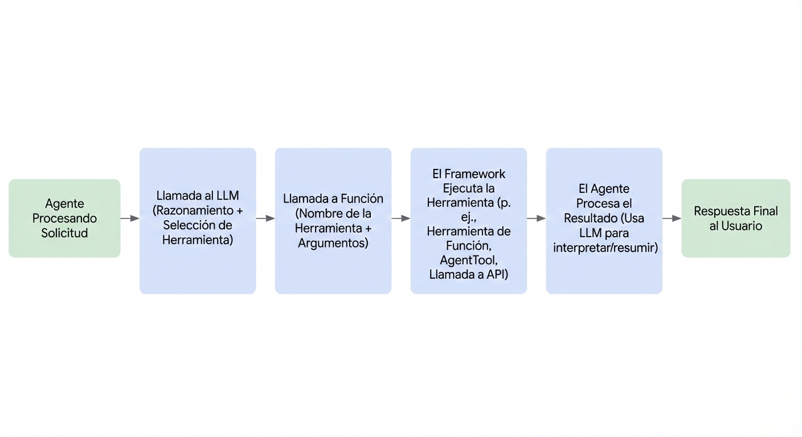

# Herramientas Personalizadas para ADK

<div class="language-support-tag">
  <span class="lst-supported">Supported in ADK</span><span class="lst-python">Python v0.1.0</span><span class="lst-typescript">Typescript v0.2.0</span><span class="lst-go">Go v0.1.0</span><span class="lst-java">Java v0.1.0</span>
</div>

En un flujo de trabajo de agente ADK, las Herramientas son funciones de programación con entrada
y salida estructurada que pueden ser llamadas por un Agente ADK para realizar acciones. Las Herramientas ADK
funcionan de manera similar a cómo usas una
[Llamada de Función](https://ai.google.dev/gemini-api/docs/function-calling)
con Gemini u otros modelos de IA generativa. Puedes realizar varias acciones y
funciones de programación con una Herramienta ADK, tales como:

*   Consultar bases de datos
*   Hacer solicitudes API: obtener datos del clima, sistemas de reservas
*   Buscar en la web
*   Ejecutar fragmentos de código
*   Recuperar información de documentos (RAG)
*   Interactuar con otro software o servicios

!!! tip "[Lista de Herramientas ADK](/tools/)"
    Antes de construir tus propias Herramientas para ADK, consulta la
    **[Lista de Herramientas ADK](/tools/)**
    para herramientas preconstruidas que puedes usar con Agentes ADK.

## ¿Qué es una Herramienta?

En el contexto de ADK, una Herramienta representa una
capacidad específica proporcionada a un agente de IA, permitiéndole realizar acciones e interactuar
con el mundo más allá de sus capacidades básicas de generación de texto y razonamiento. Lo que
distingue a los agentes capaces de los modelos de lenguaje básicos es a menudo su uso efectivo
de herramientas.

Técnicamente, una herramienta es típicamente un componente de código modular—**como una función de Python, Java o TypeScript**, un método de clase, o incluso otro agente especializado—diseñado para
ejecutar una tarea distinta y predefinida. Estas tareas a menudo involucran interactuar con
sistemas o datos externos.



### Características Clave

**Orientada a la Acción:** Las herramientas realizan acciones específicas para un agente, como
buscar información, llamar a una API o realizar cálculos.

**Extiende las capacidades del Agente:** Empoderan a los agentes para acceder a información en tiempo real, afectar sistemas externos y superar las limitaciones de conocimiento inherentes a sus datos de entrenamiento.

**Ejecuta lógica predefinida:** Crucialmente, las herramientas ejecutan lógica específica definida por el desarrollador. No poseen sus propias capacidades de razonamiento independientes como el Modelo de Lenguaje Grande (LLM) central del agente. El LLM razona sobre qué herramienta usar, cuándo y con qué entradas, pero la herramienta en sí solo ejecuta su función designada.

## Cómo los Agentes Usan las Herramientas

Los agentes aprovechan las herramientas dinámicamente a través de mecanismos que a menudo involucran llamadas de función. El proceso generalmente sigue estos pasos:

1. **Razonamiento:** El LLM del agente analiza su instrucción del sistema, historial de conversación y solicitud del usuario.
2. **Selección:** Basándose en el análisis, el LLM decide qué herramienta, si alguna, ejecutar, basándose en las herramientas disponibles para el agente y los docstrings que describen cada herramienta.
3. **Invocación:** El LLM genera los argumentos requeridos (entradas) para la herramienta seleccionada y activa su ejecución.
4. **Observación:** El agente recibe la salida (resultado) devuelta por la herramienta.
5. **Finalización:** El agente incorpora la salida de la herramienta en su proceso de razonamiento continuo para formular la próxima respuesta, decidir el paso subsecuente o determinar si se ha logrado el objetivo.

Piensa en las herramientas como un kit de herramientas especializado al que el núcleo inteligente del agente (el LLM) puede acceder y utilizar según sea necesario para lograr tareas complejas.

## Tipos de Herramientas en ADK

ADK ofrece flexibilidad al soportar varios tipos de herramientas:

1. **[Herramientas de Función](/tools-custom/function-tools/):** Herramientas creadas por ti, adaptadas a las necesidades específicas de tu aplicación.
    * **[Funciones/Métodos](/tools-custom/function-tools/#1-function-tool):** Define funciones o métodos síncronos estándar en tu código (ej., Python def).
    * **[Agentes-como-Herramientas](/tools-custom/function-tools/#3-agent-as-a-tool):** Usa otro agente, potencialmente especializado, como una herramienta para un agente padre.
    * **[Herramientas de Función de Larga Duración](/tools-custom/function-tools/#2-long-running-function-tool):** Soporte para herramientas que realizan operaciones asíncronas o toman tiempo significativo para completarse.
2. **[Herramientas Integradas](/tools/built-in-tools/):** Herramientas listas para usar proporcionadas por el framework para tareas comunes.
        Ejemplos: Búsqueda de Google, Ejecución de Código, Generación Aumentada por Recuperación (RAG).
3. **Herramientas de Terceros:** Integra herramientas sin problemas desde bibliotecas externas populares.

Navega a las respectivas páginas de documentación enlazadas arriba para información detallada y ejemplos para cada tipo de herramienta.

## Referenciar Herramientas en las Instrucciones del Agente

Dentro de las instrucciones de un agente, puedes referenciar directamente una herramienta usando su **nombre de función.** Si el **nombre de función** y el **docstring** de la herramienta son suficientemente descriptivos, tus instrucciones pueden enfocarse principalmente en **cuándo el Modelo de Lenguaje Grande (LLM) debe utilizar la herramienta**. Esto promueve claridad y ayuda al modelo a entender el uso pretendido de cada herramienta.

Es **crucial instruir claramente al agente sobre cómo manejar diferentes valores de retorno** que una herramienta puede producir. Por ejemplo, si una herramienta devuelve un mensaje de error, tus instrucciones deben especificar si el agente debe reintentar la operación, abandonar la tarea o solicitar información adicional del usuario.

Además, ADK soporta el uso secuencial de herramientas, donde la salida de una herramienta puede servir como entrada para otra. Al implementar tales flujos de trabajo, es importante **describir la secuencia pretendida del uso de herramientas** dentro de las instrucciones del agente para guiar al modelo a través de los pasos necesarios.

### Ejemplo

El siguiente ejemplo muestra cómo un agente puede usar herramientas **referenciando sus nombres de función en sus instrucciones**. También demuestra cómo guiar al agente para **manejar diferentes valores de retorno de las herramientas**, como mensajes de éxito o error, y cómo orquestar el **uso secuencial de múltiples herramientas** para lograr una tarea.

=== "Python"

    ```py
    --8<-- "examples/python/snippets/tools/overview/weather_sentiment.py"
    ```

=== "TypeScript"

    ```typescript
    --8<-- "examples/typescript/snippets/tools/overview/weather_sentiment.ts"
    ```

=== "Go"

    ```go
    --8<-- "examples/go/snippets/tools-custom/weather_sentiment/main.go"
    ```

=== "Java"

    ```java
    --8<-- "examples/java/snippets/src/main/java/tools/WeatherSentimentAgentApp.java:full_code"
    ```

## Contexto de Herramienta

Para escenarios más avanzados, ADK te permite acceder a información contextual adicional dentro de tu función de herramienta incluyendo el parámetro especial `tool_context: ToolContext`. Al incluir esto en la firma de la función, ADK automáticamente proporcionará una **instancia de la clase ToolContext** cuando tu herramienta sea llamada durante la ejecución del agente.

El **ToolContext** proporciona acceso a varias piezas clave de información y palancas de control:

* `state: State`: Lee y modifica el estado de la sesión actual. Los cambios realizados aquí son rastreados y persistidos.

* `actions: EventActions`: Influye en las acciones subsecuentes del agente después de que la herramienta se ejecuta (ej., omitir resumen, transferir a otro agente).

* `function_call_id: str`: El identificador único asignado por el framework a esta invocación específica de la herramienta. Útil para rastrear y correlacionar con respuestas de autenticación. Esto también puede ser útil cuando múltiples herramientas son llamadas dentro de una sola respuesta del modelo.

* `function_call_event_id: str`: Este atributo proporciona el identificador único del **evento** que activó la llamada de herramienta actual. Esto puede ser útil para propósitos de rastreo y registro.

* `auth_response: Any`: Contiene la respuesta/credenciales de autenticación si un flujo de autenticación fue completado antes de esta llamada de herramienta.

* Acceso a Servicios: Métodos para interactuar con servicios configurados como Artifacts y Memory.

Nota que no debes incluir el parámetro `tool_context` en el docstring de la función de herramienta. Dado que `ToolContext` es automáticamente inyectado por el framework ADK *después* de que el LLM decide llamar a la función de herramienta, no es relevante para la toma de decisiones del LLM e incluirlo puede confundir al LLM.

### **Gestión de Estado**

El atributo `tool_context.state` proporciona acceso directo de lectura y escritura al estado asociado con la sesión actual. Se comporta como un diccionario pero asegura que cualquier modificación sea rastreada como deltas y persistida por el servicio de sesión. Esto permite a las herramientas mantener y compartir información a través de diferentes interacciones y pasos del agente.

* **Leer Estado**: Usa acceso de diccionario estándar (`tool_context.state['my_key']`) o el método `.get()` (`tool_context.state.get('my_key', default_value)`).

* **Escribir Estado**: Asigna valores directamente (`tool_context.state['new_key'] = 'new_value'`). Estos cambios son registrados en el state_delta del evento resultante.

* **Prefijos de Estado**: Recuerda los prefijos de estado estándar:

    * `app:*`: Compartido a través de todos los usuarios de la aplicación.

    * `user:*`: Específico al usuario actual a través de todas sus sesiones.

    * (Sin prefijo): Específico a la sesión actual.

    * `temp:*`: Temporal, no persistido a través de invocaciones (útil para pasar datos dentro de una sola llamada de ejecución pero generalmente menos útil dentro de un contexto de herramienta que opera entre llamadas LLM).

=== "Python"

    ```py
    --8<-- "examples/python/snippets/tools/overview/user_preference.py"
    ```

=== "TypeScript"

    ```typescript
    --8<-- "examples/typescript/snippets/tools/overview/user_preference.ts"
    ```

=== "Go"

    ```go
    --8<-- "examples/go/snippets/tools-custom/user_preference/user_preference.go:example"
    ```

=== "Java"

    ```java
    import com.google.adk.tools.FunctionTool;
    import com.google.adk.tools.ToolContext;

    // Actualiza una preferencia específica del usuario.
    public Map<String, String> updateUserThemePreference(String value, ToolContext toolContext) {
      String userPrefsKey = "user:preferences:theme";

      // Obtiene las preferencias actuales o inicializa si no existen
      String preference = toolContext.state().getOrDefault(userPrefsKey, "").toString();
      if (preference.isEmpty()) {
        preference = value;
      }

      // Escribe el diccionario actualizado de vuelta al estado
      toolContext.state().put("user:preferences", preference);
      System.out.printf("Tool: Updated user preference %s to %s", userPrefsKey, preference);

      return Map.of("status", "success", "updated_preference", toolContext.state().get(userPrefsKey).toString());
      // Cuando el LLM llama a updateUserThemePreference("dark"):
      // El toolContext.state será actualizado, y el cambio será parte del
      // actions.stateDelta del evento de respuesta de herramienta resultante.
    }
    ```

### **Controlando el Flujo del Agente**

El atributo `tool_context.actions` en Python y TypeScript, `ToolContext.actions()` en Java, y `tool.Context.Actions()` en Go, contiene un objeto **EventActions**. Modificar atributos en este objeto permite a tu herramienta influir en lo que el agente o framework hace después de que la herramienta termina su ejecución.

* **`skip_summarization: bool`**: (Por defecto: False) Si se establece en True, instruye al ADK a omitir la llamada LLM que típicamente resume la salida de la herramienta. Esto es útil si el valor de retorno de tu herramienta ya es un mensaje listo para el usuario.

* **`transfer_to_agent: str`**: Establece esto al nombre de otro agente. El framework detendrá la ejecución del agente actual y **transferirá el control de la conversación al agente especificado**. Esto permite a las herramientas entregar dinámicamente tareas a agentes más especializados.

* **`escalate: bool`**: (Por defecto: False) Establecer esto en True señala que el agente actual no puede manejar la solicitud y debe pasar el control a su agente padre (si está en una jerarquía). En un LoopAgent, establecer **escalate=True** en la herramienta de un sub-agente terminará el bucle.

#### Ejemplo

=== "Python"

    ```py
    --8<-- "examples/python/snippets/tools/overview/customer_support_agent.py"
    ```

=== "TypeScript"

    ```typescript
    --8<-- "examples/typescript/snippets/tools/overview/customer_support_agent.ts"
    ```

=== "Go"

    ```go
    --8<-- "examples/go/snippets/tools-custom/customer_support_agent/main.go"
    ```

=== "Java"

    ```java
    --8<-- "examples/java/snippets/src/main/java/tools/CustomerSupportAgentApp.java:full_code"
    ```

##### Explicación

* Definimos dos agentes: `main_agent` y `support_agent`. El `main_agent` está diseñado para ser el punto inicial de contacto.
* La herramienta `check_and_transfer`, cuando es llamada por `main_agent`, examina la consulta del usuario.
* Si la consulta contiene la palabra "urgent", la herramienta accede al `tool_context`, específicamente **`tool_context.actions`**, y establece el atributo transfer\_to\_agent a `support_agent`.
* Esta acción señala al framework para **transferir el control de la conversación al agente llamado `support_agent`**.
* Cuando el `main_agent` procesa la consulta urgente, la herramienta `check_and_transfer` activa la transferencia. La respuesta subsecuente vendría idealmente del `support_agent`.
* Para una consulta normal sin urgencia, la herramienta simplemente la procesa sin activar una transferencia.

Este ejemplo ilustra cómo una herramienta, a través de EventActions en su ToolContext, puede influir dinámicamente en el flujo de la conversación transfiriendo el control a otro agente especializado.

### **Autenticación**

ToolContext proporciona mecanismos para herramientas que interactúan con APIs autenticadas. Si tu herramienta necesita manejar autenticación, podrías usar lo siguiente:

* **`auth_response`** (en Python): Contiene credenciales (ej., un token) si la autenticación ya fue manejada por el framework antes de que tu herramienta fuera llamada (común con RestApiTool y esquemas de seguridad OpenAPI). En TypeScript, esto se recupera a través del método getAuthResponse().

* **`request_credential(auth_config: dict)`** (en Python) o **`requestCredential(authConfig: AuthConfig)`** (en TypeScript): Llama a este método si tu herramienta determina que se necesita autenticación pero las credenciales no están disponibles. Esto señala al framework para iniciar un flujo de autenticación basado en el auth_config proporcionado.

* **`get_auth_response()`** (en Python) o **`getAuthResponse(authConfig: AuthConfig)`** (en TypeScript): Llama a esto en una invocación subsecuente (después de que request_credential fue manejado exitosamente) para recuperar las credenciales que el usuario proporcionó.

Para explicaciones detalladas de flujos de autenticación, configuración y ejemplos, por favor refiérete a la página de documentación dedicada a Autenticación de Herramientas.

### **Métodos de Acceso a Datos Conscientes del Contexto**

Estos métodos proporcionan formas convenientes para que tu herramienta interactúe con datos persistentes asociados con la sesión o usuario, gestionados por servicios configurados.

* **`list_artifacts()`** (en Python) o **`listArtifacts()`** (en Java y TypeScript): Devuelve una lista de nombres de archivos (o claves) para todos los artefactos actualmente almacenados para la sesión a través del artifact_service. Los artefactos son típicamente archivos (imágenes, documentos, etc.) cargados por el usuario o generados por herramientas/agentes.

* **`load_artifact(filename: str)`**: Recupera un artefacto específico por su nombre de archivo del **artifact_service**. Opcionalmente puedes especificar una versión; si se omite, se devuelve la versión más reciente. Devuelve un objeto `google.genai.types.Part` conteniendo los datos del artefacto y el tipo mime, o None si no se encuentra.

* **`save_artifact(filename: str, artifact: types.Part)`**: Guarda una nueva versión de un artefacto en el artifact_service. Devuelve el nuevo número de versión (comenzando desde 0).

* **`search_memory(query: str)`**: (Soporte en ADK Python, Go y TypeScript)
    Consulta la memoria a largo plazo del usuario usando el `memory_service` configurado. Esto es útil para recuperar información relevante de interacciones pasadas o conocimiento almacenado. La estructura del **SearchMemoryResponse** depende de la implementación específica del servicio de memoria pero típicamente contiene fragmentos de texto relevantes o extractos de conversación.


#### Ejemplo

=== "Python"

    ```py
    --8<-- "examples/python/snippets/tools/overview/doc_analysis.py"
    ```

=== "TypeScript"

    ```typescript
    --8<-- "examples/typescript/snippets/tools/overview/doc_analysis.ts"
    ```

=== "Go"

    ```go
    --8<-- "examples/go/snippets/tools-custom/doc_analysis/doc_analysis.go"
    ```

=== "Java"

    ```java
    // Analiza un documento usando contexto de la memoria.
    // También puedes listar, cargar y guardar artefactos usando Callback Context o la herramienta LoadArtifacts.
    public static @NonNull Maybe<ImmutableMap<String, Object>> processDocument(
        @Annotations.Schema(description = "The name of the document to analyze.") String documentName,
        @Annotations.Schema(description = "The query for the analysis.") String analysisQuery,
        ToolContext toolContext) {

      // 1. Lista todos los artefactos disponibles
      System.out.printf(
          "Listing all available artifacts %s:", toolContext.listArtifacts().blockingGet());

      // 2. Carga un artefacto a memoria
      System.out.println("Tool: Attempting to load artifact: " + documentName);
      Part documentPart = toolContext.loadArtifact(documentName, Optional.empty()).blockingGet();
      if (documentPart == null) {
        System.out.println("Tool: Document '" + documentName + "' not found.");
        return Maybe.just(
            ImmutableMap.<String, Object>of(
                "status", "error", "message", "Document '" + documentName + "' not found."));
      }
      String documentText = documentPart.text().orElse("");
      System.out.println(
          "Tool: Loaded document '" + documentName + "' (" + documentText.length() + " chars).");

      // 3. Realiza análisis (marcador de posición)
      String analysisResult =
          "Analysis of '"
              + documentName
              + "' regarding '"
              + analysisQuery
              + " [Placeholder Analysis Result]";
      System.out.println("Tool: Performed analysis.");

      // 4. Guarda el resultado del análisis como un nuevo artefacto
      Part analysisPart = Part.fromText(analysisResult);
      String newArtifactName = "analysis_" + documentName;

      toolContext.saveArtifact(newArtifactName, analysisPart);

      return Maybe.just(
          ImmutableMap.<String, Object>builder()
              .put("status", "success")
              .put("analysis_artifact", newArtifactName)
              .build());
    }
    // FunctionTool processDocumentTool =
    //      FunctionTool.create(ToolContextArtifactExample.class, "processDocument");
    // En el Agente, incluye esta herramienta de función.
    // LlmAgent agent = LlmAgent().builder().tools(processDocumentTool).build();
    ```

Al aprovechar el **ToolContext**, los desarrolladores pueden crear herramientas personalizadas más sofisticadas y conscientes del contexto que se integran sin problemas con la arquitectura de ADK y mejoran las capacidades generales de sus agentes.

## Definiendo Funciones de Herramienta Efectivas

Cuando usas un método o función como una Herramienta ADK, cómo la defines impacta significativamente la capacidad del agente para usarla correctamente. El Modelo de Lenguaje Grande (LLM) del agente depende en gran medida del **nombre**, **parámetros (argumentos)**, **anotaciones de tipo** y **docstring** / **comentarios de código fuente** de la función para entender su propósito y generar la llamada correcta.

Aquí hay pautas clave para definir funciones de herramienta efectivas:

* **Nombre de Función:**
    * Usa nombres descriptivos basados en verbo-sustantivo que indiquen claramente la acción (ej., `get_weather`, `searchDocuments`, `schedule_meeting`).
    * Evita nombres genéricos como `run`, `process`, `handle_data`, o nombres demasiado ambiguos como `doStuff`. Incluso con una buena descripción, un nombre como `do_stuff` podría confundir al modelo sobre cuándo usar la herramienta versus, por ejemplo, `cancelFlight`.
    * El LLM usa el nombre de función como identificador principal durante la selección de herramienta.

* **Parámetros (Argumentos):**
    * Tu función puede tener cualquier número de parámetros.
    * Usa nombres claros y descriptivos (ej., `city` en lugar de `c`, `search_query` en lugar de `q`).
    * **Proporciona anotaciones de tipo en Python** para todos los parámetros (ej., `city: str`, `user_id: int`, `items: list[str]`). Esto es esencial para que ADK genere el esquema correcto para el LLM.
    * Asegura que todos los tipos de parámetros sean **serializables en JSON**. Todos los primitivos de java así como tipos estándar de Python como `str`, `int`, `float`, `bool`, `list`, `dict`, y sus combinaciones son generalmente seguros. Evita instancias de clases personalizadas complejas como parámetros directos a menos que tengan una representación JSON clara.
    * **No establezcas valores por defecto** para parámetros. Ej., `def my_func(param1: str = "default")`. Los valores por defecto no son confiablemente soportados o usados por los modelos subyacentes durante la generación de llamadas de función. Toda la información necesaria debe ser derivada por el LLM del contexto o solicitada explícitamente si falta.
    * **`self` / `cls` Manejados Automáticamente:** Parámetros implícitos como `self` (para métodos de instancia) o `cls` (para métodos de clase) son automáticamente manejados por ADK y excluidos del esquema mostrado al LLM. Solo necesitas definir anotaciones de tipo y descripciones para los parámetros lógicos que tu herramienta requiere que el LLM proporcione.

* **Tipo de Retorno:**
    * El valor de retorno de la función **debe ser un diccionario (`dict`)** en Python, un **Map** en Java, o un **object** plano en TypeScript.
    * Si tu función devuelve un tipo no-diccionario (ej., una cadena, número, lista), el framework ADK automáticamente lo envolverá en un diccionario/Map como `{'result': your_original_return_value}` antes de pasar el resultado de vuelta al modelo.
    * Diseña las claves y valores del diccionario/Map para ser **descriptivos y fácilmente entendidos *por el LLM***. Recuerda, el modelo lee esta salida para decidir su próximo paso.
    * Incluye claves significativas. Por ejemplo, en lugar de devolver solo un código de error como `500`, devuelve `{'status': 'error', 'error_message': 'Database connection failed'}`.
    * Es una **práctica altamente recomendada** incluir una clave `status` (ej., `'success'`, `'error'`, `'pending'`, `'ambiguous'`) para indicar claramente el resultado de la ejecución de la herramienta para el modelo.

* **Docstring / Comentarios de Código Fuente:**
    * **Esto es crítico.** El docstring es la fuente principal de información descriptiva para el LLM.
    * **Declara claramente qué *hace* la herramienta.** Sé específico sobre su propósito y limitaciones.
    * **Explica *cuándo* la herramienta debe ser usada.** Proporciona contexto o escenarios de ejemplo para guiar la toma de decisiones del LLM.
    * **Describe *cada parámetro* claramente.** Explica qué información el LLM necesita proporcionar para ese argumento.
    * Describe la **estructura y significado del valor de retorno `dict` esperado**, especialmente los diferentes valores de `status` y claves de datos asociadas.
    * **No describas el parámetro ToolContext inyectado**. Evita mencionar el parámetro opcional `tool_context: ToolContext` dentro de la descripción del docstring ya que no es un parámetro que el LLM necesita conocer. ToolContext es inyectado por ADK, *después* de que el LLM decide llamarlo.

    **Ejemplo de una buena definición:**

=== "Python"

    ```python
    def lookup_order_status(order_id: str) -> dict:
      """Obtiene el estado actual del pedido de un cliente usando su ID.

      Usa esta herramienta SOLO cuando un usuario pregunta explícitamente por el estado de
      un pedido específico y proporciona el ID del pedido. No la uses para
      consultas generales.

      Args:
          order_id: El identificador único del pedido a buscar.

      Returns:
          Un diccionario indicando el resultado.
          En éxito, status es 'success' e incluye un diccionario 'order'.
          En falla, status es 'error' e incluye un 'error_message'.
          Ejemplo éxito: {'status': 'success', 'order': {'state': 'shipped', 'tracking_number': '1Z9...'}}
          Ejemplo error: {'status': 'error', 'error_message': 'Order ID not found.'}
      """
      # ... implementación de función para obtener estado ...
      if status_details := fetch_status_from_backend(order_id):
        return {
            "status": "success",
            "order": {
                "state": status_details.state,
                "tracking_number": status_details.tracking,
            },
        }
      else:
        return {"status": "error", "error_message": f"Order ID {order_id} not found."}

    ```

=== "TypeScript"

    ```typescript
    /**
     * Obtiene el estado actual del pedido de un cliente usando su ID.
     *
     * Usa esta herramienta SOLO cuando un usuario pregunta explícitamente por el estado de
     * un pedido específico y proporciona el ID del pedido. No la uses para
     * consultas generales.
     *
     * @param params Los parámetros para la función.
     * @param params.order_id El identificador único del pedido a buscar.
     * @returns Un diccionario indicando el resultado.
     *          En éxito, status es 'success' e incluye un diccionario 'order'.
     *          En falla, status es 'error' e incluye un 'error_message'.
     *          Ejemplo éxito: {'status': 'success', 'order': {'state': 'shipped', 'tracking_number': '1Z9...'}}
     *          Ejemplo error: {'status': 'error', 'error_message': 'Order ID not found.'}
     */
    async function lookupOrderStatus(params: { order_id: string }): Promise<Record<string, any>> {
      // ... implementación de función para obtener estado desde un backend ...
      const status_details = await fetchStatusFromBackend(params.order_id);
      if (status_details) {
        return {
          "status": "success",
          "order": {
            "state": status_details.state,
            "tracking_number": status_details.tracking,
          },
        };
      } else {
        return { "status": "error", "error_message": `Order ID ${params.order_id} not found.` };
      }
    }

    // Marcador de posición para una llamada backend
    async function fetchStatusFromBackend(order_id: string): Promise<{state: string, tracking: string} | null> {
        if (order_id === "12345") {
            return { state: "shipped", tracking: "1Z9..." };
        }
        return null;
    }
    ```

=== "Go"

    ```go
    --8<-- "examples/go/snippets/tools-custom/order_status/order_status.go:snippet"
    ```

=== "Java"

    ```java
    /**
     * Recupera el reporte del clima actual para una ciudad especificada.
     *
     * @param city La ciudad para la cual recuperar el reporte del clima.
     * @param toolContext El contexto para la herramienta.
     * @return Un diccionario conteniendo la información del clima.
     */
    public static Map<String, Object> getWeatherReport(String city, ToolContext toolContext) {
        Map<String, Object> response = new HashMap<>();
        if (city.toLowerCase(Locale.ROOT).equals("london")) {
            response.put("status", "success");
            response.put(
                    "report",
                    "The current weather in London is cloudy with a temperature of 18 degrees Celsius and a"
                            + " chance of rain.");
        } else if (city.toLowerCase(Locale.ROOT).equals("paris")) {
            response.put("status", "success");
            response.put("report", "The weather in Paris is sunny with a temperature of 25 degrees Celsius.");
        } else {
            response.put("status", "error");
            response.put("error_message", String.format("Weather information for '%s' is not available.", city));
        }
        return response;
    }
    ```

* **Simplicidad y Enfoque:**
    * **Mantén las Herramientas Enfocadas:** Cada herramienta idealmente debería realizar una tarea bien definida.
    * **Menos Parámetros son Mejores:** Los modelos generalmente manejan herramientas con menos parámetros claramente definidos de manera más confiable que aquellas con muchos opcionales o complejos.
    * **Usa Tipos de Datos Simples:** Prefiere tipos básicos (`str`, `int`, `bool`, `float`, `List[str]`, en **Python**; `int`, `byte`, `short`, `long`, `float`, `double`, `boolean` y `char` en **Java**; o `string`, `number`, `boolean`, y arrays como `string[]` en **TypeScript**) sobre clases personalizadas complejas o estructuras profundamente anidadas como parámetros cuando sea posible.
    * **Descompone Tareas Complejas:** Divide funciones que realizan múltiples pasos lógicos distintos en herramientas más pequeñas y enfocadas. Por ejemplo, en lugar de una sola herramienta `update_user_profile(profile: ProfileObject)`, considera herramientas separadas como `update_user_name(name: str)`, `update_user_address(address: str)`, `update_user_preferences(preferences: list[str])`, etc. Esto hace más fácil para el LLM seleccionar y usar la capacidad correcta.

Al adherirse a estas pautas, proporcionas al LLM la claridad y estructura que necesita para utilizar efectivamente tus herramientas de función personalizadas, llevando a un comportamiento del agente más capaz y confiable.

## Toolsets: Agrupar y Proporcionar Herramientas Dinámicamente

<div class="language-support-tag" title="This feature is currently available for Python and Typescript.">
   <span class="lst-supported">Supported in ADK</span><span class="lst-python">Python v0.5.0</span><span class="lst-typescript">Typescript v0.2.0</span>
</div>


Más allá de las herramientas individuales, ADK introduce el concepto de un **Toolset** a través de la interfaz `BaseToolset` (definida en `google.adk.tools.base_toolset`). Un toolset te permite gestionar y proporcionar una colección de instancias de `BaseTool`, a menudo dinámicamente, a un agente.

Este enfoque es beneficioso para:

*   **Organizar Herramientas Relacionadas:** Agrupar herramientas que sirven un propósito común (ej., todas las herramientas para operaciones matemáticas, o todas las herramientas que interactúan con una API específica).
*   **Disponibilidad Dinámica de Herramientas:** Permitir que un agente tenga diferentes herramientas disponibles basándose en el contexto actual (ej., permisos del usuario, estado de sesión, u otras condiciones de tiempo de ejecución). El método `get_tools` de un toolset puede decidir qué herramientas exponer.
*   **Integrar Proveedores de Herramientas Externos:** Los toolsets pueden actuar como adaptadores para herramientas provenientes de sistemas externos, como una especificación OpenAPI o un servidor MCP, convirtiéndolas en objetos `BaseTool` compatibles con ADK.

### La Interfaz `BaseToolset`

Cualquier clase que actúe como toolset en ADK debe implementar la clase base abstracta `BaseToolset`. Esta interfaz define principalmente dos métodos:

*   **`async def get_tools(...) -> list[BaseTool]:`**
    Este es el método central de un toolset. Cuando un agente ADK necesita conocer sus herramientas disponibles, llamará a `get_tools()` en cada instancia de `BaseToolset` proporcionada en su lista de `tools`.
    *   Recibe un `readonly_context` opcional (una instancia de `ReadonlyContext`). Este contexto proporciona acceso de solo lectura a información como el estado de sesión actual (`readonly_context.state`), nombre del agente e ID de invocación. El toolset puede usar este contexto para decidir dinámicamente qué herramientas devolver.
    *   **Debe** devolver una `list` de instancias de `BaseTool` (ej., `FunctionTool`, `RestApiTool`).

*   **`async def close(self) -> None:`**
    Este método asíncrono es llamado por el framework ADK cuando el toolset ya no es necesario, por ejemplo, cuando un servidor de agente se está cerrando o el `Runner` se está cerrando. Implementa este método para realizar cualquier limpieza necesaria, como cerrar conexiones de red, liberar manejadores de archivos, o limpiar otros recursos gestionados por el toolset.

### Usando Toolsets con Agentes

Puedes incluir instancias de tus implementaciones de `BaseToolset` directamente en la lista de `tools` de un `LlmAgent`, junto con instancias individuales de `BaseTool`.

Cuando el agente se inicializa o necesita determinar sus capacidades disponibles, el framework ADK iterará a través de la lista de `tools`:

*   Si un ítem es una instancia de `BaseTool`, se usa directamente.
*   Si un ítem es una instancia de `BaseToolset`, su método `get_tools()` es llamado (con el `ReadonlyContext` actual), y la lista devuelta de `BaseTool`s se agrega a las herramientas disponibles del agente.

### Ejemplo: Un Toolset de Matemáticas Simple

Creemos un ejemplo básico de un toolset que proporciona operaciones aritméticas simples.

=== "Python"

    ```py
    --8<-- "examples/python/snippets/tools/overview/toolset_example.py:init"
    ```

=== "TypeScript"

    ```typescript
    --8<-- "examples/typescript/snippets/tools/overview/toolset_example.ts"
    ```

En este ejemplo:

*   `SimpleMathToolset` implementa `BaseToolset` y su método `get_tools()` devuelve instancias de `FunctionTool` para `add_numbers` y `subtract_numbers`. También personaliza sus nombres usando un prefijo.
*   El `calculator_agent` está configurado tanto con un `greet_tool` individual como con una instancia de `SimpleMathToolset`.
*   Cuando `calculator_agent` se ejecuta, ADK llamará a `math_toolset_instance.get_tools()`. El LLM del agente entonces tendrá acceso a `greet_user`, `calculator_add_numbers`, y `calculator_subtract_numbers` para manejar solicitudes del usuario.
*   La herramienta `add_numbers` demuestra escribir en `tool_context.state`, y la instrucción del agente menciona leer este estado.
*   El método `close()` es llamado para asegurar que cualquier recurso retenido por el toolset sea liberado.

Los toolsets ofrecen una forma poderosa de organizar, gestionar y proporcionar dinámicamente colecciones de herramientas a tus agentes ADK, llevando a aplicaciones agénticas más modulares, mantenibles y adaptables.